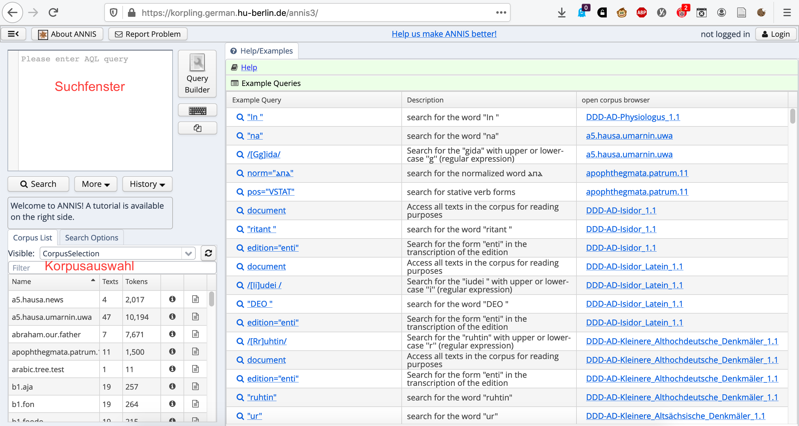
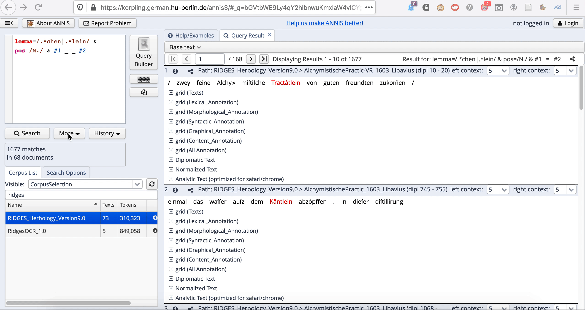

```{r setup, include=FALSE}
knitr::opts_chunk$set(echo = TRUE)
```


# ANNIS: Interface und Suchabfragesprache

In diesem Kapitel werfen wir zunächst einen genaueren Blick auf das ANNIS-Interface und lernen dann anhand eines Beispiels Grundelemente der Suchabfragesprache kennen. Dabei kann dieses Tutorial allerdings die Auseinandersetzung mit der Dokumentation von ANNIS und seiner Suchabfragesprache nicht ersetzen.


## ANNIS-Interface

Das ANNIS-Interface besteht aus drei Teilen: Links oben sehen wir die Suchmaske, darunter die Korpusauswahl, rechts sehen wir zunächst eine Seite mit Beispielanfragen und Zugang zur Hilfe, die eine sehr umfangreiche englischsprachige Dokumentation zu ANNIS und seinen Funktionen bietet.

```{r annisinterface, echo = FALSE, out.width = '80%', out.height = '80%', fig.cap="ANNIS-Interface"}

```


## Suchabfragesprache

ANNIS arbeitet mit der ANNIS Query Language, die [hier](https://corpus-tools.org/annis/aql.html) dokumentiert ist. Da ANNIS v.a. für syntaktisch annotierte Korpora entwickelt wurde (ANNIS steht für "Annotation of Information Structure"), entfaltet die Suchabfragesprache ihr volles Potential in sog. Baumbanken. Beispiele hierfür sind die Deutsche Diachrone Baumbank und die Mercurius-Baumbank, die ebenfalls über die oben verlinkte Berliner ANNIS-Instanz zugänglich sind. Im Folgenden konzentrieren wir uns jedoch auf  sehr einfache Suchanfragen auf Tokenebene. 

AQL funktioniert, wie die meisten anderen Suchanfragesprachen, nach dem Prinzip, dass man nach Variable-Wert-Paaren sucht, z.B. [`pos="NN"`](https://korpling.german.hu-berlin.de/annis3/?id=0ccc11bc-4b6b-49bf-888d-cee9f7d48966), wenn man nach Substantiven (genauer: Appellativen) suchen möchte. (Das verwendete Tagset für Wortarten ist das Stuttgart-Tübingen-Tagset, kurz STTS, das [hier](https://www.ims.uni-stuttgart.de/forschung/ressourcen/lexika/germantagsets/#id-cfcbf0a7-0) dokumentiert ist).

Bei komplexeren Suchanfragen muss man die einzelnen Variable-Wert-Paare quasi miteinander verketten, d.h. man muss angeben, in welcher Relation sie zueinander stehen. Beispielsweise bedeutet [`pos="ART" . pos="NN"`](https://korpling.german.hu-berlin.de/annis3/?id=05438eaf-7bd3-46f8-976a-1c32137cb22a), dass wir einen Artikel suchen, gefolgt von einem Substantiv - denn der Punkt dient in AQL als Indikator für "direkte Präzedenz". Alternativ kann man diese Suchanfrage auch wie folgt schreiben:

[`pos="ART" &
pos="NN" &
#1 . #2`](https://korpling.german.hu-berlin.de/annis3/?id=bba7018c-bd35-4bce-b676-2370ec220192)

In dieser ausführlichen Schreibweise spezifizieren wir zunächst die einzelnen Variable-Wert-Paare und nehmen dann durch Zahlen auf sie Bezug. Die Anfrage ist wie folgt zu lesen: Wir suchen einen Artikel (#1), und wir suchen ein Substantiv (#2). In welchem Verhältnis stehen sie zueinander? #1 geht #2 unmittelbar voran. Die Suchanfrage bringt genau das gleiche Ergebnis wie die kurze Variante weiter oben. Diese ausführliche Schreibweise hat jedoch gerade bei komplexeren Suchanfragen den Vorteil, dass man leichter den Überblick behält und ggf. noch fehlende Elemente in der Suchanfrage entdeckt.

**Aufgabe:** Finden Sie über die AQL-Dokumentation heraus, wie wir die Suchanfrage modifizieren müssen, um zu erlauben, dass a) bis zu 3 Wörter zwischen dem Artikel und dem Substantiv stehen, b) mindestens 1 Wort und maximal 5 Wörter zwischen dem Artikel und dem Substantiv stehen, c) beliebig viele (bzw. bis zu 50) Wörter zwischen dem Artikel und dem Subsnativ stehen.

Soweit der kurze "Primer" zur Suchanfragesprache - wie bereits angekündigt, bleiben wir hier sehr an der Oberfläche. Für die vertiefte Beschäftigung mit der Anfragesprache empfehle ich die Dokumentation und die auf Seite 1 verlinkten Tutorials.

Nun wollen wir uns dem versprochenen konkreten Beispiel zuwenden. Hier soll es darum gehen, Diminutive, also Verkleinerungsformen, zu finden.


## Beispiel: Diminutive in RIDGES

Dafür müssen wir zunächst in der Korpusauswahlspalte links unten das richtige Korpus finden. Wir verwenden das Korpus RIDGES_Herbology_Version9.0 (da RIDGES regelmäßig aktualisiert wird, gibt es allerdings möglicherweise schon eine neuere Version, wenn Sie dieses Tutorial lesen; evtl. funktionieren dann die im Folgenden angegebenen Links nicht mehr, die Suchanfragen sollten aber trotzdem noch funktionieren).

Eine sehr einfache Suchanfrage auf Lemmaebene könnte nun lauten: [`lemma=/.*chen|.*lein/`](https://korpling.german.hu-berlin.de/annis3/?id=674e058f-de0d-463a-a763-dd091ef8e129). Diese Suchanfrage verwendet reguläre Ausdrücke. Um in ANNIS regulare Ausdrücke zu verwenden, muss man die Anfrage in Slashes (/.../) einschließen statt, wie in den Beispielen oben, in Anführungszeichen. Einen Einstieg in reguläre Ausdrücke bietet die sehr empfehlenswerte Seite [https://www.regular-expressions.info/](https://www.regular-expressions.info/). Außerdem gebe ich in [diesem Tutorial](https://hartmast.github.io/sprachgeschichte/begleitmaterial/01-Grundlegendes.pdf) sowie im folgenden Video, das ich 2020 für einen Korpuslinguistik-Online-Kurs erstellt habe, einen ausführlichen Überblick über reguläre Ausdrücke. Um das Video zu sehen, klicken Sie wieder den entsprechenden Abschnitt auf:

<details>
<summary>klick mich</summary>
<iframe width="560" height="315" src="https://www.youtube-nocookie.com/embed/fInR16XuSJg" frameborder="0" allow="accelerometer; autoplay; encrypted-media; gyroscope; picture-in-picture" allowfullscreen></iframe>
</details>


Schauen wir uns nun die mit unserer Suchanfrage erzielten Treffer genauer an. Unschwer ist zu erkennen, dass es sehr viele Fehltreffer gibt: Beispielsweise werden *machen* und *allein* gefunden. Daher verfeinern wir die Suchanfrage etwas, indem wir nur nach spezifizieren, dass wir nur nach Substantiven suchen. Da prinzipiell auch Eigennamen ("NE") diminuiert werden können, suchen wir nach der Wortart /N./, wobei der Punkt bei regulären Ausdrücken für "irgendein Zeichen" steht. Auf diese Weise suchen wir sowohl nach Eigennamen ("NE") als auch nach Appellativen ("NN").

[`lemma=/.*chen|.*lein/ & pos=/N./ & #1 _=_ #2`](https://korpling.german.hu-berlin.de/annis3/?id=90b716ef-7005-47bc-a6c1-1cad225310cd)

Mit dem "_=_"-Operator geben wir an, dass sich beide Variable-Wert-Paare auf die gleiche Spanne (d.h. in unserem Fall: auf das gleiche Token) beziehen. Wir suchen also nach solchen Tokens, die auf der Lemma-Ebene mit "chen" oder "lein" enden und auf der POS-Ebene mit N plus einem weiteren Zeichen annotiert sind, also als Substantive getaggt sind.

Mit 1677 Treffern sind die Ergebnisse nun schon etwas stärker ausgedünnt. Um zu überprüfen, ob sich dennoch (womöglich tokenfrequente) Fehltreffer eingeschlichen haben, lohnt es sich, einen Blick auf die Frequenzliste der Treffer zu werfen. Dafür klicken wir auf More > Frequency Analysis, wie in  \@ref(fig:freqanalysis) gezeigt. Defaultmäßig will ANNIS nun nach Lemma und POS auszählen, weil das die Annotationsebenen sind, auf denen wir gesucht haben. Da wir aber nur nach Lemma auszählen möchten, entfernen wir zunächst POS und initiieren dann die Frequenzanalyse, ebenfalls wie in \@ref(fig:freq_analysis) gezeigt.

```{r freqanalysis, echo = FALSE, out.width = '80%', out.height = '80%', fig.cap="Frequenzanalyse initiieren"}

```

Wir sehen nun eine Liste der häufigsten Lemmas, die ich hier noch einmal angebe:

```{r frequencies,  echo = FALSE}

freq <- read.delim("docs/tables/frequency_analysis.txt", sep = "\t", quote = "")
colnames(freq) <- c("lemma", "count")
kableExtra::scroll_box(kableExtra::kable(freq),
                       height = "200px",
                       box_css = "border: 1px solid #ddd; padding: 5px; ",
                       extra_css = NULL,
  fixed_thead = TRUE)

```


Es zeigt sich, dass noch immer einige Fehltreffer zu verzeichnen sind, z.B. *keuchen*, *erbrechen*, *Eiche* bzw. *Eichen* und *Zeichen*. Bei den weniger frequenten finden sich sicherlich noch einige Fehltreffer mehr, aber wir wollen zunächst einmal einfach die genannten, relativ tokenfrequenten Fehltreffer ausschließen, um auf diesem Weg möglichst viele Fehltreffer auf einmal loszuwerden - alle weiteren können wir bei Bedarf später noch aussortieren.

Wir modifizieren die Suchanfrage daher wie folgt:

[`lemma=/.*chen|.*lein/ & pos=/N./ & 
lemma!=/Keuchen|Erbrechen|Eichen?|Zeichen/ &
#1 _=_ #2 &
#2 _=_ #3`](https://korpling.german.hu-berlin.de/annis3/?id=8c7f1dac-7025-4bbe-aa92-e21c8f1357cb)

Mit dem Ungleich-Operator != geben wir an, dass das Lemma keinem der Strings entsprechen soll, die innerhalb der Slashes /.../ mit dem ODER-Operator \| voneinander abgetrennt sind.

Nun haben wir die Trefferzahl einigermaßen eingegrenzt und können zum Export übergehen.