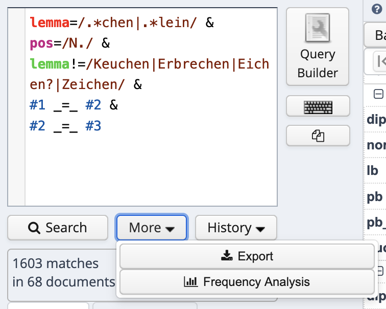
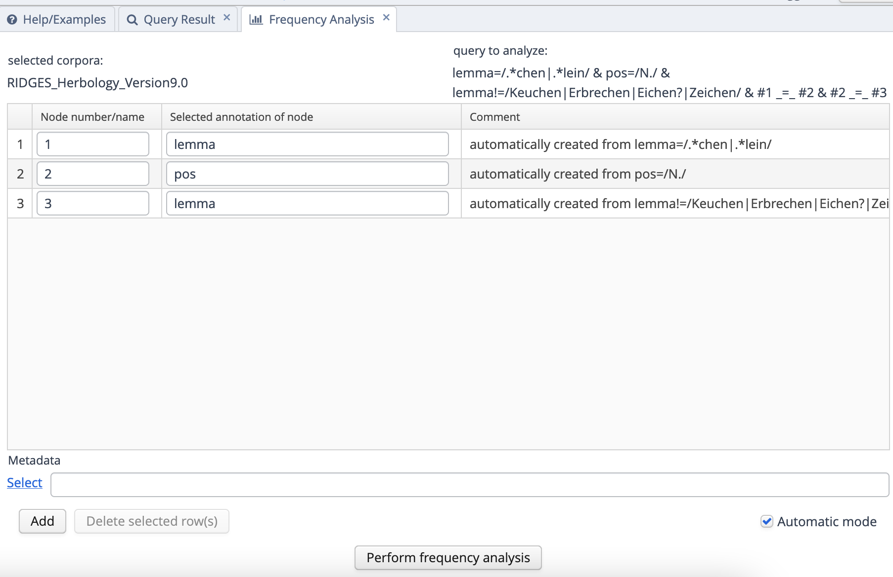
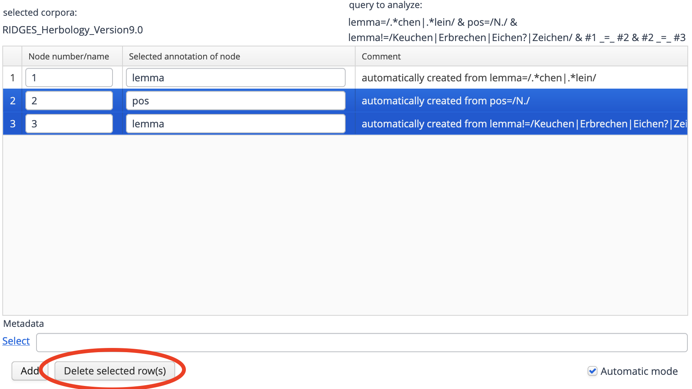
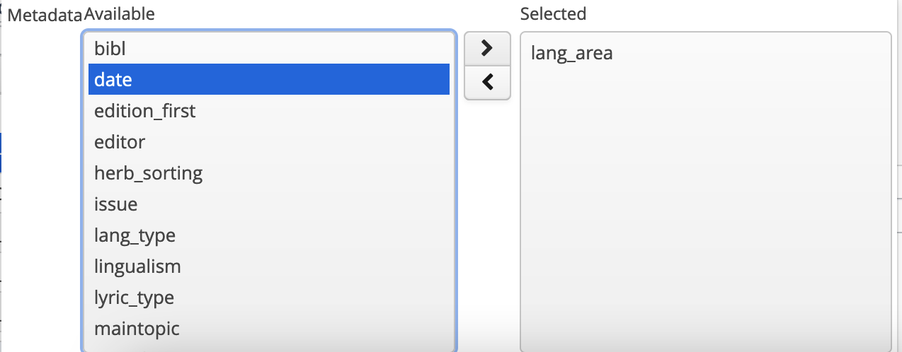
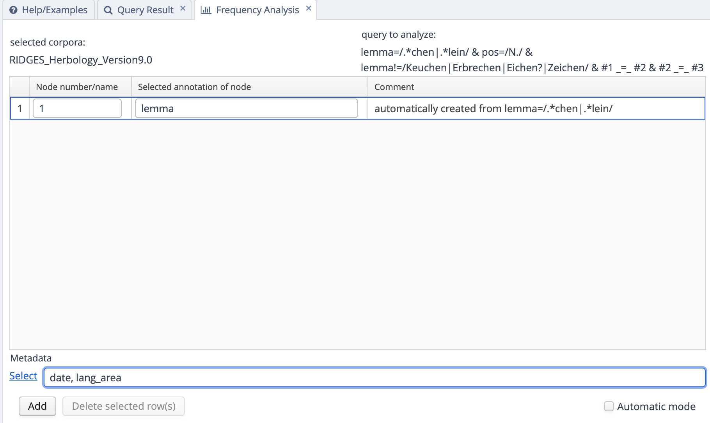
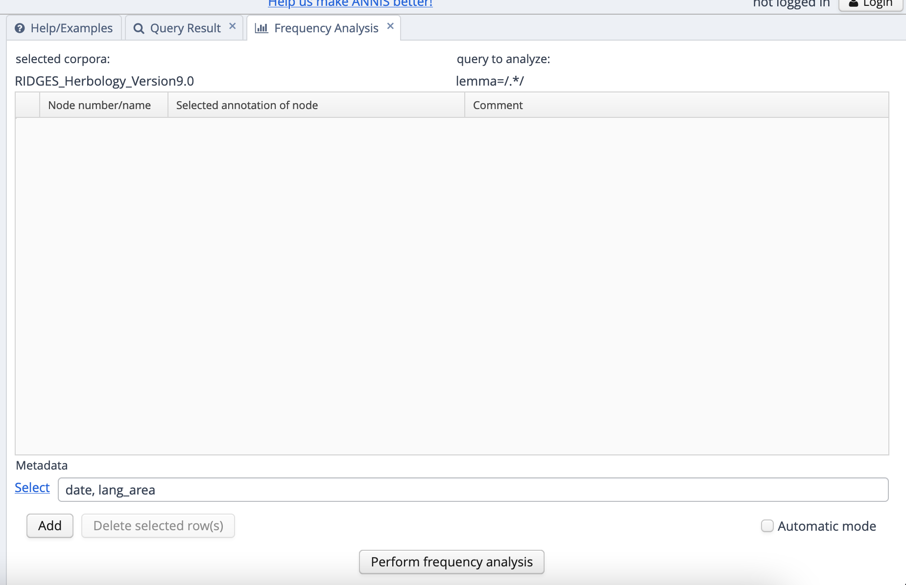
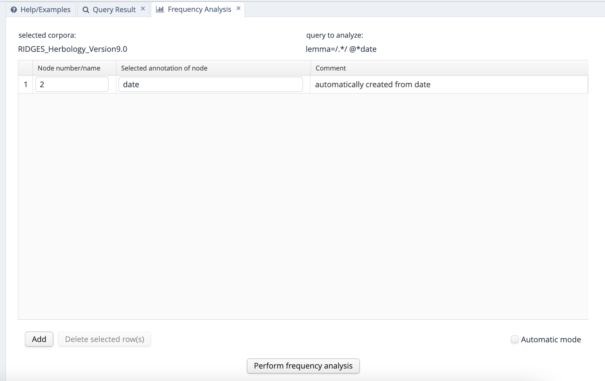

```{r setup, include=FALSE}
knitr::opts_chunk$set(echo = TRUE)
```


# Frequenzanalyse

Neben den in den vorherigen Kapiteln dargestellten Such- und Exportfunktionen bietet ANNIS auch die bereits in Abschnitt 2 illustrierte Möglichkeit, Frequenzanalysen durchzuführen, also die Suchergebnisse auszuzählen. Bleiben wir bei unserem Beispiel der Diminutive: Angenommen, wir wollen wissen, welche Diminutive wie häufig in welchem Zeitschnitt und in welchem Sprachraum vorkommen. Um das herauszufinden, können wir unter dem Suchfenster auf den Button "More" und dann auf "Frequency Analysis" klicken. 


```{r freqanal, echo = FALSE, out.width = '80%', out.height = '80%', fig.cap="Frequenzanalyse-Button unter dem Suchfenster"}

```

Es öffnet sich nun ein Fenster, in dem wir auswählen können, wonach wir auszählen wollen. Voreingestellt sind hier die Annotationsebenen, die wir in unserer Suchanfrage benutzt haben. Das führt dazu, dass "lemma" hier doppelt auftaucht, weil wir ja zweimal "lemma" in unserer Suchanfrage benutzt haben (einmal, um die Wörter zu finden, die auf *-chen* oder *-lein* enden, einmal, um die häufigsten Fehltreffer auszuschließen).


```{r freqauto, echo = FALSE, out.width = '80%', out.height = '80%', fig.cap="Automatisch voreingestellte Suchoptionen"}

```

Aber natürlich können wir die Suchoptionen anpassen. Wir löschen zunächst "pos" und das zweite "lemma", indem wir sie anklicken (die Zeile wird dann blau markiert) und "Delete selected rows" auswählen.

```{r deleteselrow, echo = FALSE, out.width = '80%', out.height = '80%', fig.cap="Button \"Delete selected rows\""}

```

Während wir im oberen Teil des Suchfensters die **Annotationen** angeben können, nach denen wir auszählen können, besteht im unteren Teil die Möglichkeit, **Metadaten** anzugeben, nach denen wir die Daten auswerten möchten - also zum Beispiel Zeitschnitt, Sprachraum oder auch Textsorte. Wie bereits erwähnt interessieren wir uns zunächst für die beiden erstgenannten Aspekte. 

**Wichtiger Hinweis**: In der neuesten Version von ANNIS ist die Frequenzanalyse nicht mehr nach Annotationen und Metadaten getrennt! Derzeit ist diese Version noch nicht auf dem Berliner Server implementiert, auf dem RIDGES online verfügbar ist, aber ich gehe davon aus, dass das in naher Zukunft der Fall sein wird. Noch funktioniert die Analyse so wie unten beschrieben. In der Zukunft kann es jedoch sein, dass Sie den weiter unten in Fig. \@ref(fig:fullfreqanal2) dargestellten Weg wählen müssen.

Wenn wir auf den "Select"-Button neben der Metadaten-Zeile klicken, sehen wir eine Liste an im Korpus vorhandenen Metadaten, aus denen wir auswählen können. Mit den beiden Buttons mit den Pfeilen nach rechts und links können wir die entsprechende Metadatenebene in unsere Analyseanfrage hinzufügen (Pfeil nach rechts) oder sie wieder entfernen (Pfeil nach links).


```{r selectmetadata, echo = FALSE, out.width = '80%', out.height = '80%', fig.cap="Metadaten auswählen"}

```

Wir wählen "date" und "lang_area" aus, um Jahr und Sprachraum zu erhalten. Die finale Anfrage sieht dann so aus:


```{r finalesuchanfrage, echo = FALSE, out.width = '80%', out.height = '80%', fig.cap="So sieht die finale Analyseanfrage aus"}

```

Auf der Ergebnisseite wird zunächst ein Balkendiagramm angezeigt, das allerdings für unsere Zwecke wenig aussagekräftig ist (diese Visualisierungsform kann ganz sinnvoll sein, wenn man nur nach einer Dimension auswertet, also z.B. nach Zeitschnitt - aber auch dann muss man aufpassen, wie valide die Darstellung ist, da ANNIS absolute Frequenzen anzeigt und die Grundgesamtheit sich bei vielen Korpora zwischen einzelnen Zeitschnitten unterscheidet.) In den meisten Fällen brauchen wir das Balkendiagramm daher nicht weiter zu beachten und sollten stattdessen mit der Frequenzliste arbeiten, die wir unterhalb des Balkendiagramms sehen. Diese Frequenzliste können wir mit dem "Download as CSV"-Button auch herunterladen, um sie z.B. in Excel weiter auszuwerten. 

Das bietet im Idealfall auch die Möglichkeit, verschiedene Frequenzauswertungen zusammenzuführen. So könnten wir zum Beispiel, um die Grundgesamtheiten für die einzelnen Kombinationen aus Sprachraum und Jahr zu bekommen, alle (lemmatisierten) Tokens im Korpus auszählen, und zwar mit der Suchanfrage

[`lemma=/.*/`](https://korpling.german.hu-berlin.de/annis3/?id=9914947c-b110-4e43-b44d-340c77f53a5b)

Auch hier können wir wieder auf More > Frequency Analysis gehen. Beachten Sie, dass wir erst auf "New Analysis" klicken müssen, um eine neue Frequenzanalyse zu initiieren! Diesmal lassen wir den oberen Teil des Anfragefensters leer, indem wir die entsprechende Zeile (mit "lemma") löschen und nur nach Jahr und Sprachraum auszählen:

```{r fullfreqanal, echo = FALSE, out.width = '80%', out.height = '80%', fig.cap="Suchanfrage für die Grundgesamtheiten in jeder Kombination aus Jahr und Sprachraum"}

```

Da dabei sehr große Datenmengen verarbeitet werden, ist diese Anfrage leider zu aufwendig, um sie über die Server-Version von ANNIS durchzuführen (es kommt regelmäßig zu Timeouts), aber glücklicherweise gibt es die Möglichkeit, sowohl ANNIS als auch das RIDGES-Korpus herunterzuladen und sich so in nur wenigen Minuten in die Lage zu versetzen, das Korpus offline zu nutzen. Wenn Sie diesen Weg gehen wollen, lesen Sie den nächsten Abschnitt - ansonsten können Sie auch mit der von mir generierten Frequenzliste [hier](https://github.com/empirical-linguistics/einfache-korpusrecherchen-annis/blob/master/docs/tables/frequency_year.txt) arbeiten und den Abschnitt überspringen.


## RIDGES offline verwenden

Um die ANNIS-Version von Ridges offline zu verwenden, müssen Sie zunächst [hier](https://corpus-tools.org/annis/) ANNIS herunterladen. Anschließend laden Sie über das Repositorium [LAUDATIO](https://www.laudatio-repository.org/browse/corpus/PySSCnMB7CArCQ9CNKFY/corpora) die ANNIS-Version von Ridges herunter. Bitte beachten Sie, dass Sie die heruntergeladene zip-Datei entpacken müssen - sie enthält wiederum mehrere Zip-Dateien, die jeweils eine RIDGES-Version enthalten, deren aktuellste die Version 9.0 ist. Diese müssen Sie nicht entpacken. Vielmehr können Sie die heruntergeladene Desktop-Version von ANNIS öffnen und mit Klick auf "Administration" oben links ins Administrationsinterface gelangen, wo Sie auf den Button "Upload ZIP file with relANNIS corpus and start import" klicken können. Dann wählen Sie den zip-Ordner Annis_9-0.zip im eben heruntergeladenen und entpackten Ridges-Ordner aus. Der Import dauert nun einige Minuten. Dann können wir die Frequenzanalyse erneut durchführen; wenn Sie die neueste Version von ANNIS heruntergeladen haben, müssen Sie die Frequenzanlayse, wie oben bereits angedeutet, ein wenig anpassen, weil nach Metadaten in der aktuellen Version einfach im gleichen Fenster gefiltert wird wie nach Annotationen; **wichtig**: die Suche nach dem Metadatum "date" muss außerdem direkt in der Suchanfrage erfolgen, d.h. die Suchanfrage muss lauten `lemma=/.*/ @*date`. (`@*` ist in der aktuellen ANNIS-Version der neue Operator zur Suche nach Metadaten; in vorherigen Versionen war das `meta::`.)

```{r fullfreqanal2, echo = FALSE, out.width = '80%', out.height = '80%', fig.cap="Suchanfrage für die Grundgesamtheiten in jeder Kombination aus Jahr und Sprachraum im neuen Frequenzanalyse-Interface"}

```

Et voilà, die Frequenzen sind da und können nun auch heruntergeladen werden.


## Frequenzlisten kombinieren

Die Frequenzlisten zu kombinieren, ist leider in Tabellenkalkulationsprogrammen wie Excel nicht ohne weiteres möglich (obwohl es dafür Optionen zu geben scheint). Hier zeige ich, wie man das Ganze relativ einfach im Programm [R](https://www.r-project.org/) machen kann:

```{r, message = FALSE}

a <- read.csv("docs/tables/frequency_year.txt", sep = "\t", quote = "")
b <- read.csv("docs/tables/frequency.txt", sep = "\t", quote = "")
both <- merge(a, b, by.y = "meta.date", by.x = "X.2.date")
head(both, 10)

```

Wie wir sehen, haben wir jetzt eine Tabelle, in der die Gesamtfrequenzen und die Frequenzen der Diminutive kombiniert sind, sodass wir z.B. auch die relative Frequenz pro Million Wörtern ausrechnen können:

```{r, message = FALSE}

# relative Frequenz
both$rel <- (both$count.y / both$count.x) * 1e6 #1e6 = 1x10 hoch 6 = 1 Million

# absteigend nach relativer Frequenz sortieren
both <- both[order(both$rel, decreasing = T),]


```

```{r, echo = FALSE}

# ausgeben
kableExtra::scroll_box(kableExtra::kable(both),
                       height = "400px",
                       box_css = "border: 1px solid #ddd; padding: 5px; ",
                       extra_css = NULL,
  fixed_thead = TRUE)

```

Wenn man nicht in R weiterarbeiten möchte (z.B. weil man nicht allzu vertraut damit ist), kann man das Ganze auch exportieren, z.B. mit

```{r, eval = FALSE}

write.csv(both, "both.csv")

```

Man erhält dann eine CSV-Datei, die man wiederum in Excel importieren kann. Näheres zum Import in Tabellenkalkulationsprogramme finden Sie in [diesem Tutorial](https://empirical-linguistics.github.io/ems/datenaufbereitung/index.html), einen (relativ) schnellen Einstieg in R bietet [dieses Tutorial](https://hartmast.github.io/sprachgeschichte/begleitmaterial/07-Schnelleinstieg%20in%20R.pdf).


## Schlusswort

Zusammenfassend lässt sich also sagen, dass ANNIS ein sehr mächtiges Tool ist, das sich insbesondere für das Durchsuchen von Korpora mit Mehrebenenannotation eignet. Es ist jedoch keineswegs eine "Catch-all"-Lösung für sämtliche korpuslinguistischen Anforderungen -- das kann und will es auch gar nicht sein. Wer wirklich eingehende quantitative Analysen vornehmen möchte, wird daher nicht umhinkommen, sich etwas tiefer auch mit anderen Tools zu beschäftigen. Wie dieses Tutorial gezeigt hat, ist auch die ständige Weiterentwicklung von ANNIS Segen und Fluch zugleich -- einerseits ist es sehr zu begrüßen, dass das Tool im Gegensatz zu vielen anderen nicht-kommerziellen Korpustools ständig weiterentwickelt und modernisiert wird; andererseits kann es gerade für Anfänger\*innen etwas abschreckend sein, mit einem dynamisch sich entwickelnden Tool zu arbeiten, bei dem Tutorials wie dieses schnell veraltet sind und sich teilweise auch Inkompatibilitäten in den Suchanfragen verschiedener Versionen ergeben (ich nenne das den Python2/Python3-Effekt). Das ist keinswegs als Kritik an ANNIS zu verstehen, weil es für solche Änderungen ja immer gute Gründe gibt. Als Nutzer\*innen überfordert uns so etwas manchmal -- vielleicht auch wegen eines Phänomens, das der Kolumnist Sascha Lobo einmal sehr treffend als ["Funktionierfetisch"](https://www.spiegel.de/netzwelt/netzpolitik/digitalisierungsdrama-in-deutschland-hauptsache-es-funktioniert-fuer-mich-kolumne-a-679a1db0-d295-46ab-ad7f-fd7191d4efa9) beschrieben hat. Gerade in der Korpuslinguistik müssen wir uns von diesem "Funktionierfetisch" ein Stückweit verabschieden und uns auch klarmachen, dass es -- unter anderem aufgrund der doch recht unterschiedlichen Herangehensweisen, die unterschiedliche Fragestellungen erfordern -- nicht das eine Tool für alles gibt, sondern wir uns im Zweifelsfall auch in eine ganze Reihe digitaler Werkzeuge einarbeiten müssen, um unsere Forschungsfragen adäquat beantworten zu können.
