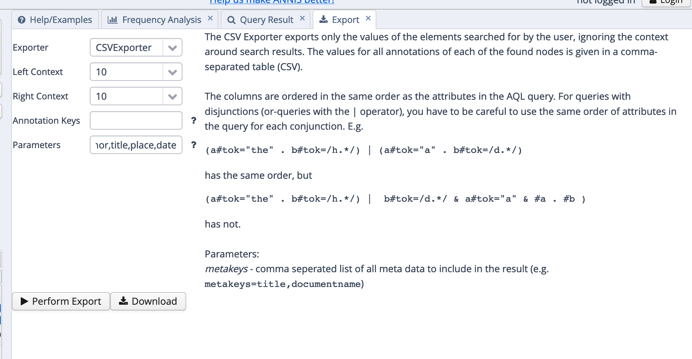
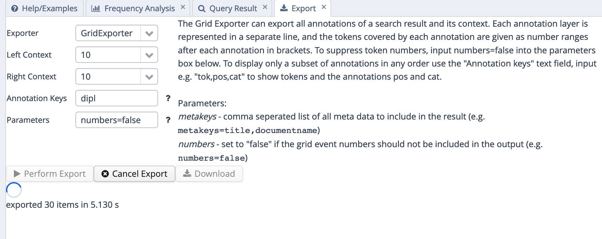

# Export

Obwohl ANNIS eine ganze Reihe von Exportern bietet, ist der Export von Konkordanzen einer der problematischsten Aspekte bei diesem Tool. Das liegt daran, dass ANNIS tatsächlich eher als Such- und Visualisierungstool gedacht ist. Dahinter steht der Gedanke, dass Annotationen jeglicher Art im Idealfall am besten über spezifische Annotationstools im Korpus selbst vorgenommen werden sollten. De facto ist es aber so, dass es gerade in der Lehre und oft auch bei kleineren Fallstudien in der Forschung praktikabler ist, mit sog. Konkordanzen zu arbeiten, also mit Belegsammlungen, die das jeweilige Keyword im Kontext anzeigen. Deshalb spricht man hier auch von KWIC-Konkordanzen (für "Key Word In Context"). 

In der aktuellen Version von ANNIS gibt es mit dem TextColumnExporter einen Exporter, der genau solche KWIC-Konkordanzen exportiert. Er hat jedoch drei Nachteile:

- Er exportiert Metadaten (wie Dokument, Jahr usw.) nicht bzw. nur sehr unzuverlässig.
- Er funktioniert - ganz vereinfacht gesagt - nur, wenn eine ganz bestimmte (Default-)Ebene genutzt wird, die aber bei manchen Korpora bewusst leer gelassen wird. Das ist bspw. beim Referenzkorpus Mittelhochdeutsch der Fall, aber offenbar auch bei RIDGES: Wenn wir versuchen, die Belege mit Hilfe dieses Exporters zu exportieren, erhalten wir eine leere Liste.
- Da er erst in neueren Versionen von ANNIS hinzugekommen ist, ist er bei einigen ANNIS-Instanzen, die sich noch auf ältere Versionen stützen, (noch) nicht verfügbar. So gibt es in der Bochumer ANNIS-Instanz, über die das Referenzkorpus Mittelhochdeutsch verfügbar ist, noch keinen TextColumnExporter.

Der zweite Nachteil gilt übrigens auch für eine Reihe anderer Exporter, etwa den SimpleTextExporter, der bei RIDGES ebenfalls nur eine leere Liste generiert.

Wenn wir dennoch eine KWIC-Konkordanz mit zusätzlichen Metadaten exportieren möchten, müssen wir uns daher mit einem Trick behelfen: Wir kombinieren einfach den Output von zwei Exportern, und zwar

- dem CSV-Exporter, der nur das Keyword mit seinen jeweiligen Annotationen exportiert und über den man auch relativ zuverlässig Metadaten exportieren kann;
- dem Grid-Exporter, der auch den Kontext mit ausgibt, bei dem aber nicht ohne weiteres zu erkennen ist, welches Wort das Keyword ist. Auch die Metadaten kann man hier mit ausgeben lassen, aber es ist einfacher, sie über den CSV-Exporter zu exportieren.


## Export mit CSV- und Grid-Exporter

Den CSV-Exporter konfigurieren wir so, dass zusätzlich zum Keyword und seinen Annotationen noch die Metadaten für Dokument, Autor/in, Titel, Ort und Zeit (*date*) angegeben werden. Dafür tragen wir `metakeys=doc,author,title,place,date` ins *parameters*-Feld ein, wie in \@ref(fig:csvexpconfig) dargestellt.

<div class="figure">

<p class="caption">(\#fig:csvexpconfig)CSV-Exporter in ANNIS</p>
</div>

Wir erhalten nun ein Textdokument, das wir in einem Texteditor wie Notepad++ (Windows) oder BBEdit (Mac) öffnen und in eine Excel- oder Calc-Tabelle copy&pasten können. In den meisten Fällen klappt das reibungslos, ohne dass wir über den Textimport-Assistenten nachjustieren müssen; falls der Import doch nicht einwandfrei klappt, können wir uns grundsätzlich an den in [diesem](https://empirical-linguistics.github.io/korpus-schnelleinstieg/von-der-fragestellung-zur-konkordanz.html#import-in-ein-tabellenkalkulationsprogramm) Tutorial gegebenen Anleitungen orientieren, nur dass wir es in diesem Fall nicht mit einer komma-, sondern mit einer tabseparierten Datei zu tun haben und das im Textimport-Assistenten entsprechend angeben müssen. \@ref(fig:importexcel) zeigt, wie man die passenden Einstellungen im Textimport-Assistenten vornimmt.

<div class="figure">

<p class="caption">(\#fig:importexcel)CSV-Export in Excel kopieren</p>
</div>

Nun haben wir also eine Tabelle, die das Keyword, seine Annotationen und die Metadaten enthält, aber noch keinen Kontext. Der Kontext ist aber in vielen Fällen sehr wichtig - gerade, wenn wir die Konkordanz mit zusätzlichen, manuellen Annotationen ergänzen wollen. Beispielsweise könnte es bei der Untersuchung von Diminutiven spannend sein, zu schauen, was genau diminuiert wird - Bezeichnungen für Menschen, Tiere, Objekte? Und hier brauchen wir den Kontext, um zu sehen, ob bspw. *Weibchen* sich auf ein weibliches Tier oder auf eine Frau bezieht. Im Gegenwartsdeutschen wäre die letztere Lesart zwar nicht mehr wirklich denkbar, aber gerade bei historischen Daten kann man sich oft nicht auf die muttersprachliche Intuition verlassen, weshalb der Kontext umso wichtiger ist, um verschiedene mögliche Bedeutungsvarianten zu desambiguieren.

Hier kommt nun der GridExporter ins Spiel. Da wir in der gerade generierten Tabelle fast alle Informationen, die uns interessieren, schon haben, nur eben nicht den Kontext, konfigurieren wir den GridExporter so, dass er uns nur die normalisierte Transkriptionsebene ("norm") ausgibt und sonst nichts. Dafür tragen wir, wie in \@ref(fig:gridexportoptions) gezeigt, `norm` ins "Annotation Keys"-Feld ein und `numbers=false` ins *Parameters*-Feld. Letzteres verhindert, dass nach jedem Token Zahlen in eckigen Klammern angegeben werden, deren Funktion an dieser Stelle nicht allzu interessant ist.


<div class="figure">

<p class="caption">(\#fig:gridexportoptions)CSV-Export in Excel kopieren</p>
</div>

Nun können wir die Daten aus dem GridExporter wiederum in einem Texteditor wie Notepad++ oder BBEdit öffnen und in die existierende Excel-Tabelle kopieren, wie in \@ref(fig:gridtoexcel) gezeigt. Dafür müssen wir zunächst die leeren Zeilen entfernen, indem wir im Texteditor `^\n` durch nichts ersetzen. ^ ist ein regulärer Ausdruck, der für den Anfang (hier: Zeilenanfang) steht, während \\n für einen Zeilenumbruch steht. Zusammengenommen sucht dieser reguläre Ausdruck also nach Zeilen, in denen ein Zeilenumbruch direkt am Zeilenanfang steht, ergo: nach leeren Zeilen. Auch dies ist in \@ref(fig:gridtoexcel) dargestellt.

<div class="figure">

<p class="caption">(\#fig:gridtoexcel)CSV-Export in Excel kopieren</p>
</div>

Et voilà, nun haben wir uns eine (halbwegs) schöne KWIC-Tabelle gebastelt, soweit die begrenzten Exportmöglichkeiten von ANNIS dies zulassen. 

Gegenüber anderen KWIC-Tabellen hat das so erstellte Spreadsheet aber den Nachteil, dass das Keyword nicht in einer eigenen Spalte steht und somit nicht ohne weiteres zu erkennen ist. Auch hier können wir uns aber mit einem Trick behelfen, um es wenigstens hervorzuheben.


## Keyword hervorheben mit einem Excel-Makro

Eines vorab: Der folgende Trick funktioniert nur in Microsoft Excel (nicht in LibreOffice Calc) - und auch dort nur, wenn Makros aktiviert sind. Dafür brauchen Sie Administratorrechte, die Sie auf vielen Arbeitsplatz-PCs standardmäßig nicht haben. Unter Windows müssen Sie ggf. zunächst die [Office-Entwicklertools](https://support.microsoft.com/de-de/office/anzeigen-der-registerkarte-entwicklertools-e1192344-5e56-4d45-931b-e5fd9bea2d45) aktivieren, bevor Sie mit Makros arbeiten können - mit einer schnellen Internet-Suche können Sie relativ einfach herausfinden, wie genau Sie in Ihrer Office-Version Makros aktivieren können, wenn sie noch nicht aktiviert sind.

Beachten Sie bitte, dass Makros ein Sicherheitsrisiko darstellen können. Verwenden Sie daher immer nur Makros aus vertrauenswürdigen Quellen oder solche, die Sie selbst aufgezeichnet bzw. programmiert haben!

Makros kann man auf unterschiedliche Art und Weise erstellen: Auf der einen Seite kann man eine Tätigkeit, die man in einem Office-Programm ausführt, "aufzeichnen", um sie dann automatisiert immer wieder ausführen zu können. Auf der anderen Seite kann man mit Hilfe der VisualBasic-Programmiersprache (VBA) komplexere Makros programmieren. Letzteres wollen wir nun tun. (Disclaimer: Ich habe wenig Ahnung von VBA und habe Frankenstein-mäßig Codebausteine aus unterschiedlichen Quellen zusammengesetzt, z.B. von [hier](https://www.mrexcel.com/board/threads/conditional-formatting-highlight-only-certain-words-in-cell-text.455752/). Aber hey, es funktioniert!)

Um ein Makro zu erstellen, das die in der Lemma-Spalte angegebenen Strings in der KWIC-Spalte erkennt und hervorhebt, copy&pasten Sie einfach den folgenden Code in das VBA-Makro-Fenster und führen Sie das Makro aus.
 
 

```polyglot

Sub highlightwords()
  Dim rCell As Range
  Dim lPos As Long, lComp As Long, lLngth As Long
  Dim sCell As String
  Dim sTxt As String
 
  Const bCase As Boolean = False  '<- True, wenn Groß- und Kleinschreibung beachtet werden soll
  
  'Anzahl der Zeilen bestimmen - es ist egal, welche Spalte wir hier nehmen,
  'solange sie nicht leer ist.
  k = Cells(Rows.Count, "O").End(xlUp).Row
  
  Application.ScreenUpdating = False
  lComp = 1 + bCase
  

  Columns("C").Font.ColorIndex = 1
  For Counter = 1 To k
  
  'Wenn das Keyword bei Ihnen in einer anderen Spalte als der dritten steht,
  'dann setzten Sie bitte hier die passende Zahl ein:
  
  Set curCell1 = Worksheets("Sheet1").Cells(Counter, 3)
  
  'Wenn der KWIC-Text bei Ihnen in einer anderen Spalte als der fünfzehnten steht,
  'dann setzten Sie bitte hier die passende Zahl ein:
  Set curCell2 = Worksheets("Sheet1").Cells(Counter, 15)
  sTxt = curCell1.Value
  lLngth = Len(sTxt)
  With curCell2
    .Font.ColorIndex = 1
    sCell = .Text
    lPos = InStr(1, sCell, sTxt, lComp)
      Do Until lPos = 0
        .Characters(lPos, lLngth).Font.ColorIndex = 5
        lPos = InStr(lPos + lLngth, sCell, sTxt, lComp)
      Loop
    End With
    Next Counter
  Application.ScreenUpdating = True
End Sub

```

Das Makro sucht Strings aus einer Spalte (hier: der dritten) in einer anderen Spalte (hier: der fünfzehnten) und hebt sie dort hervor. Natürlich können Sie das Makro so anpassen, dass auch andere Spalten als Quell- bzw. Zielspalten dienen und es somit flexibel für Ihre eigenen Zwecke einsetzen, auch solche, die gar nichts mit ANNIS zu tun haben. Im Idealfall sollte das genauso einfach funktionieren wie in \@ref(fig:excelmacros) dargestellt.


<div class="figure">

<p class="caption">(\#fig:excelmacros)Makro in VBA-Editor kopieren und ausführen</p>
</div>

Nun haben wir eine KWIC-Konkodranz, mit der wir gut weiterarbeiten können und die wir z.B. mit weiteren Annotationsspalten ergänzen können.

Das alles ist natürlich nur eine Behelfsmaßnahme: Wer sich mit Programmiersprachen, regulären Ausdrücken usw. auskennt, kann weitaus bessere Ergebnisse auf anderen Wegen effizienter erzielen. Zum Beispiel kann man erfreulicherweise sehr viele der über die diversen ANNIS-Instanzen verfügbaren Korpora auch herunterladen, z.B. über das [LAUDATIO-Repository](www.laudatio-repository.org/), und offline mit den Tools, mit denen man sich auskennt, durchsuchen. Aber denjenigen, die nur einmalig eine kleine Studie auf Grundlage von ANNIS-Exportdateien machen möchten, habe ich hiermit hoffentlich eine halbwegs nützliche Schritt-für-Schritt-Anleitung gegeben, die sich auch ohne tiefergehende Technikkenntnisse umsetzen lässt.
