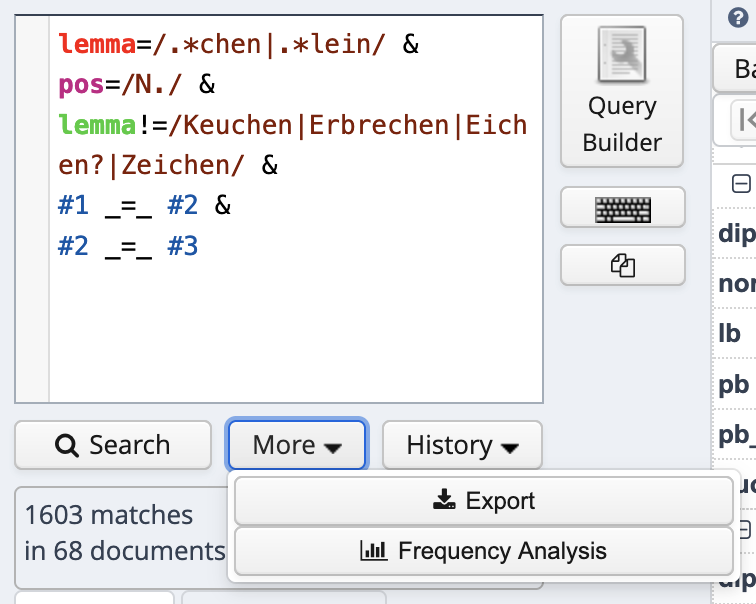
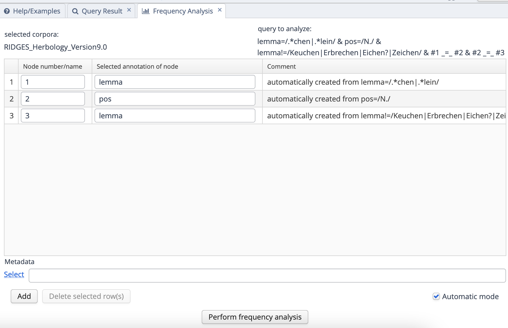
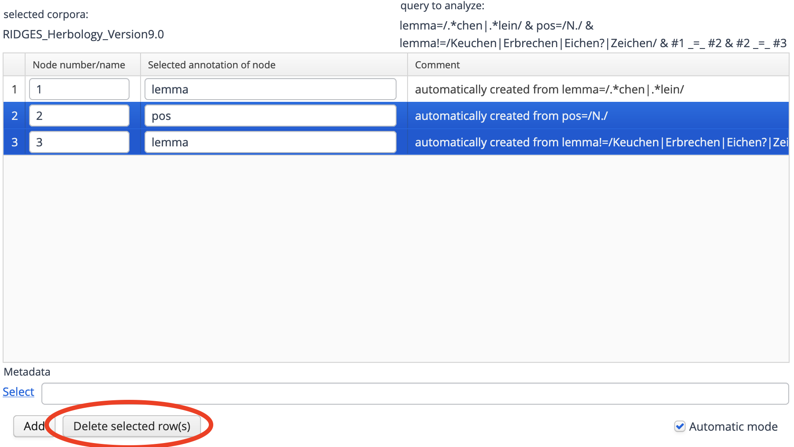
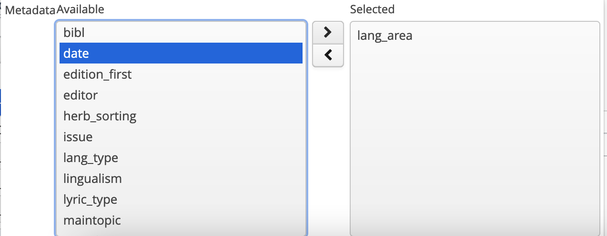
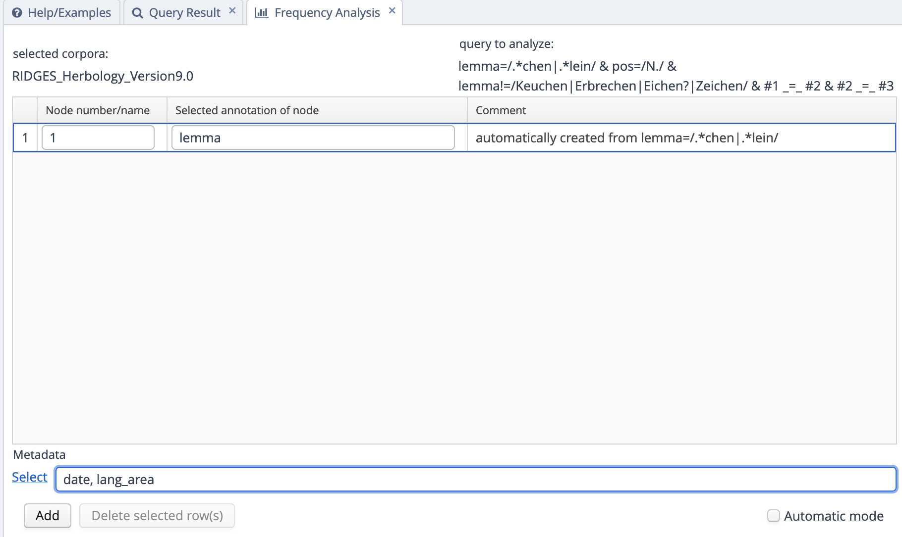
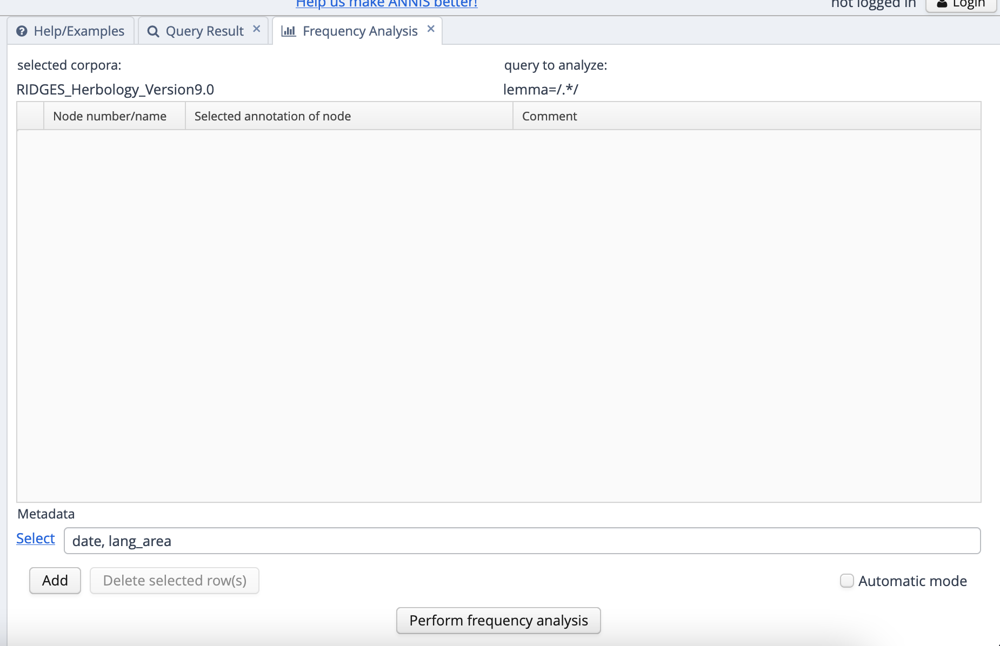
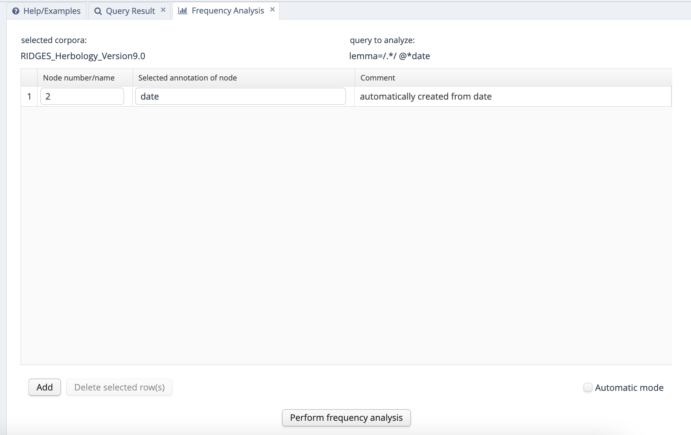

# Frequenzanalyse

Neben den in den vorherigen Kapiteln dargestellten Such- und Exportfunktionen bietet ANNIS auch die bereits in Abschnitt 2 illustrierte Möglichkeit, Frequenzanalysen durchzuführen, also die Suchergebnisse auszuzählen. Bleiben wir bei unserem Beispiel der Diminutive: Angenommen, wir wollen wissen, welche Diminutive wie häufig in welchem Zeitschnitt und in welchem Sprachraum vorkommen. 

## Frequenzanalyse im ANNIS-Online-Interface

Um das herauszufinden, können wir unter dem Suchfenster auf den Button "More" und dann auf "Frequency Analysis" klicken. 


<div class="figure">

<p class="caption">(\#fig:freqanal)Frequenzanalyse-Button unter dem Suchfenster</p>
</div>

Es öffnet sich nun ein Fenster, in dem wir auswählen können, wonach wir auszählen wollen. Voreingestellt sind hier die Annotationsebenen, die wir in unserer Suchanfrage benutzt haben. Das führt dazu, dass "lemma" hier doppelt auftaucht, weil wir ja zweimal "lemma" in unserer Suchanfrage benutzt haben (einmal, um die Wörter zu finden, die auf *-chen* oder *-lein* enden, einmal, um die häufigsten Fehltreffer auszuschließen).


<div class="figure">

<p class="caption">(\#fig:freqauto)Automatisch voreingestellte Suchoptionen</p>
</div>

Aber natürlich können wir die Suchoptionen anpassen. Wir löschen zunächst "pos" und das zweite "lemma", indem wir sie anklicken (die Zeile wird dann blau markiert) und "Delete selected rows" auswählen.

<div class="figure">

<p class="caption">(\#fig:deleteselrow)Button "Delete selected rows"</p>
</div>

Während wir im oberen Teil des Suchfensters die **Annotationen** angeben können, nach denen wir auszählen können, besteht im unteren Teil die Möglichkeit, **Metadaten** anzugeben, nach denen wir die Daten auswerten möchten - also zum Beispiel Zeitschnitt, Sprachraum oder auch Textsorte. Wie bereits erwähnt interessieren wir uns zunächst für die beiden erstgenannten Aspekte. 

**Wichtiger Hinweis**: In der neuesten Version von ANNIS ist die Frequenzanalyse nicht mehr nach Annotationen und Metadaten getrennt! Derzeit ist diese Version noch nicht auf dem Berliner Server implementiert, auf dem RIDGES online verfügbar ist, aber ich gehe davon aus, dass das in naher Zukunft der Fall sein wird. Noch funktioniert die Analyse so wie unten beschrieben. In der Zukunft kann es jedoch sein, dass Sie den weiter unten in Fig. \@ref(fig:fullfreqanal2) dargestellten Weg wählen müssen.

Wenn wir auf den "Select"-Button neben der Metadaten-Zeile klicken, sehen wir eine Liste an im Korpus vorhandenen Metadaten, aus denen wir auswählen können. Mit den beiden Buttons mit den Pfeilen nach rechts und links können wir die entsprechende Metadatenebene in unsere Analyseanfrage hinzufügen (Pfeil nach rechts) oder sie wieder entfernen (Pfeil nach links).


<div class="figure">

<p class="caption">(\#fig:selectmetadata)Metadaten auswählen</p>
</div>

Wir wählen "date" und "lang_area" aus, um Jahr und Sprachraum zu erhalten. Die finale Anfrage sieht dann so aus:


<div class="figure">

<p class="caption">(\#fig:finalesuchanfrage)So sieht die finale Analyseanfrage aus</p>
</div>

Auf der Ergebnisseite wird zunächst ein Balkendiagramm angezeigt, das allerdings für unsere Zwecke wenig aussagekräftig ist (diese Visualisierungsform kann ganz sinnvoll sein, wenn man nur nach einer Dimension auswertet, also z.B. nach Zeitschnitt - aber auch dann muss man aufpassen, wie valide die Darstellung ist, da ANNIS absolute Frequenzen anzeigt und die Grundgesamtheit sich bei vielen Korpora zwischen einzelnen Zeitschnitten unterscheidet.) In den meisten Fällen brauchen wir das Balkendiagramm daher nicht weiter zu beachten und sollten stattdessen mit der Frequenzliste arbeiten, die wir unterhalb des Balkendiagramms sehen. Diese Frequenzliste können wir mit dem "Download as CSV"-Button auch herunterladen, um sie z.B. in Excel weiter auszuwerten. 

Das bietet im Idealfall auch die Möglichkeit, verschiedene Frequenzauswertungen zusammenzuführen. So könnten wir zum Beispiel, um die Grundgesamtheiten für die einzelnen Kombinationen aus Sprachraum und Jahr zu bekommen, alle (lemmatisierten) Tokens im Korpus auszählen, und zwar mit der Suchanfrage

[`lemma=/.*/`](https://korpling.german.hu-berlin.de/annis3/?id=9914947c-b110-4e43-b44d-340c77f53a5b)

Auch hier können wir wieder auf More > Frequency Analysis gehen. Beachten Sie, dass wir erst auf "New Analysis" klicken müssen, um eine neue Frequenzanalyse zu initiieren! Diesmal lassen wir den oberen Teil des Anfragefensters leer, indem wir die entsprechende Zeile (mit "lemma") löschen und nur nach Jahr und Sprachraum auszählen:

<div class="figure">

<p class="caption">(\#fig:fullfreqanal)Suchanfrage für die Grundgesamtheiten in jeder Kombination aus Jahr und Sprachraum</p>
</div>

Da dabei sehr große Datenmengen verarbeitet werden, ist diese Anfrage leider zu aufwendig, um sie über die Server-Version von ANNIS durchzuführen (es kommt regelmäßig zu Timeouts), aber glücklicherweise gibt es die Möglichkeit, sowohl ANNIS als auch das RIDGES-Korpus herunterzuladen und sich so in nur wenigen Minuten in die Lage zu versetzen, das Korpus offline zu nutzen. Wenn Sie diesen Weg gehen wollen, lesen Sie den nächsten Abschnitt - ansonsten können Sie auch mit der von mir generierten Frequenzliste [hier](https://github.com/empirical-linguistics/einfache-korpusrecherchen-annis/blob/master/docs/tables/frequency_year.txt) arbeiten und den Abschnitt überspringen.


## RIDGES offline verwenden

Um die ANNIS-Version von Ridges offline zu verwenden, müssen Sie zunächst [hier](https://corpus-tools.org/annis/) ANNIS herunterladen. Anschließend laden Sie über das Repositorium [LAUDATIO](https://www.laudatio-repository.org/browse/corpus/PySSCnMB7CArCQ9CNKFY/corpora) die ANNIS-Version von Ridges herunter. Bitte beachten Sie, dass Sie die heruntergeladene zip-Datei entpacken müssen - sie enthält wiederum mehrere Zip-Dateien, die jeweils eine RIDGES-Version enthalten, deren aktuellste die Version 9.0 ist. Diese müssen Sie nicht entpacken. Vielmehr können Sie die heruntergeladene Desktop-Version von ANNIS öffnen und mit Klick auf "Administration" oben links ins Administrationsinterface gelangen, wo Sie auf den Button "Upload ZIP file with relANNIS corpus and start import" klicken können. Dann wählen Sie den zip-Ordner Annis_9-0.zip im eben heruntergeladenen und entpackten Ridges-Ordner aus. Der Import dauert nun einige Minuten. Dann können wir die Frequenzanalyse erneut durchführen; wenn Sie die neueste Version von ANNIS heruntergeladen haben, müssen Sie die Frequenzanlayse, wie oben bereits angedeutet, ein wenig anpassen, weil nach Metadaten in der aktuellen Version einfach im gleichen Fenster gefiltert wird wie nach Annotationen; **wichtig**: die Suche nach dem Metadatum "date" muss außerdem direkt in der Suchanfrage erfolgen, d.h. die Suchanfrage muss lauten `lemma=/.*/ @*date`. (`@*` ist in der aktuellen ANNIS-Version der neue Operator zur Suche nach Metadaten; in vorherigen Versionen war das `meta::`.)

<div class="figure">

<p class="caption">(\#fig:fullfreqanal2)Suchanfrage für die Grundgesamtheiten in jeder Kombination aus Jahr und Sprachraum im neuen Frequenzanalyse-Interface</p>
</div>

Et voilà, die Frequenzen sind da und können nun auch heruntergeladen werden.


## Frequenzlisten kombinieren

Die Frequenzlisten zu kombinieren, ist leider in Tabellenkalkulationsprogrammen wie Excel nicht ohne weiteres möglich (obwohl es dafür Optionen zu geben scheint). Hier zeige ich, wie man das Ganze relativ einfach im Programm [R](https://www.r-project.org/) machen kann:


```r
a <- read.csv("docs/tables/frequency_year.txt", sep = "\t", quote = "")
b <- read.csv("docs/tables/frequency.txt", sep = "\t", quote = "")
both <- merge(a, b, by.y = "meta.date", by.x = "X.2.date")
head(both, 10)
```

```
##    X.2.date count.x    X.1.lemma meta.lang_area count.y
## 1      1482    9942     Äderlein            obd       1
## 2      1482    9942    Kindelein            obd       1
## 3      1482    9942  Essenkochen            obd       1
## 4      1482    9942      Hütchen            obd       1
## 5      1482    9942     Unkochen            obd       1
## 6      1482    9942  Blätterlein            obd       1
## 7      1482    9942    Brüstlein            obd       2
## 8      1482    9942 Lache|Lachen            obd       1
## 9      1482    9942    Stücklein            obd       1
## 10     1482    9942     Hüttlein            obd       1
```

Wie wir sehen, haben wir jetzt eine Tabelle, in der die Gesamtfrequenzen und die Frequenzen der Diminutive kombiniert sind, sodass wir z.B. auch die relative Frequenz pro Million Wörtern ausrechnen können:


```r
# relative Frequenz
both$rel <- (both$count.y / both$count.x) * 1e6 #1e6 = 1x10 hoch 6 = 1 Million

# absteigend nach relativer Frequenz sortieren
both <- both[order(both$rel, decreasing = T),]
```

<div style="border: 1px solid #ddd; padding: 0px; overflow-y: scroll; height:400px; "><table>
 <thead>
  <tr>
   <th style="text-align:left;position: sticky; top:0; background-color: #FFFFFF;">   </th>
   <th style="text-align:right;position: sticky; top:0; background-color: #FFFFFF;"> X.2.date </th>
   <th style="text-align:right;position: sticky; top:0; background-color: #FFFFFF;"> count.x </th>
   <th style="text-align:left;position: sticky; top:0; background-color: #FFFFFF;"> X.1.lemma </th>
   <th style="text-align:left;position: sticky; top:0; background-color: #FFFFFF;"> meta.lang_area </th>
   <th style="text-align:right;position: sticky; top:0; background-color: #FFFFFF;"> count.y </th>
   <th style="text-align:right;position: sticky; top:0; background-color: #FFFFFF;"> rel </th>
  </tr>
 </thead>
<tbody>
  <tr>
   <td style="text-align:left;"> 132 </td>
   <td style="text-align:right;"> 1539 </td>
   <td style="text-align:right;"> 10037 </td>
   <td style="text-align:left;"> Peterlein </td>
   <td style="text-align:left;"> md </td>
   <td style="text-align:right;"> 25 </td>
   <td style="text-align:right;"> 2490.78410 </td>
  </tr>
  <tr>
   <td style="text-align:left;"> 591 </td>
   <td style="text-align:right;"> 1722 </td>
   <td style="text-align:right;"> 5983 </td>
   <td style="text-align:left;"> Quentchen </td>
   <td style="text-align:left;"> NA </td>
   <td style="text-align:right;"> 14 </td>
   <td style="text-align:right;"> 2339.96323 </td>
  </tr>
  <tr>
   <td style="text-align:left;"> 657 </td>
   <td style="text-align:right;"> 1769 </td>
   <td style="text-align:right;"> 7285 </td>
   <td style="text-align:left;"> Ährchen </td>
   <td style="text-align:left;"> NA </td>
   <td style="text-align:right;"> 14 </td>
   <td style="text-align:right;"> 1921.75704 </td>
  </tr>
  <tr>
   <td style="text-align:left;"> 560 </td>
   <td style="text-align:right;"> 1696 </td>
   <td style="text-align:right;"> 3658 </td>
   <td style="text-align:left;"> Quintlein </td>
   <td style="text-align:left;"> NA </td>
   <td style="text-align:right;"> 7 </td>
   <td style="text-align:right;"> 1913.61400 </td>
  </tr>
  <tr>
   <td style="text-align:left;"> 645 </td>
   <td style="text-align:right;"> 1764 </td>
   <td style="text-align:right;"> 6836 </td>
   <td style="text-align:left;"> Blümchen </td>
   <td style="text-align:left;"> NA </td>
   <td style="text-align:right;"> 11 </td>
   <td style="text-align:right;"> 1609.12815 </td>
  </tr>
  <tr>
   <td style="text-align:left;"> 169 </td>
   <td style="text-align:right;"> 1543 </td>
   <td style="text-align:right;"> 9991 </td>
   <td style="text-align:left;"> Blättlein </td>
   <td style="text-align:left;"> md </td>
   <td style="text-align:right;"> 16 </td>
   <td style="text-align:right;"> 1601.44130 </td>
  </tr>
  <tr>
   <td style="text-align:left;"> 226 </td>
   <td style="text-align:right;"> 1557 </td>
   <td style="text-align:right;"> 5848 </td>
   <td style="text-align:left;"> Quäntchen </td>
   <td style="text-align:left;"> md </td>
   <td style="text-align:right;"> 9 </td>
   <td style="text-align:right;"> 1538.98769 </td>
  </tr>
  <tr>
   <td style="text-align:left;"> 660 </td>
   <td style="text-align:right;"> 1769 </td>
   <td style="text-align:right;"> 7285 </td>
   <td style="text-align:left;"> Bälglein </td>
   <td style="text-align:left;"> NA </td>
   <td style="text-align:right;"> 11 </td>
   <td style="text-align:right;"> 1509.95196 </td>
  </tr>
  <tr>
   <td style="text-align:left;"> 643 </td>
   <td style="text-align:right;"> 1764 </td>
   <td style="text-align:right;"> 6836 </td>
   <td style="text-align:left;"> Blättchen </td>
   <td style="text-align:left;"> NA </td>
   <td style="text-align:right;"> 10 </td>
   <td style="text-align:right;"> 1462.84377 </td>
  </tr>
  <tr>
   <td style="text-align:left;"> 721 </td>
   <td style="text-align:right;"> 1828 </td>
   <td style="text-align:right;"> 12116 </td>
   <td style="text-align:left;"> Fässchen </td>
   <td style="text-align:left;"> NA </td>
   <td style="text-align:right;"> 16 </td>
   <td style="text-align:right;"> 1320.56784 </td>
  </tr>
  <tr>
   <td style="text-align:left;"> 666 </td>
   <td style="text-align:right;"> 1774 </td>
   <td style="text-align:right;"> 3839 </td>
   <td style="text-align:left;"> Kochen </td>
   <td style="text-align:left;"> NA </td>
   <td style="text-align:right;"> 5 </td>
   <td style="text-align:right;"> 1302.42251 </td>
  </tr>
  <tr>
   <td style="text-align:left;"> 151 </td>
   <td style="text-align:right;"> 1543 </td>
   <td style="text-align:right;"> 9991 </td>
   <td style="text-align:left;"> Blümlein </td>
   <td style="text-align:left;"> md </td>
   <td style="text-align:right;"> 13 </td>
   <td style="text-align:right;"> 1301.17105 </td>
  </tr>
  <tr>
   <td style="text-align:left;"> 765 </td>
   <td style="text-align:right;"> 1870 </td>
   <td style="text-align:right;"> 17415 </td>
   <td style="text-align:left;"> Blättchen </td>
   <td style="text-align:left;"> NA </td>
   <td style="text-align:right;"> 22 </td>
   <td style="text-align:right;"> 1263.27878 </td>
  </tr>
  <tr>
   <td style="text-align:left;"> 747 </td>
   <td style="text-align:right;"> 1840 </td>
   <td style="text-align:right;"> 7709 </td>
   <td style="text-align:left;"> Samentierchen </td>
   <td style="text-align:left;"> NA </td>
   <td style="text-align:right;"> 9 </td>
   <td style="text-align:right;"> 1167.46660 </td>
  </tr>
  <tr>
   <td style="text-align:left;"> 243 </td>
   <td style="text-align:right;"> 1563 </td>
   <td style="text-align:right;"> 6170 </td>
   <td style="text-align:left;"> Männlein </td>
   <td style="text-align:left;"> md </td>
   <td style="text-align:right;"> 7 </td>
   <td style="text-align:right;"> 1134.52188 </td>
  </tr>
  <tr>
   <td style="text-align:left;"> 443 </td>
   <td style="text-align:right;"> 1673 </td>
   <td style="text-align:right;"> 11277 </td>
   <td style="text-align:left;"> Quintlein </td>
   <td style="text-align:left;"> NA </td>
   <td style="text-align:right;"> 12 </td>
   <td style="text-align:right;"> 1064.11280 </td>
  </tr>
  <tr>
   <td style="text-align:left;"> 510 </td>
   <td style="text-align:right;"> 1675 </td>
   <td style="text-align:right;"> 6644 </td>
   <td style="text-align:left;"> Seitenstechen </td>
   <td style="text-align:left;"> NA </td>
   <td style="text-align:right;"> 7 </td>
   <td style="text-align:right;"> 1053.58218 </td>
  </tr>
  <tr>
   <td style="text-align:left;"> 739 </td>
   <td style="text-align:right;"> 1840 </td>
   <td style="text-align:right;"> 7709 </td>
   <td style="text-align:left;"> Eiche|Eichen </td>
   <td style="text-align:left;"> NA </td>
   <td style="text-align:right;"> 8 </td>
   <td style="text-align:right;"> 1037.74809 </td>
  </tr>
  <tr>
   <td style="text-align:left;"> 32 </td>
   <td style="text-align:right;"> 1532 </td>
   <td style="text-align:right;"> 26217 </td>
   <td style="text-align:left;"> Blättlein </td>
   <td style="text-align:left;"> md </td>
   <td style="text-align:right;"> 27 </td>
   <td style="text-align:right;"> 1029.86612 </td>
  </tr>
  <tr>
   <td style="text-align:left;"> 213 </td>
   <td style="text-align:right;"> 1557 </td>
   <td style="text-align:right;"> 5848 </td>
   <td style="text-align:left;"> Blättlein </td>
   <td style="text-align:left;"> md </td>
   <td style="text-align:right;"> 6 </td>
   <td style="text-align:right;"> 1025.99179 </td>
  </tr>
  <tr>
   <td style="text-align:left;"> 422 </td>
   <td style="text-align:right;"> 1662 </td>
   <td style="text-align:right;"> 4257 </td>
   <td style="text-align:left;"> Blümlein </td>
   <td style="text-align:left;"> obd </td>
   <td style="text-align:right;"> 4 </td>
   <td style="text-align:right;"> 939.62885 </td>
  </tr>
  <tr>
   <td style="text-align:left;"> 432 </td>
   <td style="text-align:right;"> 1662 </td>
   <td style="text-align:right;"> 4257 </td>
   <td style="text-align:left;"> Blättlein </td>
   <td style="text-align:left;"> obd </td>
   <td style="text-align:right;"> 4 </td>
   <td style="text-align:right;"> 939.62885 </td>
  </tr>
  <tr>
   <td style="text-align:left;"> 338 </td>
   <td style="text-align:right;"> 1603 </td>
   <td style="text-align:right;"> 5373 </td>
   <td style="text-align:left;"> Gläslein </td>
   <td style="text-align:left;"> md </td>
   <td style="text-align:right;"> 5 </td>
   <td style="text-align:right;"> 930.57882 </td>
  </tr>
  <tr>
   <td style="text-align:left;"> 34 </td>
   <td style="text-align:right;"> 1532 </td>
   <td style="text-align:right;"> 26217 </td>
   <td style="text-align:left;"> Blümlein </td>
   <td style="text-align:left;"> md </td>
   <td style="text-align:right;"> 24 </td>
   <td style="text-align:right;"> 915.43655 </td>
  </tr>
  <tr>
   <td style="text-align:left;"> 142 </td>
   <td style="text-align:right;"> 1539 </td>
   <td style="text-align:right;"> 10037 </td>
   <td style="text-align:left;"> Blümlein </td>
   <td style="text-align:left;"> md </td>
   <td style="text-align:right;"> 9 </td>
   <td style="text-align:right;"> 896.68228 </td>
  </tr>
  <tr>
   <td style="text-align:left;"> 468 </td>
   <td style="text-align:right;"> 1673 </td>
   <td style="text-align:right;"> 11277 </td>
   <td style="text-align:left;"> Säcklein </td>
   <td style="text-align:left;"> NA </td>
   <td style="text-align:right;"> 10 </td>
   <td style="text-align:right;"> 886.76066 </td>
  </tr>
  <tr>
   <td style="text-align:left;"> 563 </td>
   <td style="text-align:right;"> 1719 </td>
   <td style="text-align:right;"> 3416 </td>
   <td style="text-align:left;"> Bürstlein </td>
   <td style="text-align:left;"> NA </td>
   <td style="text-align:right;"> 3 </td>
   <td style="text-align:right;"> 878.22014 </td>
  </tr>
  <tr>
   <td style="text-align:left;"> 571 </td>
   <td style="text-align:right;"> 1719 </td>
   <td style="text-align:right;"> 3416 </td>
   <td style="text-align:left;"> Blättlein </td>
   <td style="text-align:left;"> NA </td>
   <td style="text-align:right;"> 3 </td>
   <td style="text-align:right;"> 878.22014 </td>
  </tr>
  <tr>
   <td style="text-align:left;"> 585 </td>
   <td style="text-align:right;"> 1719 </td>
   <td style="text-align:right;"> 3416 </td>
   <td style="text-align:left;"> Samenkörnlein </td>
   <td style="text-align:left;"> NA </td>
   <td style="text-align:right;"> 3 </td>
   <td style="text-align:right;"> 878.22014 </td>
  </tr>
  <tr>
   <td style="text-align:left;"> 228 </td>
   <td style="text-align:right;"> 1557 </td>
   <td style="text-align:right;"> 5848 </td>
   <td style="text-align:left;"> Blümlein </td>
   <td style="text-align:left;"> md </td>
   <td style="text-align:right;"> 5 </td>
   <td style="text-align:right;"> 854.99316 </td>
  </tr>
  <tr>
   <td style="text-align:left;"> 546 </td>
   <td style="text-align:right;"> 1696 </td>
   <td style="text-align:right;"> 3658 </td>
   <td style="text-align:left;"> Pontischen </td>
   <td style="text-align:left;"> NA </td>
   <td style="text-align:right;"> 3 </td>
   <td style="text-align:right;"> 820.12028 </td>
  </tr>
  <tr>
   <td style="text-align:left;"> 559 </td>
   <td style="text-align:right;"> 1696 </td>
   <td style="text-align:right;"> 3658 </td>
   <td style="text-align:left;"> Blümlein </td>
   <td style="text-align:left;"> NA </td>
   <td style="text-align:right;"> 3 </td>
   <td style="text-align:right;"> 820.12028 </td>
  </tr>
  <tr>
   <td style="text-align:left;"> 769 </td>
   <td style="text-align:right;"> 1870 </td>
   <td style="text-align:right;"> 17415 </td>
   <td style="text-align:left;"> Früchtchen </td>
   <td style="text-align:left;"> NA </td>
   <td style="text-align:right;"> 14 </td>
   <td style="text-align:right;"> 803.90468 </td>
  </tr>
  <tr>
   <td style="text-align:left;"> 146 </td>
   <td style="text-align:right;"> 1543 </td>
   <td style="text-align:right;"> 9991 </td>
   <td style="text-align:left;"> Männlein </td>
   <td style="text-align:left;"> md </td>
   <td style="text-align:right;"> 8 </td>
   <td style="text-align:right;"> 800.72065 </td>
  </tr>
  <tr>
   <td style="text-align:left;"> 153 </td>
   <td style="text-align:right;"> 1543 </td>
   <td style="text-align:right;"> 9991 </td>
   <td style="text-align:left;"> Weiblein </td>
   <td style="text-align:left;"> md </td>
   <td style="text-align:right;"> 8 </td>
   <td style="text-align:right;"> 800.72065 </td>
  </tr>
  <tr>
   <td style="text-align:left;"> 827 </td>
   <td style="text-align:right;"> 1914 </td>
   <td style="text-align:right;"> 3831 </td>
   <td style="text-align:left;"> Blütenköpfchen </td>
   <td style="text-align:left;"> NA </td>
   <td style="text-align:right;"> 3 </td>
   <td style="text-align:right;"> 783.08536 </td>
  </tr>
  <tr>
   <td style="text-align:left;"> 326 </td>
   <td style="text-align:right;"> 1603 </td>
   <td style="text-align:right;"> 5373 </td>
   <td style="text-align:left;"> Fässlein </td>
   <td style="text-align:left;"> md </td>
   <td style="text-align:right;"> 4 </td>
   <td style="text-align:right;"> 744.46306 </td>
  </tr>
  <tr>
   <td style="text-align:left;"> 344 </td>
   <td style="text-align:right;"> 1603 </td>
   <td style="text-align:right;"> 5373 </td>
   <td style="text-align:left;"> Löchlein </td>
   <td style="text-align:left;"> md </td>
   <td style="text-align:right;"> 4 </td>
   <td style="text-align:right;"> 744.46306 </td>
  </tr>
  <tr>
   <td style="text-align:left;"> 731 </td>
   <td style="text-align:right;"> 1828 </td>
   <td style="text-align:right;"> 12116 </td>
   <td style="text-align:left;"> Blümchen </td>
   <td style="text-align:left;"> NA </td>
   <td style="text-align:right;"> 9 </td>
   <td style="text-align:right;"> 742.81941 </td>
  </tr>
  <tr>
   <td style="text-align:left;"> 636 </td>
   <td style="text-align:right;"> 1764 </td>
   <td style="text-align:right;"> 6836 </td>
   <td style="text-align:left;"> Kätzchen </td>
   <td style="text-align:left;"> NA </td>
   <td style="text-align:right;"> 5 </td>
   <td style="text-align:right;"> 731.42188 </td>
  </tr>
  <tr>
   <td style="text-align:left;"> 452 </td>
   <td style="text-align:right;"> 1673 </td>
   <td style="text-align:right;"> 11277 </td>
   <td style="text-align:left;"> Tüchlein </td>
   <td style="text-align:left;"> NA </td>
   <td style="text-align:right;"> 8 </td>
   <td style="text-align:right;"> 709.40853 </td>
  </tr>
  <tr>
   <td style="text-align:left;"> 220 </td>
   <td style="text-align:right;"> 1557 </td>
   <td style="text-align:right;"> 5848 </td>
   <td style="text-align:left;"> Büchlein </td>
   <td style="text-align:left;"> md </td>
   <td style="text-align:right;"> 4 </td>
   <td style="text-align:right;"> 683.99453 </td>
  </tr>
  <tr>
   <td style="text-align:left;"> 258 </td>
   <td style="text-align:right;"> 1563 </td>
   <td style="text-align:right;"> 6170 </td>
   <td style="text-align:left;"> Weiblein </td>
   <td style="text-align:left;"> md </td>
   <td style="text-align:right;"> 4 </td>
   <td style="text-align:right;"> 648.29822 </td>
  </tr>
  <tr>
   <td style="text-align:left;"> 504 </td>
   <td style="text-align:right;"> 1675 </td>
   <td style="text-align:right;"> 6644 </td>
   <td style="text-align:left;"> Blümlein </td>
   <td style="text-align:left;"> NA </td>
   <td style="text-align:right;"> 4 </td>
   <td style="text-align:right;"> 602.04696 </td>
  </tr>
  <tr>
   <td style="text-align:left;"> 508 </td>
   <td style="text-align:right;"> 1675 </td>
   <td style="text-align:right;"> 6644 </td>
   <td style="text-align:left;"> Kräutlein </td>
   <td style="text-align:left;"> NA </td>
   <td style="text-align:right;"> 4 </td>
   <td style="text-align:right;"> 602.04696 </td>
  </tr>
  <tr>
   <td style="text-align:left;"> 265 </td>
   <td style="text-align:right;"> 1588 </td>
   <td style="text-align:right;"> 23468 </td>
   <td style="text-align:left;"> Kräutlein </td>
   <td style="text-align:left;"> obd </td>
   <td style="text-align:right;"> 14 </td>
   <td style="text-align:right;"> 596.55701 </td>
  </tr>
  <tr>
   <td style="text-align:left;"> 528 </td>
   <td style="text-align:right;"> 1687 </td>
   <td style="text-align:right;"> 3369 </td>
   <td style="text-align:left;"> Peterlein </td>
   <td style="text-align:left;"> obd </td>
   <td style="text-align:right;"> 2 </td>
   <td style="text-align:right;"> 593.64797 </td>
  </tr>
  <tr>
   <td style="text-align:left;"> 531 </td>
   <td style="text-align:right;"> 1687 </td>
   <td style="text-align:right;"> 3369 </td>
   <td style="text-align:left;"> Stücklein </td>
   <td style="text-align:left;"> obd </td>
   <td style="text-align:right;"> 2 </td>
   <td style="text-align:right;"> 593.64797 </td>
  </tr>
  <tr>
   <td style="text-align:left;"> 565 </td>
   <td style="text-align:right;"> 1719 </td>
   <td style="text-align:right;"> 3416 </td>
   <td style="text-align:left;"> Blümlein </td>
   <td style="text-align:left;"> NA </td>
   <td style="text-align:right;"> 2 </td>
   <td style="text-align:right;"> 585.48009 </td>
  </tr>
  <tr>
   <td style="text-align:left;"> 575 </td>
   <td style="text-align:right;"> 1719 </td>
   <td style="text-align:right;"> 3416 </td>
   <td style="text-align:left;"> Knöpflein </td>
   <td style="text-align:left;"> NA </td>
   <td style="text-align:right;"> 2 </td>
   <td style="text-align:right;"> 585.48009 </td>
  </tr>
  <tr>
   <td style="text-align:left;"> 576 </td>
   <td style="text-align:right;"> 1719 </td>
   <td style="text-align:right;"> 3416 </td>
   <td style="text-align:left;"> Kätzlein </td>
   <td style="text-align:left;"> NA </td>
   <td style="text-align:right;"> 2 </td>
   <td style="text-align:right;"> 585.48009 </td>
  </tr>
  <tr>
   <td style="text-align:left;"> 589 </td>
   <td style="text-align:right;"> 1719 </td>
   <td style="text-align:right;"> 3416 </td>
   <td style="text-align:left;"> Gertlein </td>
   <td style="text-align:left;"> NA </td>
   <td style="text-align:right;"> 2 </td>
   <td style="text-align:right;"> 585.48009 </td>
  </tr>
  <tr>
   <td style="text-align:left;"> 639 </td>
   <td style="text-align:right;"> 1764 </td>
   <td style="text-align:right;"> 6836 </td>
   <td style="text-align:left;"> Blumenblättchen </td>
   <td style="text-align:left;"> NA </td>
   <td style="text-align:right;"> 4 </td>
   <td style="text-align:right;"> 585.13751 </td>
  </tr>
  <tr>
   <td style="text-align:left;"> 332 </td>
   <td style="text-align:right;"> 1603 </td>
   <td style="text-align:right;"> 5373 </td>
   <td style="text-align:left;"> Schüssellein </td>
   <td style="text-align:left;"> md </td>
   <td style="text-align:right;"> 3 </td>
   <td style="text-align:right;"> 558.34729 </td>
  </tr>
  <tr>
   <td style="text-align:left;"> 289 </td>
   <td style="text-align:right;"> 1588 </td>
   <td style="text-align:right;"> 23468 </td>
   <td style="text-align:left;"> Quintlein </td>
   <td style="text-align:left;"> NA </td>
   <td style="text-align:right;"> 13 </td>
   <td style="text-align:right;"> 553.94580 </td>
  </tr>
  <tr>
   <td style="text-align:left;"> 633 </td>
   <td style="text-align:right;"> 1750 </td>
   <td style="text-align:right;"> 5468 </td>
   <td style="text-align:left;"> Fächlein </td>
   <td style="text-align:left;"> NA </td>
   <td style="text-align:right;"> 3 </td>
   <td style="text-align:right;"> 548.64667 </td>
  </tr>
  <tr>
   <td style="text-align:left;"> 635 </td>
   <td style="text-align:right;"> 1750 </td>
   <td style="text-align:right;"> 5468 </td>
   <td style="text-align:left;"> Blättlein </td>
   <td style="text-align:left;"> NA </td>
   <td style="text-align:right;"> 3 </td>
   <td style="text-align:right;"> 548.64667 </td>
  </tr>
  <tr>
   <td style="text-align:left;"> 544 </td>
   <td style="text-align:right;"> 1696 </td>
   <td style="text-align:right;"> 3658 </td>
   <td style="text-align:left;"> Nebenzweiglein </td>
   <td style="text-align:left;"> NA </td>
   <td style="text-align:right;"> 2 </td>
   <td style="text-align:right;"> 546.74686 </td>
  </tr>
  <tr>
   <td style="text-align:left;"> 545 </td>
   <td style="text-align:right;"> 1696 </td>
   <td style="text-align:right;"> 3658 </td>
   <td style="text-align:left;"> Stänglein </td>
   <td style="text-align:left;"> NA </td>
   <td style="text-align:right;"> 2 </td>
   <td style="text-align:right;"> 546.74686 </td>
  </tr>
  <tr>
   <td style="text-align:left;"> 547 </td>
   <td style="text-align:right;"> 1696 </td>
   <td style="text-align:right;"> 3658 </td>
   <td style="text-align:left;"> Täschlein </td>
   <td style="text-align:left;"> NA </td>
   <td style="text-align:right;"> 2 </td>
   <td style="text-align:right;"> 546.74686 </td>
  </tr>
  <tr>
   <td style="text-align:left;"> 550 </td>
   <td style="text-align:right;"> 1696 </td>
   <td style="text-align:right;"> 3658 </td>
   <td style="text-align:left;"> Fässlein </td>
   <td style="text-align:left;"> NA </td>
   <td style="text-align:right;"> 2 </td>
   <td style="text-align:right;"> 546.74686 </td>
  </tr>
  <tr>
   <td style="text-align:left;"> 554 </td>
   <td style="text-align:right;"> 1696 </td>
   <td style="text-align:right;"> 3658 </td>
   <td style="text-align:left;"> Blättlein </td>
   <td style="text-align:left;"> NA </td>
   <td style="text-align:right;"> 2 </td>
   <td style="text-align:right;"> 546.74686 </td>
  </tr>
  <tr>
   <td style="text-align:left;"> 557 </td>
   <td style="text-align:right;"> 1696 </td>
   <td style="text-align:right;"> 3658 </td>
   <td style="text-align:left;"> Knöpflein </td>
   <td style="text-align:left;"> NA </td>
   <td style="text-align:right;"> 2 </td>
   <td style="text-align:right;"> 546.74686 </td>
  </tr>
  <tr>
   <td style="text-align:left;"> 558 </td>
   <td style="text-align:right;"> 1696 </td>
   <td style="text-align:right;"> 3658 </td>
   <td style="text-align:left;"> Rechen </td>
   <td style="text-align:left;"> NA </td>
   <td style="text-align:right;"> 2 </td>
   <td style="text-align:right;"> 546.74686 </td>
  </tr>
  <tr>
   <td style="text-align:left;"> 561 </td>
   <td style="text-align:right;"> 1696 </td>
   <td style="text-align:right;"> 3658 </td>
   <td style="text-align:left;"> Männlein </td>
   <td style="text-align:left;"> NA </td>
   <td style="text-align:right;"> 2 </td>
   <td style="text-align:right;"> 546.74686 </td>
  </tr>
  <tr>
   <td style="text-align:left;"> 761 </td>
   <td style="text-align:right;"> 1860 </td>
   <td style="text-align:right;"> 3750 </td>
   <td style="text-align:left;"> Stämmchen </td>
   <td style="text-align:left;"> NA </td>
   <td style="text-align:right;"> 2 </td>
   <td style="text-align:right;"> 533.33333 </td>
  </tr>
  <tr>
   <td style="text-align:left;"> 763 </td>
   <td style="text-align:right;"> 1860 </td>
   <td style="text-align:right;"> 3750 </td>
   <td style="text-align:left;"> Deckblättchen </td>
   <td style="text-align:left;"> NA </td>
   <td style="text-align:right;"> 2 </td>
   <td style="text-align:right;"> 533.33333 </td>
  </tr>
  <tr>
   <td style="text-align:left;"> 465 </td>
   <td style="text-align:right;"> 1673 </td>
   <td style="text-align:right;"> 11277 </td>
   <td style="text-align:left;"> Quäntlein </td>
   <td style="text-align:left;"> NA </td>
   <td style="text-align:right;"> 6 </td>
   <td style="text-align:right;"> 532.05640 </td>
  </tr>
  <tr>
   <td style="text-align:left;"> 667 </td>
   <td style="text-align:right;"> 1774 </td>
   <td style="text-align:right;"> 3839 </td>
   <td style="text-align:left;"> Kuchen </td>
   <td style="text-align:left;"> NA </td>
   <td style="text-align:right;"> 2 </td>
   <td style="text-align:right;"> 520.96900 </td>
  </tr>
  <tr>
   <td style="text-align:left;"> 187 </td>
   <td style="text-align:right;"> 1550 </td>
   <td style="text-align:right;"> 5824 </td>
   <td style="text-align:left;"> Blümlein </td>
   <td style="text-align:left;"> NA </td>
   <td style="text-align:right;"> 3 </td>
   <td style="text-align:right;"> 515.10989 </td>
  </tr>
  <tr>
   <td style="text-align:left;"> 197 </td>
   <td style="text-align:right;"> 1550 </td>
   <td style="text-align:right;"> 5824 </td>
   <td style="text-align:left;"> Büchlein </td>
   <td style="text-align:left;"> NA </td>
   <td style="text-align:right;"> 3 </td>
   <td style="text-align:right;"> 515.10989 </td>
  </tr>
  <tr>
   <td style="text-align:left;"> 207 </td>
   <td style="text-align:right;"> 1557 </td>
   <td style="text-align:right;"> 5848 </td>
   <td style="text-align:left;"> Zweiglein </td>
   <td style="text-align:left;"> md </td>
   <td style="text-align:right;"> 3 </td>
   <td style="text-align:right;"> 512.99590 </td>
  </tr>
  <tr>
   <td style="text-align:left;"> 755 </td>
   <td style="text-align:right;"> 1843 </td>
   <td style="text-align:right;"> 7800 </td>
   <td style="text-align:left;"> Kennzeichen </td>
   <td style="text-align:left;"> NA </td>
   <td style="text-align:right;"> 4 </td>
   <td style="text-align:right;"> 512.82051 </td>
  </tr>
  <tr>
   <td style="text-align:left;"> 680 </td>
   <td style="text-align:right;"> 1793 </td>
   <td style="text-align:right;"> 3902 </td>
   <td style="text-align:left;"> Quäntchen </td>
   <td style="text-align:left;"> NA </td>
   <td style="text-align:right;"> 2 </td>
   <td style="text-align:right;"> 512.55766 </td>
  </tr>
  <tr>
   <td style="text-align:left;"> 682 </td>
   <td style="text-align:right;"> 1793 </td>
   <td style="text-align:right;"> 3902 </td>
   <td style="text-align:left;"> Blättchen </td>
   <td style="text-align:left;"> NA </td>
   <td style="text-align:right;"> 2 </td>
   <td style="text-align:right;"> 512.55766 </td>
  </tr>
  <tr>
   <td style="text-align:left;"> 600 </td>
   <td style="text-align:right;"> 1722 </td>
   <td style="text-align:right;"> 5983 </td>
   <td style="text-align:left;"> Kuchen </td>
   <td style="text-align:left;"> NA </td>
   <td style="text-align:right;"> 3 </td>
   <td style="text-align:right;"> 501.42069 </td>
  </tr>
  <tr>
   <td style="text-align:left;"> 127 </td>
   <td style="text-align:right;"> 1539 </td>
   <td style="text-align:right;"> 10037 </td>
   <td style="text-align:left;"> Gertlein </td>
   <td style="text-align:left;"> md </td>
   <td style="text-align:right;"> 5 </td>
   <td style="text-align:right;"> 498.15682 </td>
  </tr>
  <tr>
   <td style="text-align:left;"> 140 </td>
   <td style="text-align:right;"> 1539 </td>
   <td style="text-align:right;"> 10037 </td>
   <td style="text-align:left;"> Blättlein </td>
   <td style="text-align:left;"> md </td>
   <td style="text-align:right;"> 5 </td>
   <td style="text-align:right;"> 498.15682 </td>
  </tr>
  <tr>
   <td style="text-align:left;"> 702 </td>
   <td style="text-align:right;"> 1828 </td>
   <td style="text-align:right;"> 12116 </td>
   <td style="text-align:left;"> Säcklein </td>
   <td style="text-align:left;"> NA </td>
   <td style="text-align:right;"> 6 </td>
   <td style="text-align:right;"> 495.21294 </td>
  </tr>
  <tr>
   <td style="text-align:left;"> 234 </td>
   <td style="text-align:right;"> 1563 </td>
   <td style="text-align:right;"> 6170 </td>
   <td style="text-align:left;"> Quäntchen </td>
   <td style="text-align:left;"> md </td>
   <td style="text-align:right;"> 3 </td>
   <td style="text-align:right;"> 486.22366 </td>
  </tr>
  <tr>
   <td style="text-align:left;"> 248 </td>
   <td style="text-align:right;"> 1563 </td>
   <td style="text-align:right;"> 6170 </td>
   <td style="text-align:left;"> Blättlein </td>
   <td style="text-align:left;"> md </td>
   <td style="text-align:right;"> 3 </td>
   <td style="text-align:right;"> 486.22366 </td>
  </tr>
  <tr>
   <td style="text-align:left;"> 251 </td>
   <td style="text-align:right;"> 1563 </td>
   <td style="text-align:right;"> 6170 </td>
   <td style="text-align:left;"> Tüchlein </td>
   <td style="text-align:left;"> md </td>
   <td style="text-align:right;"> 3 </td>
   <td style="text-align:right;"> 486.22366 </td>
  </tr>
  <tr>
   <td style="text-align:left;"> 430 </td>
   <td style="text-align:right;"> 1662 </td>
   <td style="text-align:right;"> 4257 </td>
   <td style="text-align:left;"> Häuptlein </td>
   <td style="text-align:left;"> obd </td>
   <td style="text-align:right;"> 2 </td>
   <td style="text-align:right;"> 469.81442 </td>
  </tr>
  <tr>
   <td style="text-align:left;"> 439 </td>
   <td style="text-align:right;"> 1662 </td>
   <td style="text-align:right;"> 4257 </td>
   <td style="text-align:left;"> Gertlein </td>
   <td style="text-align:left;"> obd </td>
   <td style="text-align:right;"> 2 </td>
   <td style="text-align:right;"> 469.81442 </td>
  </tr>
  <tr>
   <td style="text-align:left;"> 441 </td>
   <td style="text-align:right;"> 1662 </td>
   <td style="text-align:right;"> 4257 </td>
   <td style="text-align:left;"> Männlein </td>
   <td style="text-align:left;"> obd </td>
   <td style="text-align:right;"> 2 </td>
   <td style="text-align:right;"> 469.81442 </td>
  </tr>
  <tr>
   <td style="text-align:left;"> 514 </td>
   <td style="text-align:right;"> 1675 </td>
   <td style="text-align:right;"> 6644 </td>
   <td style="text-align:left;"> Blättlein </td>
   <td style="text-align:left;"> NA </td>
   <td style="text-align:right;"> 3 </td>
   <td style="text-align:right;"> 451.53522 </td>
  </tr>
  <tr>
   <td style="text-align:left;"> 519 </td>
   <td style="text-align:right;"> 1675 </td>
   <td style="text-align:right;"> 6644 </td>
   <td style="text-align:left;"> Brechen </td>
   <td style="text-align:left;"> NA </td>
   <td style="text-align:right;"> 3 </td>
   <td style="text-align:right;"> 451.53522 </td>
  </tr>
  <tr>
   <td style="text-align:left;"> 392 </td>
   <td style="text-align:right;"> 1639 </td>
   <td style="text-align:right;"> 8886 </td>
   <td style="text-align:left;"> Blättlein </td>
   <td style="text-align:left;"> obd </td>
   <td style="text-align:right;"> 4 </td>
   <td style="text-align:right;"> 450.14630 </td>
  </tr>
  <tr>
   <td style="text-align:left;"> 693 </td>
   <td style="text-align:right;"> 1821 </td>
   <td style="text-align:right;"> 6676 </td>
   <td style="text-align:left;"> Corsischen </td>
   <td style="text-align:left;"> NA </td>
   <td style="text-align:right;"> 3 </td>
   <td style="text-align:right;"> 449.37088 </td>
  </tr>
  <tr>
   <td style="text-align:left;"> 649 </td>
   <td style="text-align:right;"> 1764 </td>
   <td style="text-align:right;"> 6836 </td>
   <td style="text-align:left;"> Bälglein </td>
   <td style="text-align:left;"> NA </td>
   <td style="text-align:right;"> 3 </td>
   <td style="text-align:right;"> 438.85313 </td>
  </tr>
  <tr>
   <td style="text-align:left;"> 715 </td>
   <td style="text-align:right;"> 1828 </td>
   <td style="text-align:right;"> 12116 </td>
   <td style="text-align:left;"> Weibchen </td>
   <td style="text-align:left;"> NA </td>
   <td style="text-align:right;"> 5 </td>
   <td style="text-align:right;"> 412.67745 </td>
  </tr>
  <tr>
   <td style="text-align:left;"> 735 </td>
   <td style="text-align:right;"> 1828 </td>
   <td style="text-align:right;"> 12116 </td>
   <td style="text-align:left;"> Männchen </td>
   <td style="text-align:left;"> NA </td>
   <td style="text-align:right;"> 5 </td>
   <td style="text-align:right;"> 412.67745 </td>
  </tr>
  <tr>
   <td style="text-align:left;"> 655 </td>
   <td style="text-align:right;"> 1769 </td>
   <td style="text-align:right;"> 7285 </td>
   <td style="text-align:left;"> Stielchen </td>
   <td style="text-align:left;"> NA </td>
   <td style="text-align:right;"> 3 </td>
   <td style="text-align:right;"> 411.80508 </td>
  </tr>
  <tr>
   <td style="text-align:left;"> 672 </td>
   <td style="text-align:right;"> 1792 </td>
   <td style="text-align:right;"> 4880 </td>
   <td style="text-align:left;"> Knochen </td>
   <td style="text-align:left;"> NA </td>
   <td style="text-align:right;"> 2 </td>
   <td style="text-align:right;"> 409.83607 </td>
  </tr>
  <tr>
   <td style="text-align:left;"> 421 </td>
   <td style="text-align:right;"> 1652 </td>
   <td style="text-align:right;"> 4970 </td>
   <td style="text-align:left;"> Gamanderlein </td>
   <td style="text-align:left;"> md </td>
   <td style="text-align:right;"> 2 </td>
   <td style="text-align:right;"> 402.41449 </td>
  </tr>
  <tr>
   <td style="text-align:left;"> 16 </td>
   <td style="text-align:right;"> 1482 </td>
   <td style="text-align:right;"> 9942 </td>
   <td style="text-align:left;"> Kochen </td>
   <td style="text-align:left;"> obd </td>
   <td style="text-align:right;"> 4 </td>
   <td style="text-align:right;"> 402.33353 </td>
  </tr>
  <tr>
   <td style="text-align:left;"> 770 </td>
   <td style="text-align:right;"> 1870 </td>
   <td style="text-align:right;"> 17415 </td>
   <td style="text-align:left;"> Öhrchen </td>
   <td style="text-align:left;"> NA </td>
   <td style="text-align:right;"> 7 </td>
   <td style="text-align:right;"> 401.95234 </td>
  </tr>
  <tr>
   <td style="text-align:left;"> 117 </td>
   <td style="text-align:right;"> 1539 </td>
   <td style="text-align:right;"> 10037 </td>
   <td style="text-align:left;"> Reich|Reiche|Reichen </td>
   <td style="text-align:left;"> md </td>
   <td style="text-align:right;"> 4 </td>
   <td style="text-align:right;"> 398.52546 </td>
  </tr>
  <tr>
   <td style="text-align:left;"> 119 </td>
   <td style="text-align:right;"> 1539 </td>
   <td style="text-align:right;"> 10037 </td>
   <td style="text-align:left;"> Rechen </td>
   <td style="text-align:left;"> md </td>
   <td style="text-align:right;"> 4 </td>
   <td style="text-align:right;"> 398.52546 </td>
  </tr>
  <tr>
   <td style="text-align:left;"> 738 </td>
   <td style="text-align:right;"> 1840 </td>
   <td style="text-align:right;"> 7709 </td>
   <td style="text-align:left;"> Keimbläschen </td>
   <td style="text-align:left;"> NA </td>
   <td style="text-align:right;"> 3 </td>
   <td style="text-align:right;"> 389.15553 </td>
  </tr>
  <tr>
   <td style="text-align:left;"> 751 </td>
   <td style="text-align:right;"> 1843 </td>
   <td style="text-align:right;"> 7800 </td>
   <td style="text-align:left;"> Säckchen </td>
   <td style="text-align:left;"> NA </td>
   <td style="text-align:right;"> 3 </td>
   <td style="text-align:right;"> 384.61538 </td>
  </tr>
  <tr>
   <td style="text-align:left;"> 272 </td>
   <td style="text-align:right;"> 1588 </td>
   <td style="text-align:right;"> 23468 </td>
   <td style="text-align:left;"> Säcklein </td>
   <td style="text-align:left;"> NA </td>
   <td style="text-align:right;"> 9 </td>
   <td style="text-align:right;"> 383.50094 </td>
  </tr>
  <tr>
   <td style="text-align:left;"> 328 </td>
   <td style="text-align:right;"> 1603 </td>
   <td style="text-align:right;"> 5373 </td>
   <td style="text-align:left;"> Säcklein </td>
   <td style="text-align:left;"> md </td>
   <td style="text-align:right;"> 2 </td>
   <td style="text-align:right;"> 372.23153 </td>
  </tr>
  <tr>
   <td style="text-align:left;"> 331 </td>
   <td style="text-align:right;"> 1603 </td>
   <td style="text-align:right;"> 5373 </td>
   <td style="text-align:left;"> Schälchen </td>
   <td style="text-align:left;"> md </td>
   <td style="text-align:right;"> 2 </td>
   <td style="text-align:right;"> 372.23153 </td>
  </tr>
  <tr>
   <td style="text-align:left;"> 333 </td>
   <td style="text-align:right;"> 1603 </td>
   <td style="text-align:right;"> 5373 </td>
   <td style="text-align:left;"> Röhrlein </td>
   <td style="text-align:left;"> md </td>
   <td style="text-align:right;"> 2 </td>
   <td style="text-align:right;"> 372.23153 </td>
  </tr>
  <tr>
   <td style="text-align:left;"> 334 </td>
   <td style="text-align:right;"> 1603 </td>
   <td style="text-align:right;"> 5373 </td>
   <td style="text-align:left;"> Tüchlein </td>
   <td style="text-align:left;"> md </td>
   <td style="text-align:right;"> 2 </td>
   <td style="text-align:right;"> 372.23153 </td>
  </tr>
  <tr>
   <td style="text-align:left;"> 336 </td>
   <td style="text-align:right;"> 1603 </td>
   <td style="text-align:right;"> 5373 </td>
   <td style="text-align:left;"> Pfännlein </td>
   <td style="text-align:left;"> md </td>
   <td style="text-align:right;"> 2 </td>
   <td style="text-align:right;"> 372.23153 </td>
  </tr>
  <tr>
   <td style="text-align:left;"> 337 </td>
   <td style="text-align:right;"> 1603 </td>
   <td style="text-align:right;"> 5373 </td>
   <td style="text-align:left;"> Scheiblein </td>
   <td style="text-align:left;"> md </td>
   <td style="text-align:right;"> 2 </td>
   <td style="text-align:right;"> 372.23153 </td>
  </tr>
  <tr>
   <td style="text-align:left;"> 339 </td>
   <td style="text-align:right;"> 1603 </td>
   <td style="text-align:right;"> 5373 </td>
   <td style="text-align:left;"> Waldenburgischen </td>
   <td style="text-align:left;"> md </td>
   <td style="text-align:right;"> 2 </td>
   <td style="text-align:right;"> 372.23153 </td>
  </tr>
  <tr>
   <td style="text-align:left;"> 346 </td>
   <td style="text-align:right;"> 1603 </td>
   <td style="text-align:right;"> 5373 </td>
   <td style="text-align:left;"> Tröpflein </td>
   <td style="text-align:left;"> md </td>
   <td style="text-align:right;"> 2 </td>
   <td style="text-align:right;"> 372.23153 </td>
  </tr>
  <tr>
   <td style="text-align:left;"> 349 </td>
   <td style="text-align:right;"> 1603 </td>
   <td style="text-align:right;"> 5373 </td>
   <td style="text-align:left;"> Krüglein </td>
   <td style="text-align:left;"> md </td>
   <td style="text-align:right;"> 2 </td>
   <td style="text-align:right;"> 372.23153 </td>
  </tr>
  <tr>
   <td style="text-align:left;"> 629 </td>
   <td style="text-align:right;"> 1750 </td>
   <td style="text-align:right;"> 5468 </td>
   <td style="text-align:left;"> Blümlein </td>
   <td style="text-align:left;"> NA </td>
   <td style="text-align:right;"> 2 </td>
   <td style="text-align:right;"> 365.76445 </td>
  </tr>
  <tr>
   <td style="text-align:left;"> 630 </td>
   <td style="text-align:right;"> 1750 </td>
   <td style="text-align:right;"> 5468 </td>
   <td style="text-align:left;"> Brechen </td>
   <td style="text-align:left;"> NA </td>
   <td style="text-align:right;"> 2 </td>
   <td style="text-align:right;"> 365.76445 </td>
  </tr>
  <tr>
   <td style="text-align:left;"> 451 </td>
   <td style="text-align:right;"> 1673 </td>
   <td style="text-align:right;"> 11277 </td>
   <td style="text-align:left;"> Stücklein </td>
   <td style="text-align:left;"> NA </td>
   <td style="text-align:right;"> 4 </td>
   <td style="text-align:right;"> 354.70427 </td>
  </tr>
  <tr>
   <td style="text-align:left;"> 199 </td>
   <td style="text-align:right;"> 1550 </td>
   <td style="text-align:right;"> 5824 </td>
   <td style="text-align:left;"> Kräuterbüchlein </td>
   <td style="text-align:left;"> NA </td>
   <td style="text-align:right;"> 2 </td>
   <td style="text-align:right;"> 343.40659 </td>
  </tr>
  <tr>
   <td style="text-align:left;"> 36 </td>
   <td style="text-align:right;"> 1532 </td>
   <td style="text-align:right;"> 26217 </td>
   <td style="text-align:left;"> Männlein </td>
   <td style="text-align:left;"> md </td>
   <td style="text-align:right;"> 9 </td>
   <td style="text-align:right;"> 343.28871 </td>
  </tr>
  <tr>
   <td style="text-align:left;"> 55 </td>
   <td style="text-align:right;"> 1532 </td>
   <td style="text-align:right;"> 26217 </td>
   <td style="text-align:left;"> Mausöhrlein </td>
   <td style="text-align:left;"> md </td>
   <td style="text-align:right;"> 9 </td>
   <td style="text-align:right;"> 343.28871 </td>
  </tr>
  <tr>
   <td style="text-align:left;"> 204 </td>
   <td style="text-align:right;"> 1557 </td>
   <td style="text-align:right;"> 5848 </td>
   <td style="text-align:left;"> Würzlein </td>
   <td style="text-align:left;"> md </td>
   <td style="text-align:right;"> 2 </td>
   <td style="text-align:right;"> 341.99726 </td>
  </tr>
  <tr>
   <td style="text-align:left;"> 205 </td>
   <td style="text-align:right;"> 1557 </td>
   <td style="text-align:right;"> 5848 </td>
   <td style="text-align:left;"> Küchlein </td>
   <td style="text-align:left;"> md </td>
   <td style="text-align:right;"> 2 </td>
   <td style="text-align:right;"> 341.99726 </td>
  </tr>
  <tr>
   <td style="text-align:left;"> 206 </td>
   <td style="text-align:right;"> 1557 </td>
   <td style="text-align:right;"> 5848 </td>
   <td style="text-align:left;"> Hühnlein </td>
   <td style="text-align:left;"> md </td>
   <td style="text-align:right;"> 2 </td>
   <td style="text-align:right;"> 341.99726 </td>
  </tr>
  <tr>
   <td style="text-align:left;"> 210 </td>
   <td style="text-align:right;"> 1557 </td>
   <td style="text-align:right;"> 5848 </td>
   <td style="text-align:left;"> Quäntlein </td>
   <td style="text-align:left;"> md </td>
   <td style="text-align:right;"> 2 </td>
   <td style="text-align:right;"> 341.99726 </td>
  </tr>
  <tr>
   <td style="text-align:left;"> 217 </td>
   <td style="text-align:right;"> 1557 </td>
   <td style="text-align:right;"> 5848 </td>
   <td style="text-align:left;"> Knöpflein </td>
   <td style="text-align:left;"> md </td>
   <td style="text-align:right;"> 2 </td>
   <td style="text-align:right;"> 341.99726 </td>
  </tr>
  <tr>
   <td style="text-align:left;"> 219 </td>
   <td style="text-align:right;"> 1557 </td>
   <td style="text-align:right;"> 5848 </td>
   <td style="text-align:left;"> Fisch|Fischen </td>
   <td style="text-align:left;"> md </td>
   <td style="text-align:right;"> 2 </td>
   <td style="text-align:right;"> 341.99726 </td>
  </tr>
  <tr>
   <td style="text-align:left;"> 223 </td>
   <td style="text-align:right;"> 1557 </td>
   <td style="text-align:right;"> 5848 </td>
   <td style="text-align:left;"> Stänglein </td>
   <td style="text-align:left;"> md </td>
   <td style="text-align:right;"> 2 </td>
   <td style="text-align:right;"> 341.99726 </td>
  </tr>
  <tr>
   <td style="text-align:left;"> 227 </td>
   <td style="text-align:right;"> 1557 </td>
   <td style="text-align:right;"> 5848 </td>
   <td style="text-align:left;"> Tüchlein </td>
   <td style="text-align:left;"> md </td>
   <td style="text-align:right;"> 2 </td>
   <td style="text-align:right;"> 341.99726 </td>
  </tr>
  <tr>
   <td style="text-align:left;"> 400 </td>
   <td style="text-align:right;"> 1639 </td>
   <td style="text-align:right;"> 8886 </td>
   <td style="text-align:left;"> Pflänzlein </td>
   <td style="text-align:left;"> obd </td>
   <td style="text-align:right;"> 3 </td>
   <td style="text-align:right;"> 337.60972 </td>
  </tr>
  <tr>
   <td style="text-align:left;"> 406 </td>
   <td style="text-align:right;"> 1639 </td>
   <td style="text-align:right;"> 8886 </td>
   <td style="text-align:left;"> Köpflein </td>
   <td style="text-align:left;"> obd </td>
   <td style="text-align:right;"> 3 </td>
   <td style="text-align:right;"> 337.60972 </td>
  </tr>
  <tr>
   <td style="text-align:left;"> 704 </td>
   <td style="text-align:right;"> 1828 </td>
   <td style="text-align:right;"> 12116 </td>
   <td style="text-align:left;"> Blättchen </td>
   <td style="text-align:left;"> NA </td>
   <td style="text-align:right;"> 4 </td>
   <td style="text-align:right;"> 330.14196 </td>
  </tr>
  <tr>
   <td style="text-align:left;"> 708 </td>
   <td style="text-align:right;"> 1828 </td>
   <td style="text-align:right;"> 12116 </td>
   <td style="text-align:left;"> Zäpflein </td>
   <td style="text-align:left;"> NA </td>
   <td style="text-align:right;"> 4 </td>
   <td style="text-align:right;"> 330.14196 </td>
  </tr>
  <tr>
   <td style="text-align:left;"> 720 </td>
   <td style="text-align:right;"> 1828 </td>
   <td style="text-align:right;"> 12116 </td>
   <td style="text-align:left;"> Säckchen </td>
   <td style="text-align:left;"> NA </td>
   <td style="text-align:right;"> 4 </td>
   <td style="text-align:right;"> 330.14196 </td>
  </tr>
  <tr>
   <td style="text-align:left;"> 239 </td>
   <td style="text-align:right;"> 1563 </td>
   <td style="text-align:right;"> 6170 </td>
   <td style="text-align:left;"> Täschlein </td>
   <td style="text-align:left;"> md </td>
   <td style="text-align:right;"> 2 </td>
   <td style="text-align:right;"> 324.14911 </td>
  </tr>
  <tr>
   <td style="text-align:left;"> 240 </td>
   <td style="text-align:right;"> 1563 </td>
   <td style="text-align:right;"> 6170 </td>
   <td style="text-align:left;"> Blümlein </td>
   <td style="text-align:left;"> md </td>
   <td style="text-align:right;"> 2 </td>
   <td style="text-align:right;"> 324.14911 </td>
  </tr>
  <tr>
   <td style="text-align:left;"> 242 </td>
   <td style="text-align:right;"> 1563 </td>
   <td style="text-align:right;"> 6170 </td>
   <td style="text-align:left;"> Schößlein </td>
   <td style="text-align:left;"> md </td>
   <td style="text-align:right;"> 2 </td>
   <td style="text-align:right;"> 324.14911 </td>
  </tr>
  <tr>
   <td style="text-align:left;"> 256 </td>
   <td style="text-align:right;"> 1563 </td>
   <td style="text-align:right;"> 6170 </td>
   <td style="text-align:left;"> Pontischen </td>
   <td style="text-align:left;"> md </td>
   <td style="text-align:right;"> 2 </td>
   <td style="text-align:right;"> 324.14911 </td>
  </tr>
  <tr>
   <td style="text-align:left;"> 371 </td>
   <td style="text-align:right;"> 1609 </td>
   <td style="text-align:right;"> 16008 </td>
   <td style="text-align:left;"> Zeltlein </td>
   <td style="text-align:left;"> md </td>
   <td style="text-align:right;"> 5 </td>
   <td style="text-align:right;"> 312.34383 </td>
  </tr>
  <tr>
   <td style="text-align:left;"> 56 </td>
   <td style="text-align:right;"> 1532 </td>
   <td style="text-align:right;"> 26217 </td>
   <td style="text-align:left;"> Tüchlein </td>
   <td style="text-align:left;"> md </td>
   <td style="text-align:right;"> 8 </td>
   <td style="text-align:right;"> 305.14552 </td>
  </tr>
  <tr>
   <td style="text-align:left;"> 60 </td>
   <td style="text-align:right;"> 1532 </td>
   <td style="text-align:right;"> 26217 </td>
   <td style="text-align:left;"> Weiblein </td>
   <td style="text-align:left;"> md </td>
   <td style="text-align:right;"> 8 </td>
   <td style="text-align:right;"> 305.14552 </td>
  </tr>
  <tr>
   <td style="text-align:left;"> 496 </td>
   <td style="text-align:right;"> 1675 </td>
   <td style="text-align:right;"> 6644 </td>
   <td style="text-align:left;"> Zeltlein </td>
   <td style="text-align:left;"> NA </td>
   <td style="text-align:right;"> 2 </td>
   <td style="text-align:right;"> 301.02348 </td>
  </tr>
  <tr>
   <td style="text-align:left;"> 500 </td>
   <td style="text-align:right;"> 1675 </td>
   <td style="text-align:right;"> 6644 </td>
   <td style="text-align:left;"> Blumenknöpflein </td>
   <td style="text-align:left;"> NA </td>
   <td style="text-align:right;"> 2 </td>
   <td style="text-align:right;"> 301.02348 </td>
  </tr>
  <tr>
   <td style="text-align:left;"> 503 </td>
   <td style="text-align:right;"> 1675 </td>
   <td style="text-align:right;"> 6644 </td>
   <td style="text-align:left;"> Männlein </td>
   <td style="text-align:left;"> NA </td>
   <td style="text-align:right;"> 2 </td>
   <td style="text-align:right;"> 301.02348 </td>
  </tr>
  <tr>
   <td style="text-align:left;"> 515 </td>
   <td style="text-align:right;"> 1675 </td>
   <td style="text-align:right;"> 6644 </td>
   <td style="text-align:left;"> Küchlein </td>
   <td style="text-align:left;"> NA </td>
   <td style="text-align:right;"> 2 </td>
   <td style="text-align:right;"> 301.02348 </td>
  </tr>
  <tr>
   <td style="text-align:left;"> 516 </td>
   <td style="text-align:right;"> 1675 </td>
   <td style="text-align:right;"> 6644 </td>
   <td style="text-align:left;"> Stabwurz-Männlein </td>
   <td style="text-align:left;"> NA </td>
   <td style="text-align:right;"> 2 </td>
   <td style="text-align:right;"> 301.02348 </td>
  </tr>
  <tr>
   <td style="text-align:left;"> 148 </td>
   <td style="text-align:right;"> 1543 </td>
   <td style="text-align:right;"> 9991 </td>
   <td style="text-align:left;"> Träublein </td>
   <td style="text-align:left;"> md </td>
   <td style="text-align:right;"> 3 </td>
   <td style="text-align:right;"> 300.27024 </td>
  </tr>
  <tr>
   <td style="text-align:left;"> 154 </td>
   <td style="text-align:right;"> 1543 </td>
   <td style="text-align:right;"> 9991 </td>
   <td style="text-align:left;"> Stänglein </td>
   <td style="text-align:left;"> md </td>
   <td style="text-align:right;"> 3 </td>
   <td style="text-align:right;"> 300.27024 </td>
  </tr>
  <tr>
   <td style="text-align:left;"> 157 </td>
   <td style="text-align:right;"> 1543 </td>
   <td style="text-align:right;"> 9991 </td>
   <td style="text-align:left;"> Gewerblein </td>
   <td style="text-align:left;"> md </td>
   <td style="text-align:right;"> 3 </td>
   <td style="text-align:right;"> 300.27024 </td>
  </tr>
  <tr>
   <td style="text-align:left;"> 160 </td>
   <td style="text-align:right;"> 1543 </td>
   <td style="text-align:right;"> 9991 </td>
   <td style="text-align:left;"> Zweiglein </td>
   <td style="text-align:left;"> md </td>
   <td style="text-align:right;"> 3 </td>
   <td style="text-align:right;"> 300.27024 </td>
  </tr>
  <tr>
   <td style="text-align:left;"> 166 </td>
   <td style="text-align:right;"> 1543 </td>
   <td style="text-align:right;"> 9991 </td>
   <td style="text-align:left;"> Ästlein </td>
   <td style="text-align:left;"> md </td>
   <td style="text-align:right;"> 3 </td>
   <td style="text-align:right;"> 300.27024 </td>
  </tr>
  <tr>
   <td style="text-align:left;"> 175 </td>
   <td style="text-align:right;"> 1543 </td>
   <td style="text-align:right;"> 9991 </td>
   <td style="text-align:left;"> Kölblein </td>
   <td style="text-align:left;"> md </td>
   <td style="text-align:right;"> 3 </td>
   <td style="text-align:right;"> 300.27024 </td>
  </tr>
  <tr>
   <td style="text-align:left;"> 178 </td>
   <td style="text-align:right;"> 1543 </td>
   <td style="text-align:right;"> 9991 </td>
   <td style="text-align:left;"> Knöpflein </td>
   <td style="text-align:left;"> md </td>
   <td style="text-align:right;"> 3 </td>
   <td style="text-align:right;"> 300.27024 </td>
  </tr>
  <tr>
   <td style="text-align:left;"> 688 </td>
   <td style="text-align:right;"> 1821 </td>
   <td style="text-align:right;"> 6676 </td>
   <td style="text-align:left;"> Priestleyischen </td>
   <td style="text-align:left;"> NA </td>
   <td style="text-align:right;"> 2 </td>
   <td style="text-align:right;"> 299.58059 </td>
  </tr>
  <tr>
   <td style="text-align:left;"> 110 </td>
   <td style="text-align:right;"> 1539 </td>
   <td style="text-align:right;"> 10037 </td>
   <td style="text-align:left;"> Kräutlein </td>
   <td style="text-align:left;"> md </td>
   <td style="text-align:right;"> 3 </td>
   <td style="text-align:right;"> 298.89409 </td>
  </tr>
  <tr>
   <td style="text-align:left;"> 128 </td>
   <td style="text-align:right;"> 1539 </td>
   <td style="text-align:right;"> 10037 </td>
   <td style="text-align:left;"> Gartenpeterlein </td>
   <td style="text-align:left;"> md </td>
   <td style="text-align:right;"> 3 </td>
   <td style="text-align:right;"> 298.89409 </td>
  </tr>
  <tr>
   <td style="text-align:left;"> 136 </td>
   <td style="text-align:right;"> 1539 </td>
   <td style="text-align:right;"> 10037 </td>
   <td style="text-align:left;"> Knöpflein </td>
   <td style="text-align:left;"> md </td>
   <td style="text-align:right;"> 3 </td>
   <td style="text-align:right;"> 298.89409 </td>
  </tr>
  <tr>
   <td style="text-align:left;"> 524 </td>
   <td style="text-align:right;"> 1687 </td>
   <td style="text-align:right;"> 3369 </td>
   <td style="text-align:left;"> Gartensachen </td>
   <td style="text-align:left;"> obd </td>
   <td style="text-align:right;"> 1 </td>
   <td style="text-align:right;"> 296.82398 </td>
  </tr>
  <tr>
   <td style="text-align:left;"> 525 </td>
   <td style="text-align:right;"> 1687 </td>
   <td style="text-align:right;"> 3369 </td>
   <td style="text-align:left;"> Stöcklein </td>
   <td style="text-align:left;"> obd </td>
   <td style="text-align:right;"> 1 </td>
   <td style="text-align:right;"> 296.82398 </td>
  </tr>
  <tr>
   <td style="text-align:left;"> 526 </td>
   <td style="text-align:right;"> 1687 </td>
   <td style="text-align:right;"> 3369 </td>
   <td style="text-align:left;"> Hülschen </td>
   <td style="text-align:left;"> obd </td>
   <td style="text-align:right;"> 1 </td>
   <td style="text-align:right;"> 296.82398 </td>
  </tr>
  <tr>
   <td style="text-align:left;"> 527 </td>
   <td style="text-align:right;"> 1687 </td>
   <td style="text-align:right;"> 3369 </td>
   <td style="text-align:left;"> Windlein </td>
   <td style="text-align:left;"> obd </td>
   <td style="text-align:right;"> 1 </td>
   <td style="text-align:right;"> 296.82398 </td>
  </tr>
  <tr>
   <td style="text-align:left;"> 529 </td>
   <td style="text-align:right;"> 1687 </td>
   <td style="text-align:right;"> 3369 </td>
   <td style="text-align:left;"> Stäudlein </td>
   <td style="text-align:left;"> obd </td>
   <td style="text-align:right;"> 1 </td>
   <td style="text-align:right;"> 296.82398 </td>
  </tr>
  <tr>
   <td style="text-align:left;"> 530 </td>
   <td style="text-align:right;"> 1687 </td>
   <td style="text-align:right;"> 3369 </td>
   <td style="text-align:left;"> Rüblein </td>
   <td style="text-align:left;"> obd </td>
   <td style="text-align:right;"> 1 </td>
   <td style="text-align:right;"> 296.82398 </td>
  </tr>
  <tr>
   <td style="text-align:left;"> 532 </td>
   <td style="text-align:right;"> 1687 </td>
   <td style="text-align:right;"> 3369 </td>
   <td style="text-align:left;"> Monatrettichen </td>
   <td style="text-align:left;"> obd </td>
   <td style="text-align:right;"> 1 </td>
   <td style="text-align:right;"> 296.82398 </td>
  </tr>
  <tr>
   <td style="text-align:left;"> 533 </td>
   <td style="text-align:right;"> 1687 </td>
   <td style="text-align:right;"> 3369 </td>
   <td style="text-align:left;"> Zehenlein </td>
   <td style="text-align:left;"> obd </td>
   <td style="text-align:right;"> 1 </td>
   <td style="text-align:right;"> 296.82398 </td>
  </tr>
  <tr>
   <td style="text-align:left;"> 534 </td>
   <td style="text-align:right;"> 1687 </td>
   <td style="text-align:right;"> 3369 </td>
   <td style="text-align:left;"> Zuckerwürzlein </td>
   <td style="text-align:left;"> obd </td>
   <td style="text-align:right;"> 1 </td>
   <td style="text-align:right;"> 296.82398 </td>
  </tr>
  <tr>
   <td style="text-align:left;"> 535 </td>
   <td style="text-align:right;"> 1687 </td>
   <td style="text-align:right;"> 3369 </td>
   <td style="text-align:left;"> Kuchen </td>
   <td style="text-align:left;"> obd </td>
   <td style="text-align:right;"> 1 </td>
   <td style="text-align:right;"> 296.82398 </td>
  </tr>
  <tr>
   <td style="text-align:left;"> 562 </td>
   <td style="text-align:right;"> 1719 </td>
   <td style="text-align:right;"> 3416 </td>
   <td style="text-align:left;"> Stänglein </td>
   <td style="text-align:left;"> NA </td>
   <td style="text-align:right;"> 1 </td>
   <td style="text-align:right;"> 292.74005 </td>
  </tr>
  <tr>
   <td style="text-align:left;"> 564 </td>
   <td style="text-align:right;"> 1719 </td>
   <td style="text-align:right;"> 3416 </td>
   <td style="text-align:left;"> Wermutknöpfchen </td>
   <td style="text-align:left;"> NA </td>
   <td style="text-align:right;"> 1 </td>
   <td style="text-align:right;"> 292.74005 </td>
  </tr>
  <tr>
   <td style="text-align:left;"> 566 </td>
   <td style="text-align:right;"> 1719 </td>
   <td style="text-align:right;"> 3416 </td>
   <td style="text-align:left;"> Kindlein </td>
   <td style="text-align:left;"> NA </td>
   <td style="text-align:right;"> 1 </td>
   <td style="text-align:right;"> 292.74005 </td>
  </tr>
  <tr>
   <td style="text-align:left;"> 567 </td>
   <td style="text-align:right;"> 1719 </td>
   <td style="text-align:right;"> 3416 </td>
   <td style="text-align:left;"> Benehmungsteilchen </td>
   <td style="text-align:left;"> NA </td>
   <td style="text-align:right;"> 1 </td>
   <td style="text-align:right;"> 292.74005 </td>
  </tr>
  <tr>
   <td style="text-align:left;"> 568 </td>
   <td style="text-align:right;"> 1719 </td>
   <td style="text-align:right;"> 3416 </td>
   <td style="text-align:left;"> Knöpfchen </td>
   <td style="text-align:left;"> NA </td>
   <td style="text-align:right;"> 1 </td>
   <td style="text-align:right;"> 292.74005 </td>
  </tr>
  <tr>
   <td style="text-align:left;"> 569 </td>
   <td style="text-align:right;"> 1719 </td>
   <td style="text-align:right;"> 3416 </td>
   <td style="text-align:left;"> Träublein </td>
   <td style="text-align:left;"> NA </td>
   <td style="text-align:right;"> 1 </td>
   <td style="text-align:right;"> 292.74005 </td>
  </tr>
  <tr>
   <td style="text-align:left;"> 570 </td>
   <td style="text-align:right;"> 1719 </td>
   <td style="text-align:right;"> 3416 </td>
   <td style="text-align:left;"> Krautkuchen </td>
   <td style="text-align:left;"> NA </td>
   <td style="text-align:right;"> 1 </td>
   <td style="text-align:right;"> 292.74005 </td>
  </tr>
  <tr>
   <td style="text-align:left;"> 572 </td>
   <td style="text-align:right;"> 1719 </td>
   <td style="text-align:right;"> 3416 </td>
   <td style="text-align:left;"> Fäserlein </td>
   <td style="text-align:left;"> NA </td>
   <td style="text-align:right;"> 1 </td>
   <td style="text-align:right;"> 292.74005 </td>
  </tr>
  <tr>
   <td style="text-align:left;"> 573 </td>
   <td style="text-align:right;"> 1719 </td>
   <td style="text-align:right;"> 3416 </td>
   <td style="text-align:left;"> Träctätlein </td>
   <td style="text-align:left;"> NA </td>
   <td style="text-align:right;"> 1 </td>
   <td style="text-align:right;"> 292.74005 </td>
  </tr>
  <tr>
   <td style="text-align:left;"> 574 </td>
   <td style="text-align:right;"> 1719 </td>
   <td style="text-align:right;"> 3416 </td>
   <td style="text-align:left;"> Kräutlein </td>
   <td style="text-align:left;"> NA </td>
   <td style="text-align:right;"> 1 </td>
   <td style="text-align:right;"> 292.74005 </td>
  </tr>
  <tr>
   <td style="text-align:left;"> 577 </td>
   <td style="text-align:right;"> 1719 </td>
   <td style="text-align:right;"> 3416 </td>
   <td style="text-align:left;"> Blumensträußlein </td>
   <td style="text-align:left;"> NA </td>
   <td style="text-align:right;"> 1 </td>
   <td style="text-align:right;"> 292.74005 </td>
  </tr>
  <tr>
   <td style="text-align:left;"> 578 </td>
   <td style="text-align:right;"> 1719 </td>
   <td style="text-align:right;"> 3416 </td>
   <td style="text-align:left;"> Tüchlein </td>
   <td style="text-align:left;"> NA </td>
   <td style="text-align:right;"> 1 </td>
   <td style="text-align:right;"> 292.74005 </td>
  </tr>
  <tr>
   <td style="text-align:left;"> 579 </td>
   <td style="text-align:right;"> 1719 </td>
   <td style="text-align:right;"> 3416 </td>
   <td style="text-align:left;"> Teilchen </td>
   <td style="text-align:left;"> NA </td>
   <td style="text-align:right;"> 1 </td>
   <td style="text-align:right;"> 292.74005 </td>
  </tr>
  <tr>
   <td style="text-align:left;"> 580 </td>
   <td style="text-align:right;"> 1719 </td>
   <td style="text-align:right;"> 3416 </td>
   <td style="text-align:left;"> Gärtlein </td>
   <td style="text-align:left;"> NA </td>
   <td style="text-align:right;"> 1 </td>
   <td style="text-align:right;"> 292.74005 </td>
  </tr>
  <tr>
   <td style="text-align:left;"> 581 </td>
   <td style="text-align:right;"> 1719 </td>
   <td style="text-align:right;"> 3416 </td>
   <td style="text-align:left;"> Kelchlein </td>
   <td style="text-align:left;"> NA </td>
   <td style="text-align:right;"> 1 </td>
   <td style="text-align:right;"> 292.74005 </td>
  </tr>
  <tr>
   <td style="text-align:left;"> 582 </td>
   <td style="text-align:right;"> 1719 </td>
   <td style="text-align:right;"> 3416 </td>
   <td style="text-align:left;"> Zweiglein </td>
   <td style="text-align:left;"> NA </td>
   <td style="text-align:right;"> 1 </td>
   <td style="text-align:right;"> 292.74005 </td>
  </tr>
  <tr>
   <td style="text-align:left;"> 583 </td>
   <td style="text-align:right;"> 1719 </td>
   <td style="text-align:right;"> 3416 </td>
   <td style="text-align:left;"> Weibchen </td>
   <td style="text-align:left;"> NA </td>
   <td style="text-align:right;"> 1 </td>
   <td style="text-align:right;"> 292.74005 </td>
  </tr>
  <tr>
   <td style="text-align:left;"> 584 </td>
   <td style="text-align:right;"> 1719 </td>
   <td style="text-align:right;"> 3416 </td>
   <td style="text-align:left;"> Sträuchlein </td>
   <td style="text-align:left;"> NA </td>
   <td style="text-align:right;"> 1 </td>
   <td style="text-align:right;"> 292.74005 </td>
  </tr>
  <tr>
   <td style="text-align:left;"> 586 </td>
   <td style="text-align:right;"> 1719 </td>
   <td style="text-align:right;"> 3416 </td>
   <td style="text-align:left;"> Püplein </td>
   <td style="text-align:left;"> NA </td>
   <td style="text-align:right;"> 1 </td>
   <td style="text-align:right;"> 292.74005 </td>
  </tr>
  <tr>
   <td style="text-align:left;"> 587 </td>
   <td style="text-align:right;"> 1719 </td>
   <td style="text-align:right;"> 3416 </td>
   <td style="text-align:left;"> Wermutsknöpfchen </td>
   <td style="text-align:left;"> NA </td>
   <td style="text-align:right;"> 1 </td>
   <td style="text-align:right;"> 292.74005 </td>
  </tr>
  <tr>
   <td style="text-align:left;"> 588 </td>
   <td style="text-align:right;"> 1719 </td>
   <td style="text-align:right;"> 3416 </td>
   <td style="text-align:left;"> Waldeckischen </td>
   <td style="text-align:left;"> NA </td>
   <td style="text-align:right;"> 1 </td>
   <td style="text-align:right;"> 292.74005 </td>
  </tr>
  <tr>
   <td style="text-align:left;"> 637 </td>
   <td style="text-align:right;"> 1764 </td>
   <td style="text-align:right;"> 6836 </td>
   <td style="text-align:left;"> Ährchen </td>
   <td style="text-align:left;"> NA </td>
   <td style="text-align:right;"> 2 </td>
   <td style="text-align:right;"> 292.56875 </td>
  </tr>
  <tr>
   <td style="text-align:left;"> 638 </td>
   <td style="text-align:right;"> 1764 </td>
   <td style="text-align:right;"> 6836 </td>
   <td style="text-align:left;"> Grübchen </td>
   <td style="text-align:left;"> NA </td>
   <td style="text-align:right;"> 2 </td>
   <td style="text-align:right;"> 292.56875 </td>
  </tr>
  <tr>
   <td style="text-align:left;"> 646 </td>
   <td style="text-align:right;"> 1764 </td>
   <td style="text-align:right;"> 6836 </td>
   <td style="text-align:left;"> Säulchen </td>
   <td style="text-align:left;"> NA </td>
   <td style="text-align:right;"> 2 </td>
   <td style="text-align:right;"> 292.56875 </td>
  </tr>
  <tr>
   <td style="text-align:left;"> 648 </td>
   <td style="text-align:right;"> 1764 </td>
   <td style="text-align:right;"> 6836 </td>
   <td style="text-align:left;"> Kügelchen </td>
   <td style="text-align:left;"> NA </td>
   <td style="text-align:right;"> 2 </td>
   <td style="text-align:right;"> 292.56875 </td>
  </tr>
  <tr>
   <td style="text-align:left;"> 786 </td>
   <td style="text-align:right;"> 1870 </td>
   <td style="text-align:right;"> 17415 </td>
   <td style="text-align:left;"> Honiggrübchen </td>
   <td style="text-align:left;"> NA </td>
   <td style="text-align:right;"> 5 </td>
   <td style="text-align:right;"> 287.10881 </td>
  </tr>
  <tr>
   <td style="text-align:left;"> 790 </td>
   <td style="text-align:right;"> 1870 </td>
   <td style="text-align:right;"> 17415 </td>
   <td style="text-align:left;"> Ästchen </td>
   <td style="text-align:left;"> NA </td>
   <td style="text-align:right;"> 5 </td>
   <td style="text-align:right;"> 287.10881 </td>
  </tr>
  <tr>
   <td style="text-align:left;"> 662 </td>
   <td style="text-align:right;"> 1769 </td>
   <td style="text-align:right;"> 7285 </td>
   <td style="text-align:left;"> Blatthäutchen </td>
   <td style="text-align:left;"> NA </td>
   <td style="text-align:right;"> 2 </td>
   <td style="text-align:right;"> 274.53672 </td>
  </tr>
  <tr>
   <td style="text-align:left;"> 536 </td>
   <td style="text-align:right;"> 1696 </td>
   <td style="text-align:right;"> 3658 </td>
   <td style="text-align:left;"> Glaichen </td>
   <td style="text-align:left;"> NA </td>
   <td style="text-align:right;"> 1 </td>
   <td style="text-align:right;"> 273.37343 </td>
  </tr>
  <tr>
   <td style="text-align:left;"> 537 </td>
   <td style="text-align:right;"> 1696 </td>
   <td style="text-align:right;"> 3658 </td>
   <td style="text-align:left;"> Messerspitzlein </td>
   <td style="text-align:left;"> NA </td>
   <td style="text-align:right;"> 1 </td>
   <td style="text-align:right;"> 273.37343 </td>
  </tr>
  <tr>
   <td style="text-align:left;"> 538 </td>
   <td style="text-align:right;"> 1696 </td>
   <td style="text-align:right;"> 3658 </td>
   <td style="text-align:left;"> Bäuchlein </td>
   <td style="text-align:left;"> NA </td>
   <td style="text-align:right;"> 1 </td>
   <td style="text-align:right;"> 273.37343 </td>
  </tr>
  <tr>
   <td style="text-align:left;"> 539 </td>
   <td style="text-align:right;"> 1696 </td>
   <td style="text-align:right;"> 3658 </td>
   <td style="text-align:left;"> Eichstättischen </td>
   <td style="text-align:left;"> NA </td>
   <td style="text-align:right;"> 1 </td>
   <td style="text-align:right;"> 273.37343 </td>
  </tr>
  <tr>
   <td style="text-align:left;"> 540 </td>
   <td style="text-align:right;"> 1696 </td>
   <td style="text-align:right;"> 3658 </td>
   <td style="text-align:left;"> Engländischen </td>
   <td style="text-align:left;"> NA </td>
   <td style="text-align:right;"> 1 </td>
   <td style="text-align:right;"> 273.37343 </td>
  </tr>
  <tr>
   <td style="text-align:left;"> 541 </td>
   <td style="text-align:right;"> 1696 </td>
   <td style="text-align:right;"> 3658 </td>
   <td style="text-align:left;"> Gläslein </td>
   <td style="text-align:left;"> NA </td>
   <td style="text-align:right;"> 1 </td>
   <td style="text-align:right;"> 273.37343 </td>
  </tr>
  <tr>
   <td style="text-align:left;"> 542 </td>
   <td style="text-align:right;"> 1696 </td>
   <td style="text-align:right;"> 3658 </td>
   <td style="text-align:left;"> Laxiersäcklein </td>
   <td style="text-align:left;"> NA </td>
   <td style="text-align:right;"> 1 </td>
   <td style="text-align:right;"> 273.37343 </td>
  </tr>
  <tr>
   <td style="text-align:left;"> 543 </td>
   <td style="text-align:right;"> 1696 </td>
   <td style="text-align:right;"> 3658 </td>
   <td style="text-align:left;"> Häuslein </td>
   <td style="text-align:left;"> NA </td>
   <td style="text-align:right;"> 1 </td>
   <td style="text-align:right;"> 273.37343 </td>
  </tr>
  <tr>
   <td style="text-align:left;"> 548 </td>
   <td style="text-align:right;"> 1696 </td>
   <td style="text-align:right;"> 3658 </td>
   <td style="text-align:left;"> Schößlein </td>
   <td style="text-align:left;"> NA </td>
   <td style="text-align:right;"> 1 </td>
   <td style="text-align:right;"> 273.37343 </td>
  </tr>
  <tr>
   <td style="text-align:left;"> 549 </td>
   <td style="text-align:right;"> 1696 </td>
   <td style="text-align:right;"> 3658 </td>
   <td style="text-align:left;"> Ästlein </td>
   <td style="text-align:left;"> NA </td>
   <td style="text-align:right;"> 1 </td>
   <td style="text-align:right;"> 273.37343 </td>
  </tr>
  <tr>
   <td style="text-align:left;"> 551 </td>
   <td style="text-align:right;"> 1696 </td>
   <td style="text-align:right;"> 3658 </td>
   <td style="text-align:left;"> Nebenästlein </td>
   <td style="text-align:left;"> NA </td>
   <td style="text-align:right;"> 1 </td>
   <td style="text-align:right;"> 273.37343 </td>
  </tr>
  <tr>
   <td style="text-align:left;"> 552 </td>
   <td style="text-align:right;"> 1696 </td>
   <td style="text-align:right;"> 3658 </td>
   <td style="text-align:left;"> Nebenschößlein </td>
   <td style="text-align:left;"> NA </td>
   <td style="text-align:right;"> 1 </td>
   <td style="text-align:right;"> 273.37343 </td>
  </tr>
  <tr>
   <td style="text-align:left;"> 553 </td>
   <td style="text-align:right;"> 1696 </td>
   <td style="text-align:right;"> 3658 </td>
   <td style="text-align:left;"> Städtlein </td>
   <td style="text-align:left;"> NA </td>
   <td style="text-align:right;"> 1 </td>
   <td style="text-align:right;"> 273.37343 </td>
  </tr>
  <tr>
   <td style="text-align:left;"> 555 </td>
   <td style="text-align:right;"> 1696 </td>
   <td style="text-align:right;"> 3658 </td>
   <td style="text-align:left;"> Megalensischen </td>
   <td style="text-align:left;"> NA </td>
   <td style="text-align:right;"> 1 </td>
   <td style="text-align:right;"> 273.37343 </td>
  </tr>
  <tr>
   <td style="text-align:left;"> 556 </td>
   <td style="text-align:right;"> 1696 </td>
   <td style="text-align:right;"> 3658 </td>
   <td style="text-align:left;"> Kräutlein </td>
   <td style="text-align:left;"> NA </td>
   <td style="text-align:right;"> 1 </td>
   <td style="text-align:right;"> 273.37343 </td>
  </tr>
  <tr>
   <td style="text-align:left;"> 759 </td>
   <td style="text-align:right;"> 1860 </td>
   <td style="text-align:right;"> 3750 </td>
   <td style="text-align:left;"> Blättchen </td>
   <td style="text-align:left;"> NA </td>
   <td style="text-align:right;"> 1 </td>
   <td style="text-align:right;"> 266.66667 </td>
  </tr>
  <tr>
   <td style="text-align:left;"> 760 </td>
   <td style="text-align:right;"> 1860 </td>
   <td style="text-align:right;"> 3750 </td>
   <td style="text-align:left;"> Kennzeichen </td>
   <td style="text-align:left;"> NA </td>
   <td style="text-align:right;"> 1 </td>
   <td style="text-align:right;"> 266.66667 </td>
  </tr>
  <tr>
   <td style="text-align:left;"> 762 </td>
   <td style="text-align:right;"> 1860 </td>
   <td style="text-align:right;"> 3750 </td>
   <td style="text-align:left;"> Windröschen </td>
   <td style="text-align:left;"> NA </td>
   <td style="text-align:right;"> 1 </td>
   <td style="text-align:right;"> 266.66667 </td>
  </tr>
  <tr>
   <td style="text-align:left;"> 449 </td>
   <td style="text-align:right;"> 1673 </td>
   <td style="text-align:right;"> 11277 </td>
   <td style="text-align:left;"> Quäntchen </td>
   <td style="text-align:left;"> NA </td>
   <td style="text-align:right;"> 3 </td>
   <td style="text-align:right;"> 266.02820 </td>
  </tr>
  <tr>
   <td style="text-align:left;"> 461 </td>
   <td style="text-align:right;"> 1673 </td>
   <td style="text-align:right;"> 11277 </td>
   <td style="text-align:left;"> Küchlein </td>
   <td style="text-align:left;"> NA </td>
   <td style="text-align:right;"> 3 </td>
   <td style="text-align:right;"> 266.02820 </td>
  </tr>
  <tr>
   <td style="text-align:left;"> 809 </td>
   <td style="text-align:right;"> 1887 </td>
   <td style="text-align:right;"> 3806 </td>
   <td style="text-align:left;"> Spreublättchen </td>
   <td style="text-align:left;"> NA </td>
   <td style="text-align:right;"> 1 </td>
   <td style="text-align:right;"> 262.74304 </td>
  </tr>
  <tr>
   <td style="text-align:left;"> 810 </td>
   <td style="text-align:right;"> 1887 </td>
   <td style="text-align:right;"> 3806 </td>
   <td style="text-align:left;"> Krönchen </td>
   <td style="text-align:left;"> NA </td>
   <td style="text-align:right;"> 1 </td>
   <td style="text-align:right;"> 262.74304 </td>
  </tr>
  <tr>
   <td style="text-align:left;"> 811 </td>
   <td style="text-align:right;"> 1887 </td>
   <td style="text-align:right;"> 3806 </td>
   <td style="text-align:left;"> Öhrchen </td>
   <td style="text-align:left;"> NA </td>
   <td style="text-align:right;"> 1 </td>
   <td style="text-align:right;"> 262.74304 </td>
  </tr>
  <tr>
   <td style="text-align:left;"> 812 </td>
   <td style="text-align:right;"> 1887 </td>
   <td style="text-align:right;"> 3806 </td>
   <td style="text-align:left;"> Schüppchen </td>
   <td style="text-align:left;"> NA </td>
   <td style="text-align:right;"> 1 </td>
   <td style="text-align:right;"> 262.74304 </td>
  </tr>
  <tr>
   <td style="text-align:left;"> 813 </td>
   <td style="text-align:right;"> 1914 </td>
   <td style="text-align:right;"> 3831 </td>
   <td style="text-align:left;"> Kirmsgästchen </td>
   <td style="text-align:left;"> NA </td>
   <td style="text-align:right;"> 1 </td>
   <td style="text-align:right;"> 261.02845 </td>
  </tr>
  <tr>
   <td style="text-align:left;"> 814 </td>
   <td style="text-align:right;"> 1914 </td>
   <td style="text-align:right;"> 3831 </td>
   <td style="text-align:left;"> Seitenstechen </td>
   <td style="text-align:left;"> NA </td>
   <td style="text-align:right;"> 1 </td>
   <td style="text-align:right;"> 261.02845 </td>
  </tr>
  <tr>
   <td style="text-align:left;"> 815 </td>
   <td style="text-align:right;"> 1914 </td>
   <td style="text-align:right;"> 3831 </td>
   <td style="text-align:left;"> Werschlabeschen </td>
   <td style="text-align:left;"> NA </td>
   <td style="text-align:right;"> 1 </td>
   <td style="text-align:right;"> 261.02845 </td>
  </tr>
  <tr>
   <td style="text-align:left;"> 816 </td>
   <td style="text-align:right;"> 1914 </td>
   <td style="text-align:right;"> 3831 </td>
   <td style="text-align:left;"> Eierkuchen </td>
   <td style="text-align:left;"> NA </td>
   <td style="text-align:right;"> 1 </td>
   <td style="text-align:right;"> 261.02845 </td>
  </tr>
  <tr>
   <td style="text-align:left;"> 817 </td>
   <td style="text-align:right;"> 1914 </td>
   <td style="text-align:right;"> 3831 </td>
   <td style="text-align:left;"> Auswaschen </td>
   <td style="text-align:left;"> NA </td>
   <td style="text-align:right;"> 1 </td>
   <td style="text-align:right;"> 261.02845 </td>
  </tr>
  <tr>
   <td style="text-align:left;"> 818 </td>
   <td style="text-align:right;"> 1914 </td>
   <td style="text-align:right;"> 3831 </td>
   <td style="text-align:left;"> Zirbelnüsslein </td>
   <td style="text-align:left;"> NA </td>
   <td style="text-align:right;"> 1 </td>
   <td style="text-align:right;"> 261.02845 </td>
  </tr>
  <tr>
   <td style="text-align:left;"> 819 </td>
   <td style="text-align:right;"> 1914 </td>
   <td style="text-align:right;"> 3831 </td>
   <td style="text-align:left;"> Tüchlein </td>
   <td style="text-align:left;"> NA </td>
   <td style="text-align:right;"> 1 </td>
   <td style="text-align:right;"> 261.02845 </td>
  </tr>
  <tr>
   <td style="text-align:left;"> 820 </td>
   <td style="text-align:right;"> 1914 </td>
   <td style="text-align:right;"> 3831 </td>
   <td style="text-align:left;"> Quentchen </td>
   <td style="text-align:left;"> NA </td>
   <td style="text-align:right;"> 1 </td>
   <td style="text-align:right;"> 261.02845 </td>
  </tr>
  <tr>
   <td style="text-align:left;"> 821 </td>
   <td style="text-align:right;"> 1914 </td>
   <td style="text-align:right;"> 3831 </td>
   <td style="text-align:left;"> Kornnägelein </td>
   <td style="text-align:left;"> NA </td>
   <td style="text-align:right;"> 1 </td>
   <td style="text-align:right;"> 261.02845 </td>
  </tr>
  <tr>
   <td style="text-align:left;"> 822 </td>
   <td style="text-align:right;"> 1914 </td>
   <td style="text-align:right;"> 3831 </td>
   <td style="text-align:left;"> Seitenwürzelchen </td>
   <td style="text-align:left;"> NA </td>
   <td style="text-align:right;"> 1 </td>
   <td style="text-align:right;"> 261.02845 </td>
  </tr>
  <tr>
   <td style="text-align:left;"> 823 </td>
   <td style="text-align:right;"> 1914 </td>
   <td style="text-align:right;"> 3831 </td>
   <td style="text-align:left;"> Säcklein </td>
   <td style="text-align:left;"> NA </td>
   <td style="text-align:right;"> 1 </td>
   <td style="text-align:right;"> 261.02845 </td>
  </tr>
  <tr>
   <td style="text-align:left;"> 824 </td>
   <td style="text-align:right;"> 1914 </td>
   <td style="text-align:right;"> 3831 </td>
   <td style="text-align:left;"> Hüllblättchen </td>
   <td style="text-align:left;"> NA </td>
   <td style="text-align:right;"> 1 </td>
   <td style="text-align:right;"> 261.02845 </td>
  </tr>
  <tr>
   <td style="text-align:left;"> 825 </td>
   <td style="text-align:right;"> 1914 </td>
   <td style="text-align:right;"> 3831 </td>
   <td style="text-align:left;"> Köpfchen </td>
   <td style="text-align:left;"> NA </td>
   <td style="text-align:right;"> 1 </td>
   <td style="text-align:right;"> 261.02845 </td>
  </tr>
  <tr>
   <td style="text-align:left;"> 826 </td>
   <td style="text-align:right;"> 1914 </td>
   <td style="text-align:right;"> 3831 </td>
   <td style="text-align:left;"> Labaschen </td>
   <td style="text-align:left;"> NA </td>
   <td style="text-align:right;"> 1 </td>
   <td style="text-align:right;"> 261.02845 </td>
  </tr>
  <tr>
   <td style="text-align:left;"> 664 </td>
   <td style="text-align:right;"> 1774 </td>
   <td style="text-align:right;"> 3839 </td>
   <td style="text-align:left;"> Weiche|Weichen </td>
   <td style="text-align:left;"> NA </td>
   <td style="text-align:right;"> 1 </td>
   <td style="text-align:right;"> 260.48450 </td>
  </tr>
  <tr>
   <td style="text-align:left;"> 665 </td>
   <td style="text-align:right;"> 1774 </td>
   <td style="text-align:right;"> 3839 </td>
   <td style="text-align:left;"> Feldseuchen </td>
   <td style="text-align:left;"> NA </td>
   <td style="text-align:right;"> 1 </td>
   <td style="text-align:right;"> 260.48450 </td>
  </tr>
  <tr>
   <td style="text-align:left;"> 668 </td>
   <td style="text-align:right;"> 1774 </td>
   <td style="text-align:right;"> 3839 </td>
   <td style="text-align:left;"> Imgleichen </td>
   <td style="text-align:left;"> NA </td>
   <td style="text-align:right;"> 1 </td>
   <td style="text-align:right;"> 260.48450 </td>
  </tr>
  <tr>
   <td style="text-align:left;"> 669 </td>
   <td style="text-align:right;"> 1774 </td>
   <td style="text-align:right;"> 3839 </td>
   <td style="text-align:left;"> Garkochen </td>
   <td style="text-align:left;"> NA </td>
   <td style="text-align:right;"> 1 </td>
   <td style="text-align:right;"> 260.48450 </td>
  </tr>
  <tr>
   <td style="text-align:left;"> 670 </td>
   <td style="text-align:right;"> 1774 </td>
   <td style="text-align:right;"> 3839 </td>
   <td style="text-align:left;"> Pflänzchen </td>
   <td style="text-align:left;"> NA </td>
   <td style="text-align:right;"> 1 </td>
   <td style="text-align:right;"> 260.48450 </td>
  </tr>
  <tr>
   <td style="text-align:left;"> 740 </td>
   <td style="text-align:right;"> 1840 </td>
   <td style="text-align:right;"> 7709 </td>
   <td style="text-align:left;"> Kügelchen </td>
   <td style="text-align:left;"> NA </td>
   <td style="text-align:right;"> 2 </td>
   <td style="text-align:right;"> 259.43702 </td>
  </tr>
  <tr>
   <td style="text-align:left;"> 746 </td>
   <td style="text-align:right;"> 1840 </td>
   <td style="text-align:right;"> 7709 </td>
   <td style="text-align:left;"> Samenkeimchen </td>
   <td style="text-align:left;"> NA </td>
   <td style="text-align:right;"> 2 </td>
   <td style="text-align:right;"> 259.43702 </td>
  </tr>
  <tr>
   <td style="text-align:left;"> 754 </td>
   <td style="text-align:right;"> 1843 </td>
   <td style="text-align:right;"> 7800 </td>
   <td style="text-align:left;"> Eiche|Eichen </td>
   <td style="text-align:left;"> NA </td>
   <td style="text-align:right;"> 2 </td>
   <td style="text-align:right;"> 256.41026 </td>
  </tr>
  <tr>
   <td style="text-align:left;"> 757 </td>
   <td style="text-align:right;"> 1843 </td>
   <td style="text-align:right;"> 7800 </td>
   <td style="text-align:left;"> Blättchen </td>
   <td style="text-align:left;"> NA </td>
   <td style="text-align:right;"> 2 </td>
   <td style="text-align:right;"> 256.41026 </td>
  </tr>
  <tr>
   <td style="text-align:left;"> 674 </td>
   <td style="text-align:right;"> 1793 </td>
   <td style="text-align:right;"> 3902 </td>
   <td style="text-align:left;"> Purgirlein </td>
   <td style="text-align:left;"> NA </td>
   <td style="text-align:right;"> 1 </td>
   <td style="text-align:right;"> 256.27883 </td>
  </tr>
  <tr>
   <td style="text-align:left;"> 675 </td>
   <td style="text-align:right;"> 1793 </td>
   <td style="text-align:right;"> 3902 </td>
   <td style="text-align:left;"> Wetterröslein </td>
   <td style="text-align:left;"> NA </td>
   <td style="text-align:right;"> 1 </td>
   <td style="text-align:right;"> 256.27883 </td>
  </tr>
  <tr>
   <td style="text-align:left;"> 676 </td>
   <td style="text-align:right;"> 1793 </td>
   <td style="text-align:right;"> 3902 </td>
   <td style="text-align:left;"> Wiedröslein </td>
   <td style="text-align:left;"> NA </td>
   <td style="text-align:right;"> 1 </td>
   <td style="text-align:right;"> 256.27883 </td>
  </tr>
  <tr>
   <td style="text-align:left;"> 677 </td>
   <td style="text-align:right;"> 1793 </td>
   <td style="text-align:right;"> 3902 </td>
   <td style="text-align:left;"> Deckblättchen </td>
   <td style="text-align:left;"> NA </td>
   <td style="text-align:right;"> 1 </td>
   <td style="text-align:right;"> 256.27883 </td>
  </tr>
  <tr>
   <td style="text-align:left;"> 678 </td>
   <td style="text-align:right;"> 1793 </td>
   <td style="text-align:right;"> 3902 </td>
   <td style="text-align:left;"> Kochen </td>
   <td style="text-align:left;"> NA </td>
   <td style="text-align:right;"> 1 </td>
   <td style="text-align:right;"> 256.27883 </td>
  </tr>
  <tr>
   <td style="text-align:left;"> 679 </td>
   <td style="text-align:right;"> 1793 </td>
   <td style="text-align:right;"> 3902 </td>
   <td style="text-align:left;"> Leistenbrüchen </td>
   <td style="text-align:left;"> NA </td>
   <td style="text-align:right;"> 1 </td>
   <td style="text-align:right;"> 256.27883 </td>
  </tr>
  <tr>
   <td style="text-align:left;"> 681 </td>
   <td style="text-align:right;"> 1793 </td>
   <td style="text-align:right;"> 3902 </td>
   <td style="text-align:left;"> Nervensiechen </td>
   <td style="text-align:left;"> NA </td>
   <td style="text-align:right;"> 1 </td>
   <td style="text-align:right;"> 256.27883 </td>
  </tr>
  <tr>
   <td style="text-align:left;"> 683 </td>
   <td style="text-align:right;"> 1793 </td>
   <td style="text-align:right;"> 3902 </td>
   <td style="text-align:left;"> ɡleichen </td>
   <td style="text-align:left;"> NA </td>
   <td style="text-align:right;"> 1 </td>
   <td style="text-align:right;"> 256.27883 </td>
  </tr>
  <tr>
   <td style="text-align:left;"> 262 </td>
   <td style="text-align:right;"> 1588 </td>
   <td style="text-align:right;"> 23468 </td>
   <td style="text-align:left;"> Blümlein </td>
   <td style="text-align:left;"> obd </td>
   <td style="text-align:right;"> 6 </td>
   <td style="text-align:right;"> 255.66729 </td>
  </tr>
  <tr>
   <td style="text-align:left;"> 357 </td>
   <td style="text-align:right;"> 1609 </td>
   <td style="text-align:right;"> 16008 </td>
   <td style="text-align:left;"> Männlein </td>
   <td style="text-align:left;"> md </td>
   <td style="text-align:right;"> 4 </td>
   <td style="text-align:right;"> 249.87506 </td>
  </tr>
  <tr>
   <td style="text-align:left;"> 376 </td>
   <td style="text-align:right;"> 1609 </td>
   <td style="text-align:right;"> 16008 </td>
   <td style="text-align:left;"> Zweiglein </td>
   <td style="text-align:left;"> md </td>
   <td style="text-align:right;"> 4 </td>
   <td style="text-align:right;"> 249.87506 </td>
  </tr>
  <tr>
   <td style="text-align:left;"> 384 </td>
   <td style="text-align:right;"> 1609 </td>
   <td style="text-align:right;"> 16008 </td>
   <td style="text-align:left;"> Büchlein </td>
   <td style="text-align:left;"> obd </td>
   <td style="text-align:right;"> 4 </td>
   <td style="text-align:right;"> 249.87506 </td>
  </tr>
  <tr>
   <td style="text-align:left;"> 423 </td>
   <td style="text-align:right;"> 1662 </td>
   <td style="text-align:right;"> 4257 </td>
   <td style="text-align:left;"> Ehrenpreismännlein </td>
   <td style="text-align:left;"> obd </td>
   <td style="text-align:right;"> 1 </td>
   <td style="text-align:right;"> 234.90721 </td>
  </tr>
  <tr>
   <td style="text-align:left;"> 424 </td>
   <td style="text-align:right;"> 1662 </td>
   <td style="text-align:right;"> 4257 </td>
   <td style="text-align:left;"> Ästlein </td>
   <td style="text-align:left;"> obd </td>
   <td style="text-align:right;"> 1 </td>
   <td style="text-align:right;"> 234.90721 </td>
  </tr>
  <tr>
   <td style="text-align:left;"> 425 </td>
   <td style="text-align:right;"> 1662 </td>
   <td style="text-align:right;"> 4257 </td>
   <td style="text-align:left;"> Gewerblein </td>
   <td style="text-align:left;"> obd </td>
   <td style="text-align:right;"> 1 </td>
   <td style="text-align:right;"> 234.90721 </td>
  </tr>
  <tr>
   <td style="text-align:left;"> 426 </td>
   <td style="text-align:right;"> 1662 </td>
   <td style="text-align:right;"> 4257 </td>
   <td style="text-align:left;"> Stänglein </td>
   <td style="text-align:left;"> obd </td>
   <td style="text-align:right;"> 1 </td>
   <td style="text-align:right;"> 234.90721 </td>
  </tr>
  <tr>
   <td style="text-align:left;"> 427 </td>
   <td style="text-align:right;"> 1662 </td>
   <td style="text-align:right;"> 4257 </td>
   <td style="text-align:left;"> Täschlein </td>
   <td style="text-align:left;"> obd </td>
   <td style="text-align:right;"> 1 </td>
   <td style="text-align:right;"> 234.90721 </td>
  </tr>
  <tr>
   <td style="text-align:left;"> 428 </td>
   <td style="text-align:right;"> 1662 </td>
   <td style="text-align:right;"> 4257 </td>
   <td style="text-align:left;"> Rütlein </td>
   <td style="text-align:left;"> obd </td>
   <td style="text-align:right;"> 1 </td>
   <td style="text-align:right;"> 234.90721 </td>
  </tr>
  <tr>
   <td style="text-align:left;"> 429 </td>
   <td style="text-align:right;"> 1662 </td>
   <td style="text-align:right;"> 4257 </td>
   <td style="text-align:left;"> Ehrenpreisweiblein </td>
   <td style="text-align:left;"> obd </td>
   <td style="text-align:right;"> 1 </td>
   <td style="text-align:right;"> 234.90721 </td>
  </tr>
  <tr>
   <td style="text-align:left;"> 431 </td>
   <td style="text-align:right;"> 1662 </td>
   <td style="text-align:right;"> 4257 </td>
   <td style="text-align:left;"> Äderlein </td>
   <td style="text-align:left;"> obd </td>
   <td style="text-align:right;"> 1 </td>
   <td style="text-align:right;"> 234.90721 </td>
  </tr>
  <tr>
   <td style="text-align:left;"> 433 </td>
   <td style="text-align:right;"> 1662 </td>
   <td style="text-align:right;"> 4257 </td>
   <td style="text-align:left;"> Luftröhrlein </td>
   <td style="text-align:left;"> obd </td>
   <td style="text-align:right;"> 1 </td>
   <td style="text-align:right;"> 234.90721 </td>
  </tr>
  <tr>
   <td style="text-align:left;"> 434 </td>
   <td style="text-align:right;"> 1662 </td>
   <td style="text-align:right;"> 4257 </td>
   <td style="text-align:left;"> Knöpflein </td>
   <td style="text-align:left;"> obd </td>
   <td style="text-align:right;"> 1 </td>
   <td style="text-align:right;"> 234.90721 </td>
  </tr>
  <tr>
   <td style="text-align:left;"> 435 </td>
   <td style="text-align:right;"> 1662 </td>
   <td style="text-align:right;"> 4257 </td>
   <td style="text-align:left;"> Kräutlein </td>
   <td style="text-align:left;"> obd </td>
   <td style="text-align:right;"> 1 </td>
   <td style="text-align:right;"> 234.90721 </td>
  </tr>
  <tr>
   <td style="text-align:left;"> 436 </td>
   <td style="text-align:right;"> 1662 </td>
   <td style="text-align:right;"> 4257 </td>
   <td style="text-align:left;"> Öhrlein </td>
   <td style="text-align:left;"> obd </td>
   <td style="text-align:right;"> 1 </td>
   <td style="text-align:right;"> 234.90721 </td>
  </tr>
  <tr>
   <td style="text-align:left;"> 437 </td>
   <td style="text-align:right;"> 1662 </td>
   <td style="text-align:right;"> 4257 </td>
   <td style="text-align:left;"> Träublein </td>
   <td style="text-align:left;"> obd </td>
   <td style="text-align:right;"> 1 </td>
   <td style="text-align:right;"> 234.90721 </td>
  </tr>
  <tr>
   <td style="text-align:left;"> 438 </td>
   <td style="text-align:right;"> 1662 </td>
   <td style="text-align:right;"> 4257 </td>
   <td style="text-align:left;"> Zweiglein </td>
   <td style="text-align:left;"> obd </td>
   <td style="text-align:right;"> 1 </td>
   <td style="text-align:right;"> 234.90721 </td>
  </tr>
  <tr>
   <td style="text-align:left;"> 440 </td>
   <td style="text-align:right;"> 1662 </td>
   <td style="text-align:right;"> 4257 </td>
   <td style="text-align:left;"> Küchlein </td>
   <td style="text-align:left;"> obd </td>
   <td style="text-align:right;"> 1 </td>
   <td style="text-align:right;"> 234.90721 </td>
  </tr>
  <tr>
   <td style="text-align:left;"> 767 </td>
   <td style="text-align:right;"> 1870 </td>
   <td style="text-align:right;"> 17415 </td>
   <td style="text-align:left;"> Nüsschen </td>
   <td style="text-align:left;"> NA </td>
   <td style="text-align:right;"> 4 </td>
   <td style="text-align:right;"> 229.68705 </td>
  </tr>
  <tr>
   <td style="text-align:left;"> 59 </td>
   <td style="text-align:right;"> 1532 </td>
   <td style="text-align:right;"> 26217 </td>
   <td style="text-align:left;"> Knöpflein </td>
   <td style="text-align:left;"> md </td>
   <td style="text-align:right;"> 6 </td>
   <td style="text-align:right;"> 228.85914 </td>
  </tr>
  <tr>
   <td style="text-align:left;"> 66 </td>
   <td style="text-align:right;"> 1532 </td>
   <td style="text-align:right;"> 26217 </td>
   <td style="text-align:left;"> Sämlein </td>
   <td style="text-align:left;"> md </td>
   <td style="text-align:right;"> 6 </td>
   <td style="text-align:right;"> 228.85914 </td>
  </tr>
  <tr>
   <td style="text-align:left;"> 67 </td>
   <td style="text-align:right;"> 1532 </td>
   <td style="text-align:right;"> 26217 </td>
   <td style="text-align:left;"> Quintlein </td>
   <td style="text-align:left;"> md </td>
   <td style="text-align:right;"> 6 </td>
   <td style="text-align:right;"> 228.85914 </td>
  </tr>
  <tr>
   <td style="text-align:left;"> 26 </td>
   <td style="text-align:right;"> 1487 </td>
   <td style="text-align:right;"> 13119 </td>
   <td style="text-align:left;"> Quäntlein </td>
   <td style="text-align:left;"> obd </td>
   <td style="text-align:right;"> 3 </td>
   <td style="text-align:right;"> 228.67597 </td>
  </tr>
  <tr>
   <td style="text-align:left;"> 800 </td>
   <td style="text-align:right;"> 1874 </td>
   <td style="text-align:right;"> 4439 </td>
   <td style="text-align:left;"> Quäntchen </td>
   <td style="text-align:left;"> NA </td>
   <td style="text-align:right;"> 1 </td>
   <td style="text-align:right;"> 225.27596 </td>
  </tr>
  <tr>
   <td style="text-align:left;"> 801 </td>
   <td style="text-align:right;"> 1874 </td>
   <td style="text-align:right;"> 4439 </td>
   <td style="text-align:left;"> Härchen </td>
   <td style="text-align:left;"> NA </td>
   <td style="text-align:right;"> 1 </td>
   <td style="text-align:right;"> 225.27596 </td>
  </tr>
  <tr>
   <td style="text-align:left;"> 802 </td>
   <td style="text-align:right;"> 1874 </td>
   <td style="text-align:right;"> 4439 </td>
   <td style="text-align:left;"> Blümchen </td>
   <td style="text-align:left;"> NA </td>
   <td style="text-align:right;"> 1 </td>
   <td style="text-align:right;"> 225.27596 </td>
  </tr>
  <tr>
   <td style="text-align:left;"> 803 </td>
   <td style="text-align:right;"> 1874 </td>
   <td style="text-align:right;"> 4439 </td>
   <td style="text-align:left;"> Leistenbrüchen </td>
   <td style="text-align:left;"> NA </td>
   <td style="text-align:right;"> 1 </td>
   <td style="text-align:right;"> 225.27596 </td>
  </tr>
  <tr>
   <td style="text-align:left;"> 804 </td>
   <td style="text-align:right;"> 1874 </td>
   <td style="text-align:right;"> 4439 </td>
   <td style="text-align:left;"> Waldbächen </td>
   <td style="text-align:left;"> NA </td>
   <td style="text-align:right;"> 1 </td>
   <td style="text-align:right;"> 225.27596 </td>
  </tr>
  <tr>
   <td style="text-align:left;"> 805 </td>
   <td style="text-align:right;"> 1874 </td>
   <td style="text-align:right;"> 4439 </td>
   <td style="text-align:left;"> Farrnkrautmännchen </td>
   <td style="text-align:left;"> NA </td>
   <td style="text-align:right;"> 1 </td>
   <td style="text-align:right;"> 225.27596 </td>
  </tr>
  <tr>
   <td style="text-align:left;"> 806 </td>
   <td style="text-align:right;"> 1874 </td>
   <td style="text-align:right;"> 4439 </td>
   <td style="text-align:left;"> Säckchen </td>
   <td style="text-align:left;"> NA </td>
   <td style="text-align:right;"> 1 </td>
   <td style="text-align:right;"> 225.27596 </td>
  </tr>
  <tr>
   <td style="text-align:left;"> 807 </td>
   <td style="text-align:right;"> 1874 </td>
   <td style="text-align:right;"> 4439 </td>
   <td style="text-align:left;"> Deckblättchen </td>
   <td style="text-align:left;"> NA </td>
   <td style="text-align:right;"> 1 </td>
   <td style="text-align:right;"> 225.27596 </td>
  </tr>
  <tr>
   <td style="text-align:left;"> 808 </td>
   <td style="text-align:right;"> 1874 </td>
   <td style="text-align:right;"> 4439 </td>
   <td style="text-align:left;"> Windröschen </td>
   <td style="text-align:left;"> NA </td>
   <td style="text-align:right;"> 1 </td>
   <td style="text-align:right;"> 225.27596 </td>
  </tr>
  <tr>
   <td style="text-align:left;"> 401 </td>
   <td style="text-align:right;"> 1639 </td>
   <td style="text-align:right;"> 8886 </td>
   <td style="text-align:left;"> Käferlein </td>
   <td style="text-align:left;"> obd </td>
   <td style="text-align:right;"> 2 </td>
   <td style="text-align:right;"> 225.07315 </td>
  </tr>
  <tr>
   <td style="text-align:left;"> 403 </td>
   <td style="text-align:right;"> 1639 </td>
   <td style="text-align:right;"> 8886 </td>
   <td style="text-align:left;"> Beetlein </td>
   <td style="text-align:left;"> obd </td>
   <td style="text-align:right;"> 2 </td>
   <td style="text-align:right;"> 225.07315 </td>
  </tr>
  <tr>
   <td style="text-align:left;"> 259 </td>
   <td style="text-align:right;"> 1588 </td>
   <td style="text-align:right;"> 23468 </td>
   <td style="text-align:left;"> Bürdlein </td>
   <td style="text-align:left;"> NA </td>
   <td style="text-align:right;"> 5 </td>
   <td style="text-align:right;"> 213.05608 </td>
  </tr>
  <tr>
   <td style="text-align:left;"> 261 </td>
   <td style="text-align:right;"> 1588 </td>
   <td style="text-align:right;"> 23468 </td>
   <td style="text-align:left;"> Pflänzlein </td>
   <td style="text-align:left;"> obd </td>
   <td style="text-align:right;"> 5 </td>
   <td style="text-align:right;"> 213.05608 </td>
  </tr>
  <tr>
   <td style="text-align:left;"> 296 </td>
   <td style="text-align:right;"> 1588 </td>
   <td style="text-align:right;"> 23468 </td>
   <td style="text-align:left;"> Becherlein </td>
   <td style="text-align:left;"> NA </td>
   <td style="text-align:right;"> 5 </td>
   <td style="text-align:right;"> 213.05608 </td>
  </tr>
  <tr>
   <td style="text-align:left;"> 671 </td>
   <td style="text-align:right;"> 1792 </td>
   <td style="text-align:right;"> 4880 </td>
   <td style="text-align:left;"> Bläschen </td>
   <td style="text-align:left;"> NA </td>
   <td style="text-align:right;"> 1 </td>
   <td style="text-align:right;"> 204.91803 </td>
  </tr>
  <tr>
   <td style="text-align:left;"> 673 </td>
   <td style="text-align:right;"> 1792 </td>
   <td style="text-align:right;"> 4880 </td>
   <td style="text-align:left;"> Würzelchen </td>
   <td style="text-align:left;"> NA </td>
   <td style="text-align:right;"> 1 </td>
   <td style="text-align:right;"> 204.91803 </td>
  </tr>
  <tr>
   <td style="text-align:left;"> 410 </td>
   <td style="text-align:right;"> 1652 </td>
   <td style="text-align:right;"> 4970 </td>
   <td style="text-align:left;"> Töchterlein </td>
   <td style="text-align:left;"> md </td>
   <td style="text-align:right;"> 1 </td>
   <td style="text-align:right;"> 201.20724 </td>
  </tr>
  <tr>
   <td style="text-align:left;"> 411 </td>
   <td style="text-align:right;"> 1652 </td>
   <td style="text-align:right;"> 4970 </td>
   <td style="text-align:left;"> Knödlein </td>
   <td style="text-align:left;"> md </td>
   <td style="text-align:right;"> 1 </td>
   <td style="text-align:right;"> 201.20724 </td>
  </tr>
  <tr>
   <td style="text-align:left;"> 412 </td>
   <td style="text-align:right;"> 1652 </td>
   <td style="text-align:right;"> 4970 </td>
   <td style="text-align:left;"> Rohrbüschen </td>
   <td style="text-align:left;"> md </td>
   <td style="text-align:right;"> 1 </td>
   <td style="text-align:right;"> 201.20724 </td>
  </tr>
  <tr>
   <td style="text-align:left;"> 413 </td>
   <td style="text-align:right;"> 1652 </td>
   <td style="text-align:right;"> 4970 </td>
   <td style="text-align:left;"> Erlenbüschen </td>
   <td style="text-align:left;"> md </td>
   <td style="text-align:right;"> 1 </td>
   <td style="text-align:right;"> 201.20724 </td>
  </tr>
  <tr>
   <td style="text-align:left;"> 414 </td>
   <td style="text-align:right;"> 1652 </td>
   <td style="text-align:right;"> 4970 </td>
   <td style="text-align:left;"> Fisch|Fischen </td>
   <td style="text-align:left;"> md </td>
   <td style="text-align:right;"> 1 </td>
   <td style="text-align:right;"> 201.20724 </td>
  </tr>
  <tr>
   <td style="text-align:left;"> 415 </td>
   <td style="text-align:right;"> 1652 </td>
   <td style="text-align:right;"> 4970 </td>
   <td style="text-align:left;"> Gläslein </td>
   <td style="text-align:left;"> md </td>
   <td style="text-align:right;"> 1 </td>
   <td style="text-align:right;"> 201.20724 </td>
  </tr>
  <tr>
   <td style="text-align:left;"> 416 </td>
   <td style="text-align:right;"> 1652 </td>
   <td style="text-align:right;"> 4970 </td>
   <td style="text-align:left;"> Schöttlein </td>
   <td style="text-align:left;"> md </td>
   <td style="text-align:right;"> 1 </td>
   <td style="text-align:right;"> 201.20724 </td>
  </tr>
  <tr>
   <td style="text-align:left;"> 417 </td>
   <td style="text-align:right;"> 1652 </td>
   <td style="text-align:right;"> 4970 </td>
   <td style="text-align:left;"> Flöcklein </td>
   <td style="text-align:left;"> md </td>
   <td style="text-align:right;"> 1 </td>
   <td style="text-align:right;"> 201.20724 </td>
  </tr>
  <tr>
   <td style="text-align:left;"> 418 </td>
   <td style="text-align:right;"> 1652 </td>
   <td style="text-align:right;"> 4970 </td>
   <td style="text-align:left;"> Blümlein </td>
   <td style="text-align:left;"> md </td>
   <td style="text-align:right;"> 1 </td>
   <td style="text-align:right;"> 201.20724 </td>
  </tr>
  <tr>
   <td style="text-align:left;"> 419 </td>
   <td style="text-align:right;"> 1652 </td>
   <td style="text-align:right;"> 4970 </td>
   <td style="text-align:left;"> Schötlein </td>
   <td style="text-align:left;"> md </td>
   <td style="text-align:right;"> 1 </td>
   <td style="text-align:right;"> 201.20724 </td>
  </tr>
  <tr>
   <td style="text-align:left;"> 420 </td>
   <td style="text-align:right;"> 1652 </td>
   <td style="text-align:right;"> 4970 </td>
   <td style="text-align:left;"> Leinensäcklein </td>
   <td style="text-align:left;"> md </td>
   <td style="text-align:right;"> 1 </td>
   <td style="text-align:right;"> 201.20724 </td>
  </tr>
  <tr>
   <td style="text-align:left;"> 7 </td>
   <td style="text-align:right;"> 1482 </td>
   <td style="text-align:right;"> 9942 </td>
   <td style="text-align:left;"> Brüstlein </td>
   <td style="text-align:left;"> obd </td>
   <td style="text-align:right;"> 2 </td>
   <td style="text-align:right;"> 201.16677 </td>
  </tr>
  <tr>
   <td style="text-align:left;"> 155 </td>
   <td style="text-align:right;"> 1543 </td>
   <td style="text-align:right;"> 9991 </td>
   <td style="text-align:left;"> Täschlein </td>
   <td style="text-align:left;"> md </td>
   <td style="text-align:right;"> 2 </td>
   <td style="text-align:right;"> 200.18016 </td>
  </tr>
  <tr>
   <td style="text-align:left;"> 168 </td>
   <td style="text-align:right;"> 1543 </td>
   <td style="text-align:right;"> 9991 </td>
   <td style="text-align:left;"> Quäntlein </td>
   <td style="text-align:left;"> md </td>
   <td style="text-align:right;"> 2 </td>
   <td style="text-align:right;"> 200.18016 </td>
  </tr>
  <tr>
   <td style="text-align:left;"> 173 </td>
   <td style="text-align:right;"> 1543 </td>
   <td style="text-align:right;"> 9991 </td>
   <td style="text-align:left;"> Katzenträublein </td>
   <td style="text-align:left;"> md </td>
   <td style="text-align:right;"> 2 </td>
   <td style="text-align:right;"> 200.18016 </td>
  </tr>
  <tr>
   <td style="text-align:left;"> 174 </td>
   <td style="text-align:right;"> 1543 </td>
   <td style="text-align:right;"> 9991 </td>
   <td style="text-align:left;"> Mausöhrlein </td>
   <td style="text-align:left;"> md </td>
   <td style="text-align:right;"> 2 </td>
   <td style="text-align:right;"> 200.18016 </td>
  </tr>
  <tr>
   <td style="text-align:left;"> 122 </td>
   <td style="text-align:right;"> 1539 </td>
   <td style="text-align:right;"> 10037 </td>
   <td style="text-align:left;"> Konfekttäflein </td>
   <td style="text-align:left;"> md </td>
   <td style="text-align:right;"> 2 </td>
   <td style="text-align:right;"> 199.26273 </td>
  </tr>
  <tr>
   <td style="text-align:left;"> 131 </td>
   <td style="text-align:right;"> 1539 </td>
   <td style="text-align:right;"> 10037 </td>
   <td style="text-align:left;"> Stänglein </td>
   <td style="text-align:left;"> md </td>
   <td style="text-align:right;"> 2 </td>
   <td style="text-align:right;"> 199.26273 </td>
  </tr>
  <tr>
   <td style="text-align:left;"> 134 </td>
   <td style="text-align:right;"> 1539 </td>
   <td style="text-align:right;"> 10037 </td>
   <td style="text-align:left;"> Stöcklein </td>
   <td style="text-align:left;"> md </td>
   <td style="text-align:right;"> 2 </td>
   <td style="text-align:right;"> 199.26273 </td>
  </tr>
  <tr>
   <td style="text-align:left;"> 141 </td>
   <td style="text-align:right;"> 1539 </td>
   <td style="text-align:right;"> 10037 </td>
   <td style="text-align:left;"> Sämlein </td>
   <td style="text-align:left;"> md </td>
   <td style="text-align:right;"> 2 </td>
   <td style="text-align:right;"> 199.26273 </td>
  </tr>
  <tr>
   <td style="text-align:left;"> 33 </td>
   <td style="text-align:right;"> 1532 </td>
   <td style="text-align:right;"> 26217 </td>
   <td style="text-align:left;"> Blätterlein </td>
   <td style="text-align:left;"> md </td>
   <td style="text-align:right;"> 5 </td>
   <td style="text-align:right;"> 190.71595 </td>
  </tr>
  <tr>
   <td style="text-align:left;"> 37 </td>
   <td style="text-align:right;"> 1532 </td>
   <td style="text-align:right;"> 26217 </td>
   <td style="text-align:left;"> Stechen </td>
   <td style="text-align:left;"> md </td>
   <td style="text-align:right;"> 5 </td>
   <td style="text-align:right;"> 190.71595 </td>
  </tr>
  <tr>
   <td style="text-align:left;"> 365 </td>
   <td style="text-align:right;"> 1609 </td>
   <td style="text-align:right;"> 16008 </td>
   <td style="text-align:left;"> Weiblein </td>
   <td style="text-align:left;"> md </td>
   <td style="text-align:right;"> 3 </td>
   <td style="text-align:right;"> 187.40630 </td>
  </tr>
  <tr>
   <td style="text-align:left;"> 372 </td>
   <td style="text-align:right;"> 1609 </td>
   <td style="text-align:right;"> 16008 </td>
   <td style="text-align:left;"> Quintlein </td>
   <td style="text-align:left;"> md </td>
   <td style="text-align:right;"> 3 </td>
   <td style="text-align:right;"> 187.40630 </td>
  </tr>
  <tr>
   <td style="text-align:left;"> 375 </td>
   <td style="text-align:right;"> 1609 </td>
   <td style="text-align:right;"> 16008 </td>
   <td style="text-align:left;"> Blättlein </td>
   <td style="text-align:left;"> md </td>
   <td style="text-align:right;"> 3 </td>
   <td style="text-align:right;"> 187.40630 </td>
  </tr>
  <tr>
   <td style="text-align:left;"> 325 </td>
   <td style="text-align:right;"> 1603 </td>
   <td style="text-align:right;"> 5373 </td>
   <td style="text-align:left;"> Erstlichen </td>
   <td style="text-align:left;"> md </td>
   <td style="text-align:right;"> 1 </td>
   <td style="text-align:right;"> 186.11576 </td>
  </tr>
  <tr>
   <td style="text-align:left;"> 327 </td>
   <td style="text-align:right;"> 1603 </td>
   <td style="text-align:right;"> 5373 </td>
   <td style="text-align:left;"> Kännlein </td>
   <td style="text-align:left;"> md </td>
   <td style="text-align:right;"> 1 </td>
   <td style="text-align:right;"> 186.11576 </td>
  </tr>
  <tr>
   <td style="text-align:left;"> 329 </td>
   <td style="text-align:right;"> 1603 </td>
   <td style="text-align:right;"> 5373 </td>
   <td style="text-align:left;"> Laugenschäfflein </td>
   <td style="text-align:left;"> md </td>
   <td style="text-align:right;"> 1 </td>
   <td style="text-align:right;"> 186.11576 </td>
  </tr>
  <tr>
   <td style="text-align:left;"> 330 </td>
   <td style="text-align:right;"> 1603 </td>
   <td style="text-align:right;"> 5373 </td>
   <td style="text-align:left;"> Tiegelein </td>
   <td style="text-align:left;"> md </td>
   <td style="text-align:right;"> 1 </td>
   <td style="text-align:right;"> 186.11576 </td>
  </tr>
  <tr>
   <td style="text-align:left;"> 335 </td>
   <td style="text-align:right;"> 1603 </td>
   <td style="text-align:right;"> 5373 </td>
   <td style="text-align:left;"> Eichenfässlein </td>
   <td style="text-align:left;"> md </td>
   <td style="text-align:right;"> 1 </td>
   <td style="text-align:right;"> 186.11576 </td>
  </tr>
  <tr>
   <td style="text-align:left;"> 340 </td>
   <td style="text-align:right;"> 1603 </td>
   <td style="text-align:right;"> 5373 </td>
   <td style="text-align:left;"> Brettlein </td>
   <td style="text-align:left;"> md </td>
   <td style="text-align:right;"> 1 </td>
   <td style="text-align:right;"> 186.11576 </td>
  </tr>
  <tr>
   <td style="text-align:left;"> 341 </td>
   <td style="text-align:right;"> 1603 </td>
   <td style="text-align:right;"> 5373 </td>
   <td style="text-align:left;"> Leinentüchlein </td>
   <td style="text-align:left;"> md </td>
   <td style="text-align:right;"> 1 </td>
   <td style="text-align:right;"> 186.11576 </td>
  </tr>
  <tr>
   <td style="text-align:left;"> 342 </td>
   <td style="text-align:right;"> 1603 </td>
   <td style="text-align:right;"> 5373 </td>
   <td style="text-align:left;"> Töpflein </td>
   <td style="text-align:left;"> md </td>
   <td style="text-align:right;"> 1 </td>
   <td style="text-align:right;"> 186.11576 </td>
  </tr>
  <tr>
   <td style="text-align:left;"> 343 </td>
   <td style="text-align:right;"> 1603 </td>
   <td style="text-align:right;"> 5373 </td>
   <td style="text-align:left;"> Stücklein </td>
   <td style="text-align:left;"> md </td>
   <td style="text-align:right;"> 1 </td>
   <td style="text-align:right;"> 186.11576 </td>
  </tr>
  <tr>
   <td style="text-align:left;"> 345 </td>
   <td style="text-align:right;"> 1603 </td>
   <td style="text-align:right;"> 5373 </td>
   <td style="text-align:left;"> Wännlein </td>
   <td style="text-align:left;"> md </td>
   <td style="text-align:right;"> 1 </td>
   <td style="text-align:right;"> 186.11576 </td>
  </tr>
  <tr>
   <td style="text-align:left;"> 347 </td>
   <td style="text-align:right;"> 1603 </td>
   <td style="text-align:right;"> 5373 </td>
   <td style="text-align:left;"> Badstüblein </td>
   <td style="text-align:left;"> md </td>
   <td style="text-align:right;"> 1 </td>
   <td style="text-align:right;"> 186.11576 </td>
  </tr>
  <tr>
   <td style="text-align:left;"> 348 </td>
   <td style="text-align:right;"> 1603 </td>
   <td style="text-align:right;"> 5373 </td>
   <td style="text-align:left;"> Traktätlein </td>
   <td style="text-align:left;"> md </td>
   <td style="text-align:right;"> 1 </td>
   <td style="text-align:right;"> 186.11576 </td>
  </tr>
  <tr>
   <td style="text-align:left;"> 631 </td>
   <td style="text-align:right;"> 1750 </td>
   <td style="text-align:right;"> 5468 </td>
   <td style="text-align:left;"> Samenkörnlein </td>
   <td style="text-align:left;"> NA </td>
   <td style="text-align:right;"> 1 </td>
   <td style="text-align:right;"> 182.88222 </td>
  </tr>
  <tr>
   <td style="text-align:left;"> 632 </td>
   <td style="text-align:right;"> 1750 </td>
   <td style="text-align:right;"> 5468 </td>
   <td style="text-align:left;"> Blackwellischen </td>
   <td style="text-align:left;"> NA </td>
   <td style="text-align:right;"> 1 </td>
   <td style="text-align:right;"> 182.88222 </td>
  </tr>
  <tr>
   <td style="text-align:left;"> 634 </td>
   <td style="text-align:right;"> 1750 </td>
   <td style="text-align:right;"> 5468 </td>
   <td style="text-align:left;"> Samenfächlein </td>
   <td style="text-align:left;"> NA </td>
   <td style="text-align:right;"> 1 </td>
   <td style="text-align:right;"> 182.88222 </td>
  </tr>
  <tr>
   <td style="text-align:left;"> 445 </td>
   <td style="text-align:right;"> 1673 </td>
   <td style="text-align:right;"> 11277 </td>
   <td style="text-align:left;"> Kardamömlein </td>
   <td style="text-align:left;"> NA </td>
   <td style="text-align:right;"> 2 </td>
   <td style="text-align:right;"> 177.35213 </td>
  </tr>
  <tr>
   <td style="text-align:left;"> 458 </td>
   <td style="text-align:right;"> 1673 </td>
   <td style="text-align:right;"> 11277 </td>
   <td style="text-align:left;"> Ästlein </td>
   <td style="text-align:left;"> NA </td>
   <td style="text-align:right;"> 2 </td>
   <td style="text-align:right;"> 177.35213 </td>
  </tr>
  <tr>
   <td style="text-align:left;"> 472 </td>
   <td style="text-align:right;"> 1673 </td>
   <td style="text-align:right;"> 11277 </td>
   <td style="text-align:left;"> Männlein </td>
   <td style="text-align:left;"> NA </td>
   <td style="text-align:right;"> 2 </td>
   <td style="text-align:right;"> 177.35213 </td>
  </tr>
  <tr>
   <td style="text-align:left;"> 478 </td>
   <td style="text-align:right;"> 1673 </td>
   <td style="text-align:right;"> 11277 </td>
   <td style="text-align:left;"> Freischlein </td>
   <td style="text-align:left;"> NA </td>
   <td style="text-align:right;"> 2 </td>
   <td style="text-align:right;"> 177.35213 </td>
  </tr>
  <tr>
   <td style="text-align:left;"> 485 </td>
   <td style="text-align:right;"> 1673 </td>
   <td style="text-align:right;"> 11277 </td>
   <td style="text-align:left;"> Händlein </td>
   <td style="text-align:left;"> NA </td>
   <td style="text-align:right;"> 2 </td>
   <td style="text-align:right;"> 177.35213 </td>
  </tr>
  <tr>
   <td style="text-align:left;"> 794 </td>
   <td style="text-align:right;"> 1870 </td>
   <td style="text-align:right;"> 17415 </td>
   <td style="text-align:left;"> Schließfrüchtchen </td>
   <td style="text-align:left;"> NA </td>
   <td style="text-align:right;"> 3 </td>
   <td style="text-align:right;"> 172.26529 </td>
  </tr>
  <tr>
   <td style="text-align:left;"> 184 </td>
   <td style="text-align:right;"> 1550 </td>
   <td style="text-align:right;"> 5824 </td>
   <td style="text-align:left;"> orientischen </td>
   <td style="text-align:left;"> NA </td>
   <td style="text-align:right;"> 1 </td>
   <td style="text-align:right;"> 171.70330 </td>
  </tr>
  <tr>
   <td style="text-align:left;"> 185 </td>
   <td style="text-align:right;"> 1550 </td>
   <td style="text-align:right;"> 5824 </td>
   <td style="text-align:left;"> Gertlein </td>
   <td style="text-align:left;"> NA </td>
   <td style="text-align:right;"> 1 </td>
   <td style="text-align:right;"> 171.70330 </td>
  </tr>
  <tr>
   <td style="text-align:left;"> 186 </td>
   <td style="text-align:right;"> 1550 </td>
   <td style="text-align:right;"> 5824 </td>
   <td style="text-align:left;"> Reich|Reiche|Reichen </td>
   <td style="text-align:left;"> NA </td>
   <td style="text-align:right;"> 1 </td>
   <td style="text-align:right;"> 171.70330 </td>
  </tr>
  <tr>
   <td style="text-align:left;"> 188 </td>
   <td style="text-align:right;"> 1550 </td>
   <td style="text-align:right;"> 5824 </td>
   <td style="text-align:left;"> Wörtlein </td>
   <td style="text-align:left;"> NA </td>
   <td style="text-align:right;"> 1 </td>
   <td style="text-align:right;"> 171.70330 </td>
  </tr>
  <tr>
   <td style="text-align:left;"> 189 </td>
   <td style="text-align:right;"> 1550 </td>
   <td style="text-align:right;"> 5824 </td>
   <td style="text-align:left;"> Rohrbüschen </td>
   <td style="text-align:left;"> NA </td>
   <td style="text-align:right;"> 1 </td>
   <td style="text-align:right;"> 171.70330 </td>
  </tr>
  <tr>
   <td style="text-align:left;"> 190 </td>
   <td style="text-align:right;"> 1550 </td>
   <td style="text-align:right;"> 5824 </td>
   <td style="text-align:left;"> Bächlein </td>
   <td style="text-align:left;"> NA </td>
   <td style="text-align:right;"> 1 </td>
   <td style="text-align:right;"> 171.70330 </td>
  </tr>
  <tr>
   <td style="text-align:left;"> 191 </td>
   <td style="text-align:right;"> 1550 </td>
   <td style="text-align:right;"> 5824 </td>
   <td style="text-align:left;"> Stechen </td>
   <td style="text-align:left;"> NA </td>
   <td style="text-align:right;"> 1 </td>
   <td style="text-align:right;"> 171.70330 </td>
  </tr>
  <tr>
   <td style="text-align:left;"> 192 </td>
   <td style="text-align:right;"> 1550 </td>
   <td style="text-align:right;"> 5824 </td>
   <td style="text-align:left;"> Drachen </td>
   <td style="text-align:left;"> NA </td>
   <td style="text-align:right;"> 1 </td>
   <td style="text-align:right;"> 171.70330 </td>
  </tr>
  <tr>
   <td style="text-align:left;"> 193 </td>
   <td style="text-align:right;"> 1550 </td>
   <td style="text-align:right;"> 5824 </td>
   <td style="text-align:left;"> Kräutlein </td>
   <td style="text-align:left;"> NA </td>
   <td style="text-align:right;"> 1 </td>
   <td style="text-align:right;"> 171.70330 </td>
  </tr>
  <tr>
   <td style="text-align:left;"> 194 </td>
   <td style="text-align:right;"> 1550 </td>
   <td style="text-align:right;"> 5824 </td>
   <td style="text-align:left;"> Rechen </td>
   <td style="text-align:left;"> NA </td>
   <td style="text-align:right;"> 1 </td>
   <td style="text-align:right;"> 171.70330 </td>
  </tr>
  <tr>
   <td style="text-align:left;"> 195 </td>
   <td style="text-align:right;"> 1550 </td>
   <td style="text-align:right;"> 5824 </td>
   <td style="text-align:left;"> Tüchlein </td>
   <td style="text-align:left;"> NA </td>
   <td style="text-align:right;"> 1 </td>
   <td style="text-align:right;"> 171.70330 </td>
  </tr>
  <tr>
   <td style="text-align:left;"> 196 </td>
   <td style="text-align:right;"> 1550 </td>
   <td style="text-align:right;"> 5824 </td>
   <td style="text-align:left;"> Letschen </td>
   <td style="text-align:left;"> NA </td>
   <td style="text-align:right;"> 1 </td>
   <td style="text-align:right;"> 171.70330 </td>
  </tr>
  <tr>
   <td style="text-align:left;"> 198 </td>
   <td style="text-align:right;"> 1550 </td>
   <td style="text-align:right;"> 5824 </td>
   <td style="text-align:left;"> Stücklein </td>
   <td style="text-align:left;"> NA </td>
   <td style="text-align:right;"> 1 </td>
   <td style="text-align:right;"> 171.70330 </td>
  </tr>
  <tr>
   <td style="text-align:left;"> 200 </td>
   <td style="text-align:right;"> 1557 </td>
   <td style="text-align:right;"> 5848 </td>
   <td style="text-align:left;"> Trünklein </td>
   <td style="text-align:left;"> md </td>
   <td style="text-align:right;"> 1 </td>
   <td style="text-align:right;"> 170.99863 </td>
  </tr>
  <tr>
   <td style="text-align:left;"> 201 </td>
   <td style="text-align:right;"> 1557 </td>
   <td style="text-align:right;"> 5848 </td>
   <td style="text-align:left;"> Zinklein </td>
   <td style="text-align:left;"> md </td>
   <td style="text-align:right;"> 1 </td>
   <td style="text-align:right;"> 170.99863 </td>
  </tr>
  <tr>
   <td style="text-align:left;"> 202 </td>
   <td style="text-align:right;"> 1557 </td>
   <td style="text-align:right;"> 5848 </td>
   <td style="text-align:left;"> Nebenäderlein </td>
   <td style="text-align:left;"> md </td>
   <td style="text-align:right;"> 1 </td>
   <td style="text-align:right;"> 170.99863 </td>
  </tr>
  <tr>
   <td style="text-align:left;"> 203 </td>
   <td style="text-align:right;"> 1557 </td>
   <td style="text-align:right;"> 5848 </td>
   <td style="text-align:left;"> Sälblein </td>
   <td style="text-align:left;"> md </td>
   <td style="text-align:right;"> 1 </td>
   <td style="text-align:right;"> 170.99863 </td>
  </tr>
  <tr>
   <td style="text-align:left;"> 208 </td>
   <td style="text-align:right;"> 1557 </td>
   <td style="text-align:right;"> 5848 </td>
   <td style="text-align:left;"> Sämlein </td>
   <td style="text-align:left;"> md </td>
   <td style="text-align:right;"> 1 </td>
   <td style="text-align:right;"> 170.99863 </td>
  </tr>
  <tr>
   <td style="text-align:left;"> 209 </td>
   <td style="text-align:right;"> 1557 </td>
   <td style="text-align:right;"> 5848 </td>
   <td style="text-align:left;"> Nebenwürzlein </td>
   <td style="text-align:left;"> md </td>
   <td style="text-align:right;"> 1 </td>
   <td style="text-align:right;"> 170.99863 </td>
  </tr>
  <tr>
   <td style="text-align:left;"> 211 </td>
   <td style="text-align:right;"> 1557 </td>
   <td style="text-align:right;"> 5848 </td>
   <td style="text-align:left;"> Granatenbäumlein </td>
   <td style="text-align:left;"> md </td>
   <td style="text-align:right;"> 1 </td>
   <td style="text-align:right;"> 170.99863 </td>
  </tr>
  <tr>
   <td style="text-align:left;"> 212 </td>
   <td style="text-align:right;"> 1557 </td>
   <td style="text-align:right;"> 5848 </td>
   <td style="text-align:left;"> Zäserlein </td>
   <td style="text-align:left;"> md </td>
   <td style="text-align:right;"> 1 </td>
   <td style="text-align:right;"> 170.99863 </td>
  </tr>
  <tr>
   <td style="text-align:left;"> 214 </td>
   <td style="text-align:right;"> 1557 </td>
   <td style="text-align:right;"> 5848 </td>
   <td style="text-align:left;"> Stäudlein </td>
   <td style="text-align:left;"> md </td>
   <td style="text-align:right;"> 1 </td>
   <td style="text-align:right;"> 170.99863 </td>
  </tr>
  <tr>
   <td style="text-align:left;"> 215 </td>
   <td style="text-align:right;"> 1557 </td>
   <td style="text-align:right;"> 5848 </td>
   <td style="text-align:left;"> Nägelein </td>
   <td style="text-align:left;"> md </td>
   <td style="text-align:right;"> 1 </td>
   <td style="text-align:right;"> 170.99863 </td>
  </tr>
  <tr>
   <td style="text-align:left;"> 216 </td>
   <td style="text-align:right;"> 1557 </td>
   <td style="text-align:right;"> 5848 </td>
   <td style="text-align:left;"> Kindlein </td>
   <td style="text-align:left;"> md </td>
   <td style="text-align:right;"> 1 </td>
   <td style="text-align:right;"> 170.99863 </td>
  </tr>
  <tr>
   <td style="text-align:left;"> 218 </td>
   <td style="text-align:right;"> 1557 </td>
   <td style="text-align:right;"> 5848 </td>
   <td style="text-align:left;"> Strichlein </td>
   <td style="text-align:left;"> md </td>
   <td style="text-align:right;"> 1 </td>
   <td style="text-align:right;"> 170.99863 </td>
  </tr>
  <tr>
   <td style="text-align:left;"> 221 </td>
   <td style="text-align:right;"> 1557 </td>
   <td style="text-align:right;"> 5848 </td>
   <td style="text-align:left;"> Wundkräutlein </td>
   <td style="text-align:left;"> md </td>
   <td style="text-align:right;"> 1 </td>
   <td style="text-align:right;"> 170.99863 </td>
  </tr>
  <tr>
   <td style="text-align:left;"> 222 </td>
   <td style="text-align:right;"> 1557 </td>
   <td style="text-align:right;"> 5848 </td>
   <td style="text-align:left;"> Rietlein </td>
   <td style="text-align:left;"> md </td>
   <td style="text-align:right;"> 1 </td>
   <td style="text-align:right;"> 170.99863 </td>
  </tr>
  <tr>
   <td style="text-align:left;"> 224 </td>
   <td style="text-align:right;"> 1557 </td>
   <td style="text-align:right;"> 5848 </td>
   <td style="text-align:left;"> Sternlein </td>
   <td style="text-align:left;"> md </td>
   <td style="text-align:right;"> 1 </td>
   <td style="text-align:right;"> 170.99863 </td>
  </tr>
  <tr>
   <td style="text-align:left;"> 225 </td>
   <td style="text-align:right;"> 1557 </td>
   <td style="text-align:right;"> 5848 </td>
   <td style="text-align:left;"> Nebenzinklein </td>
   <td style="text-align:left;"> md </td>
   <td style="text-align:right;"> 1 </td>
   <td style="text-align:right;"> 170.99863 </td>
  </tr>
  <tr>
   <td style="text-align:left;"> 229 </td>
   <td style="text-align:right;"> 1557 </td>
   <td style="text-align:right;"> 5848 </td>
   <td style="text-align:left;"> Stengelein </td>
   <td style="text-align:left;"> md </td>
   <td style="text-align:right;"> 1 </td>
   <td style="text-align:right;"> 170.99863 </td>
  </tr>
  <tr>
   <td style="text-align:left;"> 230 </td>
   <td style="text-align:right;"> 1557 </td>
   <td style="text-align:right;"> 5848 </td>
   <td style="text-align:left;"> Bützlein </td>
   <td style="text-align:left;"> md </td>
   <td style="text-align:right;"> 1 </td>
   <td style="text-align:right;"> 170.99863 </td>
  </tr>
  <tr>
   <td style="text-align:left;"> 231 </td>
   <td style="text-align:right;"> 1557 </td>
   <td style="text-align:right;"> 5848 </td>
   <td style="text-align:left;"> Zünglein </td>
   <td style="text-align:left;"> md </td>
   <td style="text-align:right;"> 1 </td>
   <td style="text-align:right;"> 170.99863 </td>
  </tr>
  <tr>
   <td style="text-align:left;"> 232 </td>
   <td style="text-align:right;"> 1557 </td>
   <td style="text-align:right;"> 5848 </td>
   <td style="text-align:left;"> Becherlein </td>
   <td style="text-align:left;"> md </td>
   <td style="text-align:right;"> 1 </td>
   <td style="text-align:right;"> 170.99863 </td>
  </tr>
  <tr>
   <td style="text-align:left;"> 233 </td>
   <td style="text-align:right;"> 1557 </td>
   <td style="text-align:right;"> 5848 </td>
   <td style="text-align:left;"> Kerblein </td>
   <td style="text-align:left;"> md </td>
   <td style="text-align:right;"> 1 </td>
   <td style="text-align:right;"> 170.99863 </td>
  </tr>
  <tr>
   <td style="text-align:left;"> 304 </td>
   <td style="text-align:right;"> 1588 </td>
   <td style="text-align:right;"> 23468 </td>
   <td style="text-align:left;"> Nebenästlein </td>
   <td style="text-align:left;"> NA </td>
   <td style="text-align:right;"> 4 </td>
   <td style="text-align:right;"> 170.44486 </td>
  </tr>
  <tr>
   <td style="text-align:left;"> 307 </td>
   <td style="text-align:right;"> 1588 </td>
   <td style="text-align:right;"> 23468 </td>
   <td style="text-align:left;"> Blümlein </td>
   <td style="text-align:left;"> NA </td>
   <td style="text-align:right;"> 4 </td>
   <td style="text-align:right;"> 170.44486 </td>
  </tr>
  <tr>
   <td style="text-align:left;"> 590 </td>
   <td style="text-align:right;"> 1722 </td>
   <td style="text-align:right;"> 5983 </td>
   <td style="text-align:left;"> Verrauchen </td>
   <td style="text-align:left;"> NA </td>
   <td style="text-align:right;"> 1 </td>
   <td style="text-align:right;"> 167.14023 </td>
  </tr>
  <tr>
   <td style="text-align:left;"> 592 </td>
   <td style="text-align:right;"> 1722 </td>
   <td style="text-align:right;"> 5983 </td>
   <td style="text-align:left;"> Retortchen </td>
   <td style="text-align:left;"> NA </td>
   <td style="text-align:right;"> 1 </td>
   <td style="text-align:right;"> 167.14023 </td>
  </tr>
  <tr>
   <td style="text-align:left;"> 593 </td>
   <td style="text-align:right;"> 1722 </td>
   <td style="text-align:right;"> 5983 </td>
   <td style="text-align:left;"> Berlinischen </td>
   <td style="text-align:left;"> NA </td>
   <td style="text-align:right;"> 1 </td>
   <td style="text-align:right;"> 167.14023 </td>
  </tr>
  <tr>
   <td style="text-align:left;"> 594 </td>
   <td style="text-align:right;"> 1722 </td>
   <td style="text-align:right;"> 5983 </td>
   <td style="text-align:left;"> Teilchen </td>
   <td style="text-align:left;"> NA </td>
   <td style="text-align:right;"> 1 </td>
   <td style="text-align:right;"> 167.14023 </td>
  </tr>
  <tr>
   <td style="text-align:left;"> 595 </td>
   <td style="text-align:right;"> 1722 </td>
   <td style="text-align:right;"> 5983 </td>
   <td style="text-align:left;"> verrauchen </td>
   <td style="text-align:left;"> NA </td>
   <td style="text-align:right;"> 1 </td>
   <td style="text-align:right;"> 167.14023 </td>
  </tr>
  <tr>
   <td style="text-align:left;"> 596 </td>
   <td style="text-align:right;"> 1722 </td>
   <td style="text-align:right;"> 5983 </td>
   <td style="text-align:left;"> Waldenburgischen </td>
   <td style="text-align:left;"> NA </td>
   <td style="text-align:right;"> 1 </td>
   <td style="text-align:right;"> 167.14023 </td>
  </tr>
  <tr>
   <td style="text-align:left;"> 597 </td>
   <td style="text-align:right;"> 1722 </td>
   <td style="text-align:right;"> 5983 </td>
   <td style="text-align:left;"> Stückchen </td>
   <td style="text-align:left;"> NA </td>
   <td style="text-align:right;"> 1 </td>
   <td style="text-align:right;"> 167.14023 </td>
  </tr>
  <tr>
   <td style="text-align:left;"> 598 </td>
   <td style="text-align:right;"> 1722 </td>
   <td style="text-align:right;"> 5983 </td>
   <td style="text-align:left;"> Zuckergläschen </td>
   <td style="text-align:left;"> NA </td>
   <td style="text-align:right;"> 1 </td>
   <td style="text-align:right;"> 167.14023 </td>
  </tr>
  <tr>
   <td style="text-align:left;"> 599 </td>
   <td style="text-align:right;"> 1722 </td>
   <td style="text-align:right;"> 5983 </td>
   <td style="text-align:left;"> Fisch|Fischen </td>
   <td style="text-align:left;"> NA </td>
   <td style="text-align:right;"> 1 </td>
   <td style="text-align:right;"> 167.14023 </td>
  </tr>
  <tr>
   <td style="text-align:left;"> 697 </td>
   <td style="text-align:right;"> 1828 </td>
   <td style="text-align:right;"> 12116 </td>
   <td style="text-align:left;"> Faserchen </td>
   <td style="text-align:left;"> NA </td>
   <td style="text-align:right;"> 2 </td>
   <td style="text-align:right;"> 165.07098 </td>
  </tr>
  <tr>
   <td style="text-align:left;"> 698 </td>
   <td style="text-align:right;"> 1828 </td>
   <td style="text-align:right;"> 12116 </td>
   <td style="text-align:left;"> Zweiglein </td>
   <td style="text-align:left;"> NA </td>
   <td style="text-align:right;"> 2 </td>
   <td style="text-align:right;"> 165.07098 </td>
  </tr>
  <tr>
   <td style="text-align:left;"> 703 </td>
   <td style="text-align:right;"> 1828 </td>
   <td style="text-align:right;"> 12116 </td>
   <td style="text-align:left;"> Gläschen </td>
   <td style="text-align:left;"> NA </td>
   <td style="text-align:right;"> 2 </td>
   <td style="text-align:right;"> 165.07098 </td>
  </tr>
  <tr>
   <td style="text-align:left;"> 707 </td>
   <td style="text-align:right;"> 1828 </td>
   <td style="text-align:right;"> 12116 </td>
   <td style="text-align:left;"> Quentchen </td>
   <td style="text-align:left;"> NA </td>
   <td style="text-align:right;"> 2 </td>
   <td style="text-align:right;"> 165.07098 </td>
  </tr>
  <tr>
   <td style="text-align:left;"> 729 </td>
   <td style="text-align:right;"> 1828 </td>
   <td style="text-align:right;"> 12116 </td>
   <td style="text-align:left;"> Quäntchen </td>
   <td style="text-align:left;"> NA </td>
   <td style="text-align:right;"> 2 </td>
   <td style="text-align:right;"> 165.07098 </td>
  </tr>
  <tr>
   <td style="text-align:left;"> 734 </td>
   <td style="text-align:right;"> 1828 </td>
   <td style="text-align:right;"> 12116 </td>
   <td style="text-align:left;"> Körnchen </td>
   <td style="text-align:left;"> NA </td>
   <td style="text-align:right;"> 2 </td>
   <td style="text-align:right;"> 165.07098 </td>
  </tr>
  <tr>
   <td style="text-align:left;"> 235 </td>
   <td style="text-align:right;"> 1563 </td>
   <td style="text-align:right;"> 6170 </td>
   <td style="text-align:left;"> Schwämmlein </td>
   <td style="text-align:left;"> md </td>
   <td style="text-align:right;"> 1 </td>
   <td style="text-align:right;"> 162.07455 </td>
  </tr>
  <tr>
   <td style="text-align:left;"> 236 </td>
   <td style="text-align:right;"> 1563 </td>
   <td style="text-align:right;"> 6170 </td>
   <td style="text-align:left;"> Zäpflein </td>
   <td style="text-align:left;"> md </td>
   <td style="text-align:right;"> 1 </td>
   <td style="text-align:right;"> 162.07455 </td>
  </tr>
  <tr>
   <td style="text-align:left;"> 237 </td>
   <td style="text-align:right;"> 1563 </td>
   <td style="text-align:right;"> 6170 </td>
   <td style="text-align:left;"> Ansuchen </td>
   <td style="text-align:left;"> md </td>
   <td style="text-align:right;"> 1 </td>
   <td style="text-align:right;"> 162.07455 </td>
  </tr>
  <tr>
   <td style="text-align:left;"> 238 </td>
   <td style="text-align:right;"> 1563 </td>
   <td style="text-align:right;"> 6170 </td>
   <td style="text-align:left;"> Zweiglein </td>
   <td style="text-align:left;"> md </td>
   <td style="text-align:right;"> 1 </td>
   <td style="text-align:right;"> 162.07455 </td>
  </tr>
  <tr>
   <td style="text-align:left;"> 241 </td>
   <td style="text-align:right;"> 1563 </td>
   <td style="text-align:right;"> 6170 </td>
   <td style="text-align:left;"> Trichterlein </td>
   <td style="text-align:left;"> md </td>
   <td style="text-align:right;"> 1 </td>
   <td style="text-align:right;"> 162.07455 </td>
  </tr>
  <tr>
   <td style="text-align:left;"> 244 </td>
   <td style="text-align:right;"> 1563 </td>
   <td style="text-align:right;"> 6170 </td>
   <td style="text-align:left;"> Knöpflein </td>
   <td style="text-align:left;"> md </td>
   <td style="text-align:right;"> 1 </td>
   <td style="text-align:right;"> 162.07455 </td>
  </tr>
  <tr>
   <td style="text-align:left;"> 245 </td>
   <td style="text-align:right;"> 1563 </td>
   <td style="text-align:right;"> 6170 </td>
   <td style="text-align:left;"> Gertlein </td>
   <td style="text-align:left;"> md </td>
   <td style="text-align:right;"> 1 </td>
   <td style="text-align:right;"> 162.07455 </td>
  </tr>
  <tr>
   <td style="text-align:left;"> 246 </td>
   <td style="text-align:right;"> 1563 </td>
   <td style="text-align:right;"> 6170 </td>
   <td style="text-align:left;"> Leinentüchlein </td>
   <td style="text-align:left;"> md </td>
   <td style="text-align:right;"> 1 </td>
   <td style="text-align:right;"> 162.07455 </td>
  </tr>
  <tr>
   <td style="text-align:left;"> 247 </td>
   <td style="text-align:right;"> 1563 </td>
   <td style="text-align:right;"> 6170 </td>
   <td style="text-align:left;"> Bäumlein </td>
   <td style="text-align:left;"> md </td>
   <td style="text-align:right;"> 1 </td>
   <td style="text-align:right;"> 162.07455 </td>
  </tr>
  <tr>
   <td style="text-align:left;"> 249 </td>
   <td style="text-align:right;"> 1563 </td>
   <td style="text-align:right;"> 6170 </td>
   <td style="text-align:left;"> Wörtlein </td>
   <td style="text-align:left;"> md </td>
   <td style="text-align:right;"> 1 </td>
   <td style="text-align:right;"> 162.07455 </td>
  </tr>
  <tr>
   <td style="text-align:left;"> 250 </td>
   <td style="text-align:right;"> 1563 </td>
   <td style="text-align:right;"> 6170 </td>
   <td style="text-align:left;"> Hülslein </td>
   <td style="text-align:left;"> md </td>
   <td style="text-align:right;"> 1 </td>
   <td style="text-align:right;"> 162.07455 </td>
  </tr>
  <tr>
   <td style="text-align:left;"> 252 </td>
   <td style="text-align:right;"> 1563 </td>
   <td style="text-align:right;"> 6170 </td>
   <td style="text-align:left;"> Ästlein </td>
   <td style="text-align:left;"> md </td>
   <td style="text-align:right;"> 1 </td>
   <td style="text-align:right;"> 162.07455 </td>
  </tr>
  <tr>
   <td style="text-align:left;"> 253 </td>
   <td style="text-align:right;"> 1563 </td>
   <td style="text-align:right;"> 6170 </td>
   <td style="text-align:left;"> Träublein </td>
   <td style="text-align:left;"> md </td>
   <td style="text-align:right;"> 1 </td>
   <td style="text-align:right;"> 162.07455 </td>
  </tr>
  <tr>
   <td style="text-align:left;"> 254 </td>
   <td style="text-align:right;"> 1563 </td>
   <td style="text-align:right;"> 6170 </td>
   <td style="text-align:left;"> Grüblein </td>
   <td style="text-align:left;"> md </td>
   <td style="text-align:right;"> 1 </td>
   <td style="text-align:right;"> 162.07455 </td>
  </tr>
  <tr>
   <td style="text-align:left;"> 255 </td>
   <td style="text-align:right;"> 1563 </td>
   <td style="text-align:right;"> 6170 </td>
   <td style="text-align:left;"> Kräutlein </td>
   <td style="text-align:left;"> md </td>
   <td style="text-align:right;"> 1 </td>
   <td style="text-align:right;"> 162.07455 </td>
  </tr>
  <tr>
   <td style="text-align:left;"> 257 </td>
   <td style="text-align:right;"> 1563 </td>
   <td style="text-align:right;"> 6170 </td>
   <td style="text-align:left;"> Nachforschen </td>
   <td style="text-align:left;"> md </td>
   <td style="text-align:right;"> 1 </td>
   <td style="text-align:right;"> 162.07455 </td>
  </tr>
  <tr>
   <td style="text-align:left;"> 52 </td>
   <td style="text-align:right;"> 1532 </td>
   <td style="text-align:right;"> 26217 </td>
   <td style="text-align:left;"> Kräutlein </td>
   <td style="text-align:left;"> md </td>
   <td style="text-align:right;"> 4 </td>
   <td style="text-align:right;"> 152.57276 </td>
  </tr>
  <tr>
   <td style="text-align:left;"> 77 </td>
   <td style="text-align:right;"> 1532 </td>
   <td style="text-align:right;"> 26217 </td>
   <td style="text-align:left;"> Wörtlein </td>
   <td style="text-align:left;"> md </td>
   <td style="text-align:right;"> 4 </td>
   <td style="text-align:right;"> 152.57276 </td>
  </tr>
  <tr>
   <td style="text-align:left;"> 90 </td>
   <td style="text-align:right;"> 1532 </td>
   <td style="text-align:right;"> 26217 </td>
   <td style="text-align:left;"> Würmlein </td>
   <td style="text-align:left;"> md </td>
   <td style="text-align:right;"> 4 </td>
   <td style="text-align:right;"> 152.57276 </td>
  </tr>
  <tr>
   <td style="text-align:left;"> 92 </td>
   <td style="text-align:right;"> 1532 </td>
   <td style="text-align:right;"> 26217 </td>
   <td style="text-align:left;"> Pfaffenröhrlein </td>
   <td style="text-align:left;"> md </td>
   <td style="text-align:right;"> 4 </td>
   <td style="text-align:right;"> 152.57276 </td>
  </tr>
  <tr>
   <td style="text-align:left;"> 95 </td>
   <td style="text-align:right;"> 1532 </td>
   <td style="text-align:right;"> 26217 </td>
   <td style="text-align:left;"> Köpflein </td>
   <td style="text-align:left;"> md </td>
   <td style="text-align:right;"> 4 </td>
   <td style="text-align:right;"> 152.57276 </td>
  </tr>
  <tr>
   <td style="text-align:left;"> 31 </td>
   <td style="text-align:right;"> 1487 </td>
   <td style="text-align:right;"> 13119 </td>
   <td style="text-align:left;"> Brechen </td>
   <td style="text-align:left;"> obd </td>
   <td style="text-align:right;"> 2 </td>
   <td style="text-align:right;"> 152.45064 </td>
  </tr>
  <tr>
   <td style="text-align:left;"> 494 </td>
   <td style="text-align:right;"> 1675 </td>
   <td style="text-align:right;"> 6644 </td>
   <td style="text-align:left;"> Sprößlein </td>
   <td style="text-align:left;"> NA </td>
   <td style="text-align:right;"> 1 </td>
   <td style="text-align:right;"> 150.51174 </td>
  </tr>
  <tr>
   <td style="text-align:left;"> 495 </td>
   <td style="text-align:right;"> 1675 </td>
   <td style="text-align:right;"> 6644 </td>
   <td style="text-align:left;"> Knöpflein </td>
   <td style="text-align:left;"> NA </td>
   <td style="text-align:right;"> 1 </td>
   <td style="text-align:right;"> 150.51174 </td>
  </tr>
  <tr>
   <td style="text-align:left;"> 497 </td>
   <td style="text-align:right;"> 1675 </td>
   <td style="text-align:right;"> 6644 </td>
   <td style="text-align:left;"> Häublein </td>
   <td style="text-align:left;"> NA </td>
   <td style="text-align:right;"> 1 </td>
   <td style="text-align:right;"> 150.51174 </td>
  </tr>
  <tr>
   <td style="text-align:left;"> 498 </td>
   <td style="text-align:right;"> 1675 </td>
   <td style="text-align:right;"> 6644 </td>
   <td style="text-align:left;"> Knötlein </td>
   <td style="text-align:left;"> NA </td>
   <td style="text-align:right;"> 1 </td>
   <td style="text-align:right;"> 150.51174 </td>
  </tr>
  <tr>
   <td style="text-align:left;"> 499 </td>
   <td style="text-align:right;"> 1675 </td>
   <td style="text-align:right;"> 6644 </td>
   <td style="text-align:left;"> Ästlein </td>
   <td style="text-align:left;"> NA </td>
   <td style="text-align:right;"> 1 </td>
   <td style="text-align:right;"> 150.51174 </td>
  </tr>
  <tr>
   <td style="text-align:left;"> 501 </td>
   <td style="text-align:right;"> 1675 </td>
   <td style="text-align:right;"> 6644 </td>
   <td style="text-align:left;"> Mützlein </td>
   <td style="text-align:left;"> NA </td>
   <td style="text-align:right;"> 1 </td>
   <td style="text-align:right;"> 150.51174 </td>
  </tr>
  <tr>
   <td style="text-align:left;"> 502 </td>
   <td style="text-align:right;"> 1675 </td>
   <td style="text-align:right;"> 6644 </td>
   <td style="text-align:left;"> Weiblein </td>
   <td style="text-align:left;"> NA </td>
   <td style="text-align:right;"> 1 </td>
   <td style="text-align:right;"> 150.51174 </td>
  </tr>
  <tr>
   <td style="text-align:left;"> 505 </td>
   <td style="text-align:right;"> 1675 </td>
   <td style="text-align:right;"> 6644 </td>
   <td style="text-align:left;"> Samenhäuslein </td>
   <td style="text-align:left;"> NA </td>
   <td style="text-align:right;"> 1 </td>
   <td style="text-align:right;"> 150.51174 </td>
  </tr>
  <tr>
   <td style="text-align:left;"> 506 </td>
   <td style="text-align:right;"> 1675 </td>
   <td style="text-align:right;"> 6644 </td>
   <td style="text-align:left;"> Herzgrüblein </td>
   <td style="text-align:left;"> NA </td>
   <td style="text-align:right;"> 1 </td>
   <td style="text-align:right;"> 150.51174 </td>
  </tr>
  <tr>
   <td style="text-align:left;"> 507 </td>
   <td style="text-align:right;"> 1675 </td>
   <td style="text-align:right;"> 6644 </td>
   <td style="text-align:left;"> Fäserlein </td>
   <td style="text-align:left;"> NA </td>
   <td style="text-align:right;"> 1 </td>
   <td style="text-align:right;"> 150.51174 </td>
  </tr>
  <tr>
   <td style="text-align:left;"> 509 </td>
   <td style="text-align:right;"> 1675 </td>
   <td style="text-align:right;"> 6644 </td>
   <td style="text-align:left;"> Weiche|Weichen </td>
   <td style="text-align:left;"> NA </td>
   <td style="text-align:right;"> 1 </td>
   <td style="text-align:right;"> 150.51174 </td>
  </tr>
  <tr>
   <td style="text-align:left;"> 511 </td>
   <td style="text-align:right;"> 1675 </td>
   <td style="text-align:right;"> 6644 </td>
   <td style="text-align:left;"> Äderlein </td>
   <td style="text-align:left;"> NA </td>
   <td style="text-align:right;"> 1 </td>
   <td style="text-align:right;"> 150.51174 </td>
  </tr>
  <tr>
   <td style="text-align:left;"> 512 </td>
   <td style="text-align:right;"> 1675 </td>
   <td style="text-align:right;"> 6644 </td>
   <td style="text-align:left;"> Blättchen </td>
   <td style="text-align:left;"> NA </td>
   <td style="text-align:right;"> 1 </td>
   <td style="text-align:right;"> 150.51174 </td>
  </tr>
  <tr>
   <td style="text-align:left;"> 513 </td>
   <td style="text-align:right;"> 1675 </td>
   <td style="text-align:right;"> 6644 </td>
   <td style="text-align:left;"> Bäumlein </td>
   <td style="text-align:left;"> NA </td>
   <td style="text-align:right;"> 1 </td>
   <td style="text-align:right;"> 150.51174 </td>
  </tr>
  <tr>
   <td style="text-align:left;"> 517 </td>
   <td style="text-align:right;"> 1675 </td>
   <td style="text-align:right;"> 6644 </td>
   <td style="text-align:left;"> Pontischen </td>
   <td style="text-align:left;"> NA </td>
   <td style="text-align:right;"> 1 </td>
   <td style="text-align:right;"> 150.51174 </td>
  </tr>
  <tr>
   <td style="text-align:left;"> 518 </td>
   <td style="text-align:right;"> 1675 </td>
   <td style="text-align:right;"> 6644 </td>
   <td style="text-align:left;"> Steinchen </td>
   <td style="text-align:left;"> NA </td>
   <td style="text-align:right;"> 1 </td>
   <td style="text-align:right;"> 150.51174 </td>
  </tr>
  <tr>
   <td style="text-align:left;"> 520 </td>
   <td style="text-align:right;"> 1675 </td>
   <td style="text-align:right;"> 6644 </td>
   <td style="text-align:left;"> Herzpochen </td>
   <td style="text-align:left;"> NA </td>
   <td style="text-align:right;"> 1 </td>
   <td style="text-align:right;"> 150.51174 </td>
  </tr>
  <tr>
   <td style="text-align:left;"> 521 </td>
   <td style="text-align:right;"> 1675 </td>
   <td style="text-align:right;"> 6644 </td>
   <td style="text-align:left;"> Tridentiarischen </td>
   <td style="text-align:left;"> NA </td>
   <td style="text-align:right;"> 1 </td>
   <td style="text-align:right;"> 150.51174 </td>
  </tr>
  <tr>
   <td style="text-align:left;"> 522 </td>
   <td style="text-align:right;"> 1675 </td>
   <td style="text-align:right;"> 6644 </td>
   <td style="text-align:left;"> Tüpflein </td>
   <td style="text-align:left;"> NA </td>
   <td style="text-align:right;"> 1 </td>
   <td style="text-align:right;"> 150.51174 </td>
  </tr>
  <tr>
   <td style="text-align:left;"> 523 </td>
   <td style="text-align:right;"> 1675 </td>
   <td style="text-align:right;"> 6644 </td>
   <td style="text-align:left;"> Zäserlein </td>
   <td style="text-align:left;"> NA </td>
   <td style="text-align:right;"> 1 </td>
   <td style="text-align:right;"> 150.51174 </td>
  </tr>
  <tr>
   <td style="text-align:left;"> 684 </td>
   <td style="text-align:right;"> 1821 </td>
   <td style="text-align:right;"> 6676 </td>
   <td style="text-align:left;"> gelblättchen </td>
   <td style="text-align:left;"> NA </td>
   <td style="text-align:right;"> 1 </td>
   <td style="text-align:right;"> 149.79029 </td>
  </tr>
  <tr>
   <td style="text-align:left;"> 685 </td>
   <td style="text-align:right;"> 1821 </td>
   <td style="text-align:right;"> 6676 </td>
   <td style="text-align:left;"> Köpfchen </td>
   <td style="text-align:left;"> NA </td>
   <td style="text-align:right;"> 1 </td>
   <td style="text-align:right;"> 149.79029 </td>
  </tr>
  <tr>
   <td style="text-align:left;"> 686 </td>
   <td style="text-align:right;"> 1821 </td>
   <td style="text-align:right;"> 6676 </td>
   <td style="text-align:left;"> Kelchläppchen </td>
   <td style="text-align:left;"> NA </td>
   <td style="text-align:right;"> 1 </td>
   <td style="text-align:right;"> 149.79029 </td>
  </tr>
  <tr>
   <td style="text-align:left;"> 687 </td>
   <td style="text-align:right;"> 1821 </td>
   <td style="text-align:right;"> 6676 </td>
   <td style="text-align:left;"> Verbrechen </td>
   <td style="text-align:left;"> NA </td>
   <td style="text-align:right;"> 1 </td>
   <td style="text-align:right;"> 149.79029 </td>
  </tr>
  <tr>
   <td style="text-align:left;"> 689 </td>
   <td style="text-align:right;"> 1821 </td>
   <td style="text-align:right;"> 6676 </td>
   <td style="text-align:left;"> Keimchen </td>
   <td style="text-align:left;"> NA </td>
   <td style="text-align:right;"> 1 </td>
   <td style="text-align:right;"> 149.79029 </td>
  </tr>
  <tr>
   <td style="text-align:left;"> 690 </td>
   <td style="text-align:right;"> 1821 </td>
   <td style="text-align:right;"> 6676 </td>
   <td style="text-align:left;"> Kügelchen </td>
   <td style="text-align:left;"> NA </td>
   <td style="text-align:right;"> 1 </td>
   <td style="text-align:right;"> 149.79029 </td>
  </tr>
  <tr>
   <td style="text-align:left;"> 691 </td>
   <td style="text-align:right;"> 1821 </td>
   <td style="text-align:right;"> 6676 </td>
   <td style="text-align:left;"> Schildchen </td>
   <td style="text-align:left;"> NA </td>
   <td style="text-align:right;"> 1 </td>
   <td style="text-align:right;"> 149.79029 </td>
  </tr>
  <tr>
   <td style="text-align:left;"> 692 </td>
   <td style="text-align:right;"> 1821 </td>
   <td style="text-align:right;"> 6676 </td>
   <td style="text-align:left;"> Blatthäutchen </td>
   <td style="text-align:left;"> NA </td>
   <td style="text-align:right;"> 1 </td>
   <td style="text-align:right;"> 149.79029 </td>
  </tr>
  <tr>
   <td style="text-align:left;"> 694 </td>
   <td style="text-align:right;"> 1821 </td>
   <td style="text-align:right;"> 6676 </td>
   <td style="text-align:left;"> Jenaischen </td>
   <td style="text-align:left;"> NA </td>
   <td style="text-align:right;"> 1 </td>
   <td style="text-align:right;"> 149.79029 </td>
  </tr>
  <tr>
   <td style="text-align:left;"> 695 </td>
   <td style="text-align:right;"> 1821 </td>
   <td style="text-align:right;"> 6676 </td>
   <td style="text-align:left;"> Blättchen </td>
   <td style="text-align:left;"> NA </td>
   <td style="text-align:right;"> 1 </td>
   <td style="text-align:right;"> 149.79029 </td>
  </tr>
  <tr>
   <td style="text-align:left;"> 640 </td>
   <td style="text-align:right;"> 1764 </td>
   <td style="text-align:right;"> 6836 </td>
   <td style="text-align:left;"> Zwitterblümchen </td>
   <td style="text-align:left;"> NA </td>
   <td style="text-align:right;"> 1 </td>
   <td style="text-align:right;"> 146.28438 </td>
  </tr>
  <tr>
   <td style="text-align:left;"> 641 </td>
   <td style="text-align:right;"> 1764 </td>
   <td style="text-align:right;"> 6836 </td>
   <td style="text-align:left;"> Stielchen </td>
   <td style="text-align:left;"> NA </td>
   <td style="text-align:right;"> 1 </td>
   <td style="text-align:right;"> 146.28438 </td>
  </tr>
  <tr>
   <td style="text-align:left;"> 642 </td>
   <td style="text-align:right;"> 1764 </td>
   <td style="text-align:right;"> 6836 </td>
   <td style="text-align:left;"> Blumblättchen </td>
   <td style="text-align:left;"> NA </td>
   <td style="text-align:right;"> 1 </td>
   <td style="text-align:right;"> 146.28438 </td>
  </tr>
  <tr>
   <td style="text-align:left;"> 644 </td>
   <td style="text-align:right;"> 1764 </td>
   <td style="text-align:right;"> 6836 </td>
   <td style="text-align:left;"> Häufchen </td>
   <td style="text-align:left;"> NA </td>
   <td style="text-align:right;"> 1 </td>
   <td style="text-align:right;"> 146.28438 </td>
  </tr>
  <tr>
   <td style="text-align:left;"> 647 </td>
   <td style="text-align:right;"> 1764 </td>
   <td style="text-align:right;"> 6836 </td>
   <td style="text-align:left;"> Pflänzchen </td>
   <td style="text-align:left;"> NA </td>
   <td style="text-align:right;"> 1 </td>
   <td style="text-align:right;"> 146.28438 </td>
  </tr>
  <tr>
   <td style="text-align:left;"> 650 </td>
   <td style="text-align:right;"> 1764 </td>
   <td style="text-align:right;"> 6836 </td>
   <td style="text-align:left;"> Ästchen </td>
   <td style="text-align:left;"> NA </td>
   <td style="text-align:right;"> 1 </td>
   <td style="text-align:right;"> 146.28438 </td>
  </tr>
  <tr>
   <td style="text-align:left;"> 651 </td>
   <td style="text-align:right;"> 1764 </td>
   <td style="text-align:right;"> 6836 </td>
   <td style="text-align:left;"> Nebenblättchen </td>
   <td style="text-align:left;"> NA </td>
   <td style="text-align:right;"> 1 </td>
   <td style="text-align:right;"> 146.28438 </td>
  </tr>
  <tr>
   <td style="text-align:left;"> 652 </td>
   <td style="text-align:right;"> 1769 </td>
   <td style="text-align:right;"> 7285 </td>
   <td style="text-align:left;"> Härchen </td>
   <td style="text-align:left;"> NA </td>
   <td style="text-align:right;"> 1 </td>
   <td style="text-align:right;"> 137.26836 </td>
  </tr>
  <tr>
   <td style="text-align:left;"> 653 </td>
   <td style="text-align:right;"> 1769 </td>
   <td style="text-align:right;"> 7285 </td>
   <td style="text-align:left;"> Balglein </td>
   <td style="text-align:left;"> NA </td>
   <td style="text-align:right;"> 1 </td>
   <td style="text-align:right;"> 137.26836 </td>
  </tr>
  <tr>
   <td style="text-align:left;"> 654 </td>
   <td style="text-align:right;"> 1769 </td>
   <td style="text-align:right;"> 7285 </td>
   <td style="text-align:left;"> Saftblätchen </td>
   <td style="text-align:left;"> NA </td>
   <td style="text-align:right;"> 1 </td>
   <td style="text-align:right;"> 137.26836 </td>
  </tr>
  <tr>
   <td style="text-align:left;"> 656 </td>
   <td style="text-align:right;"> 1769 </td>
   <td style="text-align:right;"> 7285 </td>
   <td style="text-align:left;"> Aehrchen </td>
   <td style="text-align:left;"> NA </td>
   <td style="text-align:right;"> 1 </td>
   <td style="text-align:right;"> 137.26836 </td>
  </tr>
  <tr>
   <td style="text-align:left;"> 658 </td>
   <td style="text-align:right;"> 1769 </td>
   <td style="text-align:right;"> 7285 </td>
   <td style="text-align:left;"> Kuchen </td>
   <td style="text-align:left;"> NA </td>
   <td style="text-align:right;"> 1 </td>
   <td style="text-align:right;"> 137.26836 </td>
  </tr>
  <tr>
   <td style="text-align:left;"> 659 </td>
   <td style="text-align:right;"> 1769 </td>
   <td style="text-align:right;"> 7285 </td>
   <td style="text-align:left;"> Kochen </td>
   <td style="text-align:left;"> NA </td>
   <td style="text-align:right;"> 1 </td>
   <td style="text-align:right;"> 137.26836 </td>
  </tr>
  <tr>
   <td style="text-align:left;"> 661 </td>
   <td style="text-align:right;"> 1769 </td>
   <td style="text-align:right;"> 7285 </td>
   <td style="text-align:left;"> Heumachen </td>
   <td style="text-align:left;"> NA </td>
   <td style="text-align:right;"> 1 </td>
   <td style="text-align:right;"> 137.26836 </td>
  </tr>
  <tr>
   <td style="text-align:left;"> 663 </td>
   <td style="text-align:right;"> 1769 </td>
   <td style="text-align:right;"> 7285 </td>
   <td style="text-align:left;"> Saftblättchen </td>
   <td style="text-align:left;"> NA </td>
   <td style="text-align:right;"> 1 </td>
   <td style="text-align:right;"> 137.26836 </td>
  </tr>
  <tr>
   <td style="text-align:left;"> 601 </td>
   <td style="text-align:right;"> 1735 </td>
   <td style="text-align:right;"> 7581 </td>
   <td style="text-align:left;"> Großnäglein </td>
   <td style="text-align:left;"> NA </td>
   <td style="text-align:right;"> 1 </td>
   <td style="text-align:right;"> 131.90872 </td>
  </tr>
  <tr>
   <td style="text-align:left;"> 602 </td>
   <td style="text-align:right;"> 1735 </td>
   <td style="text-align:right;"> 7581 </td>
   <td style="text-align:left;"> Groschen </td>
   <td style="text-align:left;"> NA </td>
   <td style="text-align:right;"> 1 </td>
   <td style="text-align:right;"> 131.90872 </td>
  </tr>
  <tr>
   <td style="text-align:left;"> 603 </td>
   <td style="text-align:right;"> 1735 </td>
   <td style="text-align:right;"> 7581 </td>
   <td style="text-align:left;"> Gewürznäglein </td>
   <td style="text-align:left;"> NA </td>
   <td style="text-align:right;"> 1 </td>
   <td style="text-align:right;"> 131.90872 </td>
  </tr>
  <tr>
   <td style="text-align:left;"> 604 </td>
   <td style="text-align:right;"> 1735 </td>
   <td style="text-align:right;"> 7581 </td>
   <td style="text-align:left;"> Johannisträublein </td>
   <td style="text-align:left;"> NA </td>
   <td style="text-align:right;"> 1 </td>
   <td style="text-align:right;"> 131.90872 </td>
  </tr>
  <tr>
   <td style="text-align:left;"> 605 </td>
   <td style="text-align:right;"> 1735 </td>
   <td style="text-align:right;"> 7581 </td>
   <td style="text-align:left;"> Eiche|Eichen </td>
   <td style="text-align:left;"> NA </td>
   <td style="text-align:right;"> 1 </td>
   <td style="text-align:right;"> 131.90872 </td>
  </tr>
  <tr>
   <td style="text-align:left;"> 606 </td>
   <td style="text-align:right;"> 1735 </td>
   <td style="text-align:right;"> 7581 </td>
   <td style="text-align:left;"> Beerlein </td>
   <td style="text-align:left;"> NA </td>
   <td style="text-align:right;"> 1 </td>
   <td style="text-align:right;"> 131.90872 </td>
  </tr>
  <tr>
   <td style="text-align:left;"> 607 </td>
   <td style="text-align:right;"> 1735 </td>
   <td style="text-align:right;"> 7581 </td>
   <td style="text-align:left;"> Großäderlein </td>
   <td style="text-align:left;"> NA </td>
   <td style="text-align:right;"> 1 </td>
   <td style="text-align:right;"> 131.90872 </td>
  </tr>
  <tr>
   <td style="text-align:left;"> 608 </td>
   <td style="text-align:right;"> 1735 </td>
   <td style="text-align:right;"> 7581 </td>
   <td style="text-align:left;"> Schlaffkräutlein </td>
   <td style="text-align:left;"> NA </td>
   <td style="text-align:right;"> 1 </td>
   <td style="text-align:right;"> 131.90872 </td>
  </tr>
  <tr>
   <td style="text-align:left;"> 609 </td>
   <td style="text-align:right;"> 1735 </td>
   <td style="text-align:right;"> 7581 </td>
   <td style="text-align:left;"> Weiberchen </td>
   <td style="text-align:left;"> NA </td>
   <td style="text-align:right;"> 1 </td>
   <td style="text-align:right;"> 131.90872 </td>
  </tr>
  <tr>
   <td style="text-align:left;"> 610 </td>
   <td style="text-align:right;"> 1735 </td>
   <td style="text-align:right;"> 7581 </td>
   <td style="text-align:left;"> Johannisbeerlein </td>
   <td style="text-align:left;"> NA </td>
   <td style="text-align:right;"> 1 </td>
   <td style="text-align:right;"> 131.90872 </td>
  </tr>
  <tr>
   <td style="text-align:left;"> 611 </td>
   <td style="text-align:right;"> 1735 </td>
   <td style="text-align:right;"> 7581 </td>
   <td style="text-align:left;"> Säcklein </td>
   <td style="text-align:left;"> NA </td>
   <td style="text-align:right;"> 1 </td>
   <td style="text-align:right;"> 131.90872 </td>
  </tr>
  <tr>
   <td style="text-align:left;"> 612 </td>
   <td style="text-align:right;"> 1735 </td>
   <td style="text-align:right;"> 7581 </td>
   <td style="text-align:left;"> Maiblümlein </td>
   <td style="text-align:left;"> NA </td>
   <td style="text-align:right;"> 1 </td>
   <td style="text-align:right;"> 131.90872 </td>
  </tr>
  <tr>
   <td style="text-align:left;"> 613 </td>
   <td style="text-align:right;"> 1735 </td>
   <td style="text-align:right;"> 7581 </td>
   <td style="text-align:left;"> Margen-Frauen-Himmel-Röslein </td>
   <td style="text-align:left;"> NA </td>
   <td style="text-align:right;"> 1 </td>
   <td style="text-align:right;"> 131.90872 </td>
  </tr>
  <tr>
   <td style="text-align:left;"> 614 </td>
   <td style="text-align:right;"> 1735 </td>
   <td style="text-align:right;"> 7581 </td>
   <td style="text-align:left;"> Seitenstechen </td>
   <td style="text-align:left;"> NA </td>
   <td style="text-align:right;"> 1 </td>
   <td style="text-align:right;"> 131.90872 </td>
  </tr>
  <tr>
   <td style="text-align:left;"> 615 </td>
   <td style="text-align:right;"> 1735 </td>
   <td style="text-align:right;"> 7581 </td>
   <td style="text-align:left;"> Kröseäderlein </td>
   <td style="text-align:left;"> NA </td>
   <td style="text-align:right;"> 1 </td>
   <td style="text-align:right;"> 131.90872 </td>
  </tr>
  <tr>
   <td style="text-align:left;"> 616 </td>
   <td style="text-align:right;"> 1735 </td>
   <td style="text-align:right;"> 7581 </td>
   <td style="text-align:left;"> Blutäderlein </td>
   <td style="text-align:left;"> NA </td>
   <td style="text-align:right;"> 1 </td>
   <td style="text-align:right;"> 131.90872 </td>
  </tr>
  <tr>
   <td style="text-align:left;"> 617 </td>
   <td style="text-align:right;"> 1735 </td>
   <td style="text-align:right;"> 7581 </td>
   <td style="text-align:left;"> Martialischen </td>
   <td style="text-align:left;"> NA </td>
   <td style="text-align:right;"> 1 </td>
   <td style="text-align:right;"> 131.90872 </td>
  </tr>
  <tr>
   <td style="text-align:left;"> 618 </td>
   <td style="text-align:right;"> 1735 </td>
   <td style="text-align:right;"> 7581 </td>
   <td style="text-align:left;"> Blümlein </td>
   <td style="text-align:left;"> NA </td>
   <td style="text-align:right;"> 1 </td>
   <td style="text-align:right;"> 131.90872 </td>
  </tr>
  <tr>
   <td style="text-align:left;"> 619 </td>
   <td style="text-align:right;"> 1735 </td>
   <td style="text-align:right;"> 7581 </td>
   <td style="text-align:left;"> Stücklein </td>
   <td style="text-align:left;"> NA </td>
   <td style="text-align:right;"> 1 </td>
   <td style="text-align:right;"> 131.90872 </td>
  </tr>
  <tr>
   <td style="text-align:left;"> 620 </td>
   <td style="text-align:right;"> 1735 </td>
   <td style="text-align:right;"> 7581 </td>
   <td style="text-align:left;"> Röhrlein </td>
   <td style="text-align:left;"> NA </td>
   <td style="text-align:right;"> 1 </td>
   <td style="text-align:right;"> 131.90872 </td>
  </tr>
  <tr>
   <td style="text-align:left;"> 621 </td>
   <td style="text-align:right;"> 1735 </td>
   <td style="text-align:right;"> 7581 </td>
   <td style="text-align:left;"> Nägelblümlein </td>
   <td style="text-align:left;"> NA </td>
   <td style="text-align:right;"> 1 </td>
   <td style="text-align:right;"> 131.90872 </td>
  </tr>
  <tr>
   <td style="text-align:left;"> 622 </td>
   <td style="text-align:right;"> 1735 </td>
   <td style="text-align:right;"> 7581 </td>
   <td style="text-align:left;"> Saurachbeerlein </td>
   <td style="text-align:left;"> NA </td>
   <td style="text-align:right;"> 1 </td>
   <td style="text-align:right;"> 131.90872 </td>
  </tr>
  <tr>
   <td style="text-align:left;"> 623 </td>
   <td style="text-align:right;"> 1735 </td>
   <td style="text-align:right;"> 7581 </td>
   <td style="text-align:left;"> Pestilenzischen </td>
   <td style="text-align:left;"> NA </td>
   <td style="text-align:right;"> 1 </td>
   <td style="text-align:right;"> 131.90872 </td>
  </tr>
  <tr>
   <td style="text-align:left;"> 624 </td>
   <td style="text-align:right;"> 1735 </td>
   <td style="text-align:right;"> 7581 </td>
   <td style="text-align:left;"> Würmlein </td>
   <td style="text-align:left;"> NA </td>
   <td style="text-align:right;"> 1 </td>
   <td style="text-align:right;"> 131.90872 </td>
  </tr>
  <tr>
   <td style="text-align:left;"> 625 </td>
   <td style="text-align:right;"> 1735 </td>
   <td style="text-align:right;"> 7581 </td>
   <td style="text-align:left;"> Gartennäglein </td>
   <td style="text-align:left;"> NA </td>
   <td style="text-align:right;"> 1 </td>
   <td style="text-align:right;"> 131.90872 </td>
  </tr>
  <tr>
   <td style="text-align:left;"> 626 </td>
   <td style="text-align:right;"> 1735 </td>
   <td style="text-align:right;"> 7581 </td>
   <td style="text-align:left;"> Knüpflein </td>
   <td style="text-align:left;"> NA </td>
   <td style="text-align:right;"> 1 </td>
   <td style="text-align:right;"> 131.90872 </td>
  </tr>
  <tr>
   <td style="text-align:left;"> 627 </td>
   <td style="text-align:right;"> 1735 </td>
   <td style="text-align:right;"> 7581 </td>
   <td style="text-align:left;"> Würznelklein </td>
   <td style="text-align:left;"> NA </td>
   <td style="text-align:right;"> 1 </td>
   <td style="text-align:right;"> 131.90872 </td>
  </tr>
  <tr>
   <td style="text-align:left;"> 628 </td>
   <td style="text-align:right;"> 1735 </td>
   <td style="text-align:right;"> 7581 </td>
   <td style="text-align:left;"> Weibchen </td>
   <td style="text-align:left;"> NA </td>
   <td style="text-align:right;"> 1 </td>
   <td style="text-align:right;"> 131.90872 </td>
  </tr>
  <tr>
   <td style="text-align:left;"> 741 </td>
   <td style="text-align:right;"> 1840 </td>
   <td style="text-align:right;"> 7709 </td>
   <td style="text-align:left;"> Würzelchen </td>
   <td style="text-align:left;"> NA </td>
   <td style="text-align:right;"> 1 </td>
   <td style="text-align:right;"> 129.71851 </td>
  </tr>
  <tr>
   <td style="text-align:left;"> 742 </td>
   <td style="text-align:right;"> 1840 </td>
   <td style="text-align:right;"> 7709 </td>
   <td style="text-align:left;"> Bläschen </td>
   <td style="text-align:left;"> NA </td>
   <td style="text-align:right;"> 1 </td>
   <td style="text-align:right;"> 129.71851 </td>
  </tr>
  <tr>
   <td style="text-align:left;"> 743 </td>
   <td style="text-align:right;"> 1840 </td>
   <td style="text-align:right;"> 7709 </td>
   <td style="text-align:left;"> monoecischen </td>
   <td style="text-align:left;"> NA </td>
   <td style="text-align:right;"> 1 </td>
   <td style="text-align:right;"> 129.71851 </td>
  </tr>
  <tr>
   <td style="text-align:left;"> 744 </td>
   <td style="text-align:right;"> 1840 </td>
   <td style="text-align:right;"> 7709 </td>
   <td style="text-align:left;"> Strünkchen </td>
   <td style="text-align:left;"> NA </td>
   <td style="text-align:right;"> 1 </td>
   <td style="text-align:right;"> 129.71851 </td>
  </tr>
  <tr>
   <td style="text-align:left;"> 745 </td>
   <td style="text-align:right;"> 1840 </td>
   <td style="text-align:right;"> 7709 </td>
   <td style="text-align:left;"> Stielchen </td>
   <td style="text-align:left;"> NA </td>
   <td style="text-align:right;"> 1 </td>
   <td style="text-align:right;"> 129.71851 </td>
  </tr>
  <tr>
   <td style="text-align:left;"> 748 </td>
   <td style="text-align:right;"> 1840 </td>
   <td style="text-align:right;"> 7709 </td>
   <td style="text-align:left;"> Amylum-Kügelchen </td>
   <td style="text-align:left;"> NA </td>
   <td style="text-align:right;"> 1 </td>
   <td style="text-align:right;"> 129.71851 </td>
  </tr>
  <tr>
   <td style="text-align:left;"> 749 </td>
   <td style="text-align:right;"> 1840 </td>
   <td style="text-align:right;"> 7709 </td>
   <td style="text-align:left;"> Pollenschläuchen </td>
   <td style="text-align:left;"> NA </td>
   <td style="text-align:right;"> 1 </td>
   <td style="text-align:right;"> 129.71851 </td>
  </tr>
  <tr>
   <td style="text-align:left;"> 750 </td>
   <td style="text-align:right;"> 1843 </td>
   <td style="text-align:right;"> 7800 </td>
   <td style="text-align:left;"> Wacholdersträuchen </td>
   <td style="text-align:left;"> NA </td>
   <td style="text-align:right;"> 1 </td>
   <td style="text-align:right;"> 128.20513 </td>
  </tr>
  <tr>
   <td style="text-align:left;"> 752 </td>
   <td style="text-align:right;"> 1843 </td>
   <td style="text-align:right;"> 7800 </td>
   <td style="text-align:left;"> Stielchen </td>
   <td style="text-align:left;"> NA </td>
   <td style="text-align:right;"> 1 </td>
   <td style="text-align:right;"> 128.20513 </td>
  </tr>
  <tr>
   <td style="text-align:left;"> 753 </td>
   <td style="text-align:right;"> 1843 </td>
   <td style="text-align:right;"> 7800 </td>
   <td style="text-align:left;"> Infusionstierchen </td>
   <td style="text-align:left;"> NA </td>
   <td style="text-align:right;"> 1 </td>
   <td style="text-align:right;"> 128.20513 </td>
  </tr>
  <tr>
   <td style="text-align:left;"> 756 </td>
   <td style="text-align:right;"> 1843 </td>
   <td style="text-align:right;"> 7800 </td>
   <td style="text-align:left;"> Kügelchen </td>
   <td style="text-align:left;"> NA </td>
   <td style="text-align:right;"> 1 </td>
   <td style="text-align:right;"> 128.20513 </td>
  </tr>
  <tr>
   <td style="text-align:left;"> 758 </td>
   <td style="text-align:right;"> 1843 </td>
   <td style="text-align:right;"> 7800 </td>
   <td style="text-align:left;"> Oberhäutchen </td>
   <td style="text-align:left;"> NA </td>
   <td style="text-align:right;"> 1 </td>
   <td style="text-align:right;"> 128.20513 </td>
  </tr>
  <tr>
   <td style="text-align:left;"> 275 </td>
   <td style="text-align:right;"> 1588 </td>
   <td style="text-align:right;"> 23468 </td>
   <td style="text-align:left;"> Blättlein </td>
   <td style="text-align:left;"> obd </td>
   <td style="text-align:right;"> 3 </td>
   <td style="text-align:right;"> 127.83365 </td>
  </tr>
  <tr>
   <td style="text-align:left;"> 276 </td>
   <td style="text-align:right;"> 1588 </td>
   <td style="text-align:right;"> 23468 </td>
   <td style="text-align:left;"> Knöpflein </td>
   <td style="text-align:left;"> NA </td>
   <td style="text-align:right;"> 3 </td>
   <td style="text-align:right;"> 127.83365 </td>
  </tr>
  <tr>
   <td style="text-align:left;"> 278 </td>
   <td style="text-align:right;"> 1588 </td>
   <td style="text-align:right;"> 23468 </td>
   <td style="text-align:left;"> Blättlein </td>
   <td style="text-align:left;"> NA </td>
   <td style="text-align:right;"> 3 </td>
   <td style="text-align:right;"> 127.83365 </td>
  </tr>
  <tr>
   <td style="text-align:left;"> 294 </td>
   <td style="text-align:right;"> 1588 </td>
   <td style="text-align:right;"> 23468 </td>
   <td style="text-align:left;"> Mutterzäpflein </td>
   <td style="text-align:left;"> NA </td>
   <td style="text-align:right;"> 3 </td>
   <td style="text-align:right;"> 127.83365 </td>
  </tr>
  <tr>
   <td style="text-align:left;"> 302 </td>
   <td style="text-align:right;"> 1588 </td>
   <td style="text-align:right;"> 23468 </td>
   <td style="text-align:left;"> Brechen </td>
   <td style="text-align:left;"> NA </td>
   <td style="text-align:right;"> 3 </td>
   <td style="text-align:right;"> 127.83365 </td>
  </tr>
  <tr>
   <td style="text-align:left;"> 364 </td>
   <td style="text-align:right;"> 1609 </td>
   <td style="text-align:right;"> 16008 </td>
   <td style="text-align:left;"> Gamanderlein </td>
   <td style="text-align:left;"> obd </td>
   <td style="text-align:right;"> 2 </td>
   <td style="text-align:right;"> 124.93753 </td>
  </tr>
  <tr>
   <td style="text-align:left;"> 367 </td>
   <td style="text-align:right;"> 1609 </td>
   <td style="text-align:right;"> 16008 </td>
   <td style="text-align:left;"> Ästlein </td>
   <td style="text-align:left;"> md </td>
   <td style="text-align:right;"> 2 </td>
   <td style="text-align:right;"> 124.93753 </td>
  </tr>
  <tr>
   <td style="text-align:left;"> 368 </td>
   <td style="text-align:right;"> 1609 </td>
   <td style="text-align:right;"> 16008 </td>
   <td style="text-align:left;"> Blümlein </td>
   <td style="text-align:left;"> md </td>
   <td style="text-align:right;"> 2 </td>
   <td style="text-align:right;"> 124.93753 </td>
  </tr>
  <tr>
   <td style="text-align:left;"> 369 </td>
   <td style="text-align:right;"> 1609 </td>
   <td style="text-align:right;"> 16008 </td>
   <td style="text-align:left;"> Sprösslein </td>
   <td style="text-align:left;"> md </td>
   <td style="text-align:right;"> 2 </td>
   <td style="text-align:right;"> 124.93753 </td>
  </tr>
  <tr>
   <td style="text-align:left;"> 385 </td>
   <td style="text-align:right;"> 1609 </td>
   <td style="text-align:right;"> 16008 </td>
   <td style="text-align:left;"> Bläslein </td>
   <td style="text-align:left;"> md </td>
   <td style="text-align:right;"> 2 </td>
   <td style="text-align:right;"> 124.93753 </td>
  </tr>
  <tr>
   <td style="text-align:left;"> 771 </td>
   <td style="text-align:right;"> 1870 </td>
   <td style="text-align:right;"> 17415 </td>
   <td style="text-align:left;"> Windröschen </td>
   <td style="text-align:left;"> NA </td>
   <td style="text-align:right;"> 2 </td>
   <td style="text-align:right;"> 114.84353 </td>
  </tr>
  <tr>
   <td style="text-align:left;"> 797 </td>
   <td style="text-align:right;"> 1870 </td>
   <td style="text-align:right;"> 17415 </td>
   <td style="text-align:left;"> Eiche|Eichen </td>
   <td style="text-align:left;"> NA </td>
   <td style="text-align:right;"> 2 </td>
   <td style="text-align:right;"> 114.84353 </td>
  </tr>
  <tr>
   <td style="text-align:left;"> 44 </td>
   <td style="text-align:right;"> 1532 </td>
   <td style="text-align:right;"> 26217 </td>
   <td style="text-align:left;"> Büchlein </td>
   <td style="text-align:left;"> md </td>
   <td style="text-align:right;"> 3 </td>
   <td style="text-align:right;"> 114.42957 </td>
  </tr>
  <tr>
   <td style="text-align:left;"> 82 </td>
   <td style="text-align:right;"> 1532 </td>
   <td style="text-align:right;"> 26217 </td>
   <td style="text-align:left;"> Bürdlein </td>
   <td style="text-align:left;"> md </td>
   <td style="text-align:right;"> 3 </td>
   <td style="text-align:right;"> 114.42957 </td>
  </tr>
  <tr>
   <td style="text-align:left;"> 86 </td>
   <td style="text-align:right;"> 1532 </td>
   <td style="text-align:right;"> 26217 </td>
   <td style="text-align:left;"> Körnlein </td>
   <td style="text-align:left;"> md </td>
   <td style="text-align:right;"> 3 </td>
   <td style="text-align:right;"> 114.42957 </td>
  </tr>
  <tr>
   <td style="text-align:left;"> 91 </td>
   <td style="text-align:right;"> 1532 </td>
   <td style="text-align:right;"> 26217 </td>
   <td style="text-align:left;"> Zäpflein </td>
   <td style="text-align:left;"> md </td>
   <td style="text-align:right;"> 3 </td>
   <td style="text-align:right;"> 114.42957 </td>
  </tr>
  <tr>
   <td style="text-align:left;"> 96 </td>
   <td style="text-align:right;"> 1532 </td>
   <td style="text-align:right;"> 26217 </td>
   <td style="text-align:left;"> Säcklein </td>
   <td style="text-align:left;"> md </td>
   <td style="text-align:right;"> 3 </td>
   <td style="text-align:right;"> 114.42957 </td>
  </tr>
  <tr>
   <td style="text-align:left;"> 390 </td>
   <td style="text-align:right;"> 1639 </td>
   <td style="text-align:right;"> 8886 </td>
   <td style="text-align:left;"> Kochen </td>
   <td style="text-align:left;"> obd </td>
   <td style="text-align:right;"> 1 </td>
   <td style="text-align:right;"> 112.53657 </td>
  </tr>
  <tr>
   <td style="text-align:left;"> 391 </td>
   <td style="text-align:right;"> 1639 </td>
   <td style="text-align:right;"> 8886 </td>
   <td style="text-align:left;"> Grüblein </td>
   <td style="text-align:left;"> obd </td>
   <td style="text-align:right;"> 1 </td>
   <td style="text-align:right;"> 112.53657 </td>
  </tr>
  <tr>
   <td style="text-align:left;"> 393 </td>
   <td style="text-align:right;"> 1639 </td>
   <td style="text-align:right;"> 8886 </td>
   <td style="text-align:left;"> Ziegelstücklein </td>
   <td style="text-align:left;"> obd </td>
   <td style="text-align:right;"> 1 </td>
   <td style="text-align:right;"> 112.53657 </td>
  </tr>
  <tr>
   <td style="text-align:left;"> 394 </td>
   <td style="text-align:right;"> 1639 </td>
   <td style="text-align:right;"> 8886 </td>
   <td style="text-align:left;"> Weiblein </td>
   <td style="text-align:left;"> obd </td>
   <td style="text-align:right;"> 1 </td>
   <td style="text-align:right;"> 112.53657 </td>
  </tr>
  <tr>
   <td style="text-align:left;"> 395 </td>
   <td style="text-align:right;"> 1639 </td>
   <td style="text-align:right;"> 8886 </td>
   <td style="text-align:left;"> Männlein </td>
   <td style="text-align:left;"> obd </td>
   <td style="text-align:right;"> 1 </td>
   <td style="text-align:right;"> 112.53657 </td>
  </tr>
  <tr>
   <td style="text-align:left;"> 396 </td>
   <td style="text-align:right;"> 1639 </td>
   <td style="text-align:right;"> 8886 </td>
   <td style="text-align:left;"> Dölderlein </td>
   <td style="text-align:left;"> obd </td>
   <td style="text-align:right;"> 1 </td>
   <td style="text-align:right;"> 112.53657 </td>
  </tr>
  <tr>
   <td style="text-align:left;"> 397 </td>
   <td style="text-align:right;"> 1639 </td>
   <td style="text-align:right;"> 8886 </td>
   <td style="text-align:left;"> Schösslein </td>
   <td style="text-align:left;"> obd </td>
   <td style="text-align:right;"> 1 </td>
   <td style="text-align:right;"> 112.53657 </td>
  </tr>
  <tr>
   <td style="text-align:left;"> 398 </td>
   <td style="text-align:right;"> 1639 </td>
   <td style="text-align:right;"> 8886 </td>
   <td style="text-align:left;"> Messerlein </td>
   <td style="text-align:left;"> obd </td>
   <td style="text-align:right;"> 1 </td>
   <td style="text-align:right;"> 112.53657 </td>
  </tr>
  <tr>
   <td style="text-align:left;"> 399 </td>
   <td style="text-align:right;"> 1639 </td>
   <td style="text-align:right;"> 8886 </td>
   <td style="text-align:left;"> Büttelein </td>
   <td style="text-align:left;"> obd </td>
   <td style="text-align:right;"> 1 </td>
   <td style="text-align:right;"> 112.53657 </td>
  </tr>
  <tr>
   <td style="text-align:left;"> 402 </td>
   <td style="text-align:right;"> 1639 </td>
   <td style="text-align:right;"> 8886 </td>
   <td style="text-align:left;"> Bäumlein </td>
   <td style="text-align:left;"> obd </td>
   <td style="text-align:right;"> 1 </td>
   <td style="text-align:right;"> 112.53657 </td>
  </tr>
  <tr>
   <td style="text-align:left;"> 404 </td>
   <td style="text-align:right;"> 1639 </td>
   <td style="text-align:right;"> 8886 </td>
   <td style="text-align:left;"> Äuglein </td>
   <td style="text-align:left;"> obd </td>
   <td style="text-align:right;"> 1 </td>
   <td style="text-align:right;"> 112.53657 </td>
  </tr>
  <tr>
   <td style="text-align:left;"> 405 </td>
   <td style="text-align:right;"> 1639 </td>
   <td style="text-align:right;"> 8886 </td>
   <td style="text-align:left;"> Stücklein </td>
   <td style="text-align:left;"> obd </td>
   <td style="text-align:right;"> 1 </td>
   <td style="text-align:right;"> 112.53657 </td>
  </tr>
  <tr>
   <td style="text-align:left;"> 407 </td>
   <td style="text-align:right;"> 1639 </td>
   <td style="text-align:right;"> 8886 </td>
   <td style="text-align:left;"> Stämmlein </td>
   <td style="text-align:left;"> obd </td>
   <td style="text-align:right;"> 1 </td>
   <td style="text-align:right;"> 112.53657 </td>
  </tr>
  <tr>
   <td style="text-align:left;"> 408 </td>
   <td style="text-align:right;"> 1639 </td>
   <td style="text-align:right;"> 8886 </td>
   <td style="text-align:left;"> Einmachen </td>
   <td style="text-align:left;"> obd </td>
   <td style="text-align:right;"> 1 </td>
   <td style="text-align:right;"> 112.53657 </td>
  </tr>
  <tr>
   <td style="text-align:left;"> 409 </td>
   <td style="text-align:right;"> 1639 </td>
   <td style="text-align:right;"> 8886 </td>
   <td style="text-align:left;"> Bächlein </td>
   <td style="text-align:left;"> obd </td>
   <td style="text-align:right;"> 1 </td>
   <td style="text-align:right;"> 112.53657 </td>
  </tr>
  <tr>
   <td style="text-align:left;"> 1 </td>
   <td style="text-align:right;"> 1482 </td>
   <td style="text-align:right;"> 9942 </td>
   <td style="text-align:left;"> Äderlein </td>
   <td style="text-align:left;"> obd </td>
   <td style="text-align:right;"> 1 </td>
   <td style="text-align:right;"> 100.58338 </td>
  </tr>
  <tr>
   <td style="text-align:left;"> 2 </td>
   <td style="text-align:right;"> 1482 </td>
   <td style="text-align:right;"> 9942 </td>
   <td style="text-align:left;"> Kindelein </td>
   <td style="text-align:left;"> obd </td>
   <td style="text-align:right;"> 1 </td>
   <td style="text-align:right;"> 100.58338 </td>
  </tr>
  <tr>
   <td style="text-align:left;"> 3 </td>
   <td style="text-align:right;"> 1482 </td>
   <td style="text-align:right;"> 9942 </td>
   <td style="text-align:left;"> Essenkochen </td>
   <td style="text-align:left;"> obd </td>
   <td style="text-align:right;"> 1 </td>
   <td style="text-align:right;"> 100.58338 </td>
  </tr>
  <tr>
   <td style="text-align:left;"> 4 </td>
   <td style="text-align:right;"> 1482 </td>
   <td style="text-align:right;"> 9942 </td>
   <td style="text-align:left;"> Hütchen </td>
   <td style="text-align:left;"> obd </td>
   <td style="text-align:right;"> 1 </td>
   <td style="text-align:right;"> 100.58338 </td>
  </tr>
  <tr>
   <td style="text-align:left;"> 5 </td>
   <td style="text-align:right;"> 1482 </td>
   <td style="text-align:right;"> 9942 </td>
   <td style="text-align:left;"> Unkochen </td>
   <td style="text-align:left;"> obd </td>
   <td style="text-align:right;"> 1 </td>
   <td style="text-align:right;"> 100.58338 </td>
  </tr>
  <tr>
   <td style="text-align:left;"> 6 </td>
   <td style="text-align:right;"> 1482 </td>
   <td style="text-align:right;"> 9942 </td>
   <td style="text-align:left;"> Blätterlein </td>
   <td style="text-align:left;"> obd </td>
   <td style="text-align:right;"> 1 </td>
   <td style="text-align:right;"> 100.58338 </td>
  </tr>
  <tr>
   <td style="text-align:left;"> 8 </td>
   <td style="text-align:right;"> 1482 </td>
   <td style="text-align:right;"> 9942 </td>
   <td style="text-align:left;"> Lache|Lachen </td>
   <td style="text-align:left;"> obd </td>
   <td style="text-align:right;"> 1 </td>
   <td style="text-align:right;"> 100.58338 </td>
  </tr>
  <tr>
   <td style="text-align:left;"> 9 </td>
   <td style="text-align:right;"> 1482 </td>
   <td style="text-align:right;"> 9942 </td>
   <td style="text-align:left;"> Stücklein </td>
   <td style="text-align:left;"> obd </td>
   <td style="text-align:right;"> 1 </td>
   <td style="text-align:right;"> 100.58338 </td>
  </tr>
  <tr>
   <td style="text-align:left;"> 10 </td>
   <td style="text-align:right;"> 1482 </td>
   <td style="text-align:right;"> 9942 </td>
   <td style="text-align:left;"> Hüttlein </td>
   <td style="text-align:left;"> obd </td>
   <td style="text-align:right;"> 1 </td>
   <td style="text-align:right;"> 100.58338 </td>
  </tr>
  <tr>
   <td style="text-align:left;"> 11 </td>
   <td style="text-align:right;"> 1482 </td>
   <td style="text-align:right;"> 9942 </td>
   <td style="text-align:left;"> Sieche|Siechen </td>
   <td style="text-align:left;"> obd </td>
   <td style="text-align:right;"> 1 </td>
   <td style="text-align:right;"> 100.58338 </td>
  </tr>
  <tr>
   <td style="text-align:left;"> 12 </td>
   <td style="text-align:right;"> 1482 </td>
   <td style="text-align:right;"> 9942 </td>
   <td style="text-align:left;"> Heschen </td>
   <td style="text-align:left;"> obd </td>
   <td style="text-align:right;"> 1 </td>
   <td style="text-align:right;"> 100.58338 </td>
  </tr>
  <tr>
   <td style="text-align:left;"> 13 </td>
   <td style="text-align:right;"> 1482 </td>
   <td style="text-align:right;"> 9942 </td>
   <td style="text-align:left;"> Bälglein </td>
   <td style="text-align:left;"> obd </td>
   <td style="text-align:right;"> 1 </td>
   <td style="text-align:right;"> 100.58338 </td>
  </tr>
  <tr>
   <td style="text-align:left;"> 14 </td>
   <td style="text-align:right;"> 1482 </td>
   <td style="text-align:right;"> 9942 </td>
   <td style="text-align:left;"> Atemgebrechen </td>
   <td style="text-align:left;"> obd </td>
   <td style="text-align:right;"> 1 </td>
   <td style="text-align:right;"> 100.58338 </td>
  </tr>
  <tr>
   <td style="text-align:left;"> 15 </td>
   <td style="text-align:right;"> 1482 </td>
   <td style="text-align:right;"> 9942 </td>
   <td style="text-align:left;"> Nägelein </td>
   <td style="text-align:left;"> obd </td>
   <td style="text-align:right;"> 1 </td>
   <td style="text-align:right;"> 100.58338 </td>
  </tr>
  <tr>
   <td style="text-align:left;"> 17 </td>
   <td style="text-align:right;"> 1482 </td>
   <td style="text-align:right;"> 9942 </td>
   <td style="text-align:left;"> Gärtlein </td>
   <td style="text-align:left;"> obd </td>
   <td style="text-align:right;"> 1 </td>
   <td style="text-align:right;"> 100.58338 </td>
  </tr>
  <tr>
   <td style="text-align:left;"> 147 </td>
   <td style="text-align:right;"> 1543 </td>
   <td style="text-align:right;"> 9991 </td>
   <td style="text-align:left;"> Bürdlein </td>
   <td style="text-align:left;"> md </td>
   <td style="text-align:right;"> 1 </td>
   <td style="text-align:right;"> 100.09008 </td>
  </tr>
  <tr>
   <td style="text-align:left;"> 149 </td>
   <td style="text-align:right;"> 1543 </td>
   <td style="text-align:right;"> 9991 </td>
   <td style="text-align:left;"> Röslein </td>
   <td style="text-align:left;"> md </td>
   <td style="text-align:right;"> 1 </td>
   <td style="text-align:right;"> 100.09008 </td>
  </tr>
  <tr>
   <td style="text-align:left;"> 150 </td>
   <td style="text-align:right;"> 1543 </td>
   <td style="text-align:right;"> 9991 </td>
   <td style="text-align:left;"> Bäumlein </td>
   <td style="text-align:left;"> md </td>
   <td style="text-align:right;"> 1 </td>
   <td style="text-align:right;"> 100.09008 </td>
  </tr>
  <tr>
   <td style="text-align:left;"> 152 </td>
   <td style="text-align:right;"> 1543 </td>
   <td style="text-align:right;"> 9991 </td>
   <td style="text-align:left;"> Käslein </td>
   <td style="text-align:left;"> md </td>
   <td style="text-align:right;"> 1 </td>
   <td style="text-align:right;"> 100.09008 </td>
  </tr>
  <tr>
   <td style="text-align:left;"> 156 </td>
   <td style="text-align:right;"> 1543 </td>
   <td style="text-align:right;"> 9991 </td>
   <td style="text-align:left;"> Gipfelein </td>
   <td style="text-align:left;"> md </td>
   <td style="text-align:right;"> 1 </td>
   <td style="text-align:right;"> 100.09008 </td>
  </tr>
  <tr>
   <td style="text-align:left;"> 158 </td>
   <td style="text-align:right;"> 1543 </td>
   <td style="text-align:right;"> 9991 </td>
   <td style="text-align:left;"> Stäudlein </td>
   <td style="text-align:left;"> md </td>
   <td style="text-align:right;"> 1 </td>
   <td style="text-align:right;"> 100.09008 </td>
  </tr>
  <tr>
   <td style="text-align:left;"> 159 </td>
   <td style="text-align:right;"> 1543 </td>
   <td style="text-align:right;"> 9991 </td>
   <td style="text-align:left;"> Häklein </td>
   <td style="text-align:left;"> md </td>
   <td style="text-align:right;"> 1 </td>
   <td style="text-align:right;"> 100.09008 </td>
  </tr>
  <tr>
   <td style="text-align:left;"> 161 </td>
   <td style="text-align:right;"> 1543 </td>
   <td style="text-align:right;"> 9991 </td>
   <td style="text-align:left;"> Zünglein </td>
   <td style="text-align:left;"> md </td>
   <td style="text-align:right;"> 1 </td>
   <td style="text-align:right;"> 100.09008 </td>
  </tr>
  <tr>
   <td style="text-align:left;"> 162 </td>
   <td style="text-align:right;"> 1543 </td>
   <td style="text-align:right;"> 9991 </td>
   <td style="text-align:left;"> Goldwürmlein </td>
   <td style="text-align:left;"> md </td>
   <td style="text-align:right;"> 1 </td>
   <td style="text-align:right;"> 100.09008 </td>
  </tr>
  <tr>
   <td style="text-align:left;"> 163 </td>
   <td style="text-align:right;"> 1543 </td>
   <td style="text-align:right;"> 9991 </td>
   <td style="text-align:left;"> Stengelein </td>
   <td style="text-align:left;"> md </td>
   <td style="text-align:right;"> 1 </td>
   <td style="text-align:right;"> 100.09008 </td>
  </tr>
  <tr>
   <td style="text-align:left;"> 164 </td>
   <td style="text-align:right;"> 1543 </td>
   <td style="text-align:right;"> 9991 </td>
   <td style="text-align:left;"> Ansuchen </td>
   <td style="text-align:left;"> md </td>
   <td style="text-align:right;"> 1 </td>
   <td style="text-align:right;"> 100.09008 </td>
  </tr>
  <tr>
   <td style="text-align:left;"> 165 </td>
   <td style="text-align:right;"> 1543 </td>
   <td style="text-align:right;"> 9991 </td>
   <td style="text-align:left;"> Drache|Drachen </td>
   <td style="text-align:left;"> md </td>
   <td style="text-align:right;"> 1 </td>
   <td style="text-align:right;"> 100.09008 </td>
  </tr>
  <tr>
   <td style="text-align:left;"> 167 </td>
   <td style="text-align:right;"> 1543 </td>
   <td style="text-align:right;"> 9991 </td>
   <td style="text-align:left;"> Zipflein </td>
   <td style="text-align:left;"> md </td>
   <td style="text-align:right;"> 1 </td>
   <td style="text-align:right;"> 100.09008 </td>
  </tr>
  <tr>
   <td style="text-align:left;"> 170 </td>
   <td style="text-align:right;"> 1543 </td>
   <td style="text-align:right;"> 9991 </td>
   <td style="text-align:left;"> Säcklein </td>
   <td style="text-align:left;"> md </td>
   <td style="text-align:right;"> 1 </td>
   <td style="text-align:right;"> 100.09008 </td>
  </tr>
  <tr>
   <td style="text-align:left;"> 171 </td>
   <td style="text-align:right;"> 1543 </td>
   <td style="text-align:right;"> 9991 </td>
   <td style="text-align:left;"> Gertlein </td>
   <td style="text-align:left;"> md </td>
   <td style="text-align:right;"> 1 </td>
   <td style="text-align:right;"> 100.09008 </td>
  </tr>
  <tr>
   <td style="text-align:left;"> 172 </td>
   <td style="text-align:right;"> 1543 </td>
   <td style="text-align:right;"> 9991 </td>
   <td style="text-align:left;"> Schifflein </td>
   <td style="text-align:left;"> md </td>
   <td style="text-align:right;"> 1 </td>
   <td style="text-align:right;"> 100.09008 </td>
  </tr>
  <tr>
   <td style="text-align:left;"> 176 </td>
   <td style="text-align:right;"> 1543 </td>
   <td style="text-align:right;"> 9991 </td>
   <td style="text-align:left;"> Zirbelnüsslein </td>
   <td style="text-align:left;"> md </td>
   <td style="text-align:right;"> 1 </td>
   <td style="text-align:right;"> 100.09008 </td>
  </tr>
  <tr>
   <td style="text-align:left;"> 177 </td>
   <td style="text-align:right;"> 1543 </td>
   <td style="text-align:right;"> 9991 </td>
   <td style="text-align:left;"> Zäserlein </td>
   <td style="text-align:left;"> md </td>
   <td style="text-align:right;"> 1 </td>
   <td style="text-align:right;"> 100.09008 </td>
  </tr>
  <tr>
   <td style="text-align:left;"> 179 </td>
   <td style="text-align:right;"> 1543 </td>
   <td style="text-align:right;"> 9991 </td>
   <td style="text-align:left;"> Würmlein </td>
   <td style="text-align:left;"> md </td>
   <td style="text-align:right;"> 1 </td>
   <td style="text-align:right;"> 100.09008 </td>
  </tr>
  <tr>
   <td style="text-align:left;"> 180 </td>
   <td style="text-align:right;"> 1543 </td>
   <td style="text-align:right;"> 9991 </td>
   <td style="text-align:left;"> Desgleichen </td>
   <td style="text-align:left;"> md </td>
   <td style="text-align:right;"> 1 </td>
   <td style="text-align:right;"> 100.09008 </td>
  </tr>
  <tr>
   <td style="text-align:left;"> 181 </td>
   <td style="text-align:right;"> 1543 </td>
   <td style="text-align:right;"> 9991 </td>
   <td style="text-align:left;"> Hülslein </td>
   <td style="text-align:left;"> md </td>
   <td style="text-align:right;"> 1 </td>
   <td style="text-align:right;"> 100.09008 </td>
  </tr>
  <tr>
   <td style="text-align:left;"> 182 </td>
   <td style="text-align:right;"> 1543 </td>
   <td style="text-align:right;"> 9991 </td>
   <td style="text-align:left;"> Gleichlein </td>
   <td style="text-align:left;"> md </td>
   <td style="text-align:right;"> 1 </td>
   <td style="text-align:right;"> 100.09008 </td>
  </tr>
  <tr>
   <td style="text-align:left;"> 183 </td>
   <td style="text-align:right;"> 1543 </td>
   <td style="text-align:right;"> 9991 </td>
   <td style="text-align:left;"> Sämlein </td>
   <td style="text-align:left;"> md </td>
   <td style="text-align:right;"> 1 </td>
   <td style="text-align:right;"> 100.09008 </td>
  </tr>
  <tr>
   <td style="text-align:left;"> 107 </td>
   <td style="text-align:right;"> 1539 </td>
   <td style="text-align:right;"> 10037 </td>
   <td style="text-align:left;"> Händlein </td>
   <td style="text-align:left;"> md </td>
   <td style="text-align:right;"> 1 </td>
   <td style="text-align:right;"> 99.63136 </td>
  </tr>
  <tr>
   <td style="text-align:left;"> 108 </td>
   <td style="text-align:right;"> 1539 </td>
   <td style="text-align:right;"> 10037 </td>
   <td style="text-align:left;"> Bäumlein </td>
   <td style="text-align:left;"> md </td>
   <td style="text-align:right;"> 1 </td>
   <td style="text-align:right;"> 99.63136 </td>
  </tr>
  <tr>
   <td style="text-align:left;"> 109 </td>
   <td style="text-align:right;"> 1539 </td>
   <td style="text-align:right;"> 10037 </td>
   <td style="text-align:left;"> Zäpflein </td>
   <td style="text-align:left;"> md </td>
   <td style="text-align:right;"> 1 </td>
   <td style="text-align:right;"> 99.63136 </td>
  </tr>
  <tr>
   <td style="text-align:left;"> 111 </td>
   <td style="text-align:right;"> 1539 </td>
   <td style="text-align:right;"> 10037 </td>
   <td style="text-align:left;"> Rüdlein </td>
   <td style="text-align:left;"> md </td>
   <td style="text-align:right;"> 1 </td>
   <td style="text-align:right;"> 99.63136 </td>
  </tr>
  <tr>
   <td style="text-align:left;"> 112 </td>
   <td style="text-align:right;"> 1539 </td>
   <td style="text-align:right;"> 10037 </td>
   <td style="text-align:left;"> Drache|Drachen </td>
   <td style="text-align:left;"> md </td>
   <td style="text-align:right;"> 1 </td>
   <td style="text-align:right;"> 99.63136 </td>
  </tr>
  <tr>
   <td style="text-align:left;"> 113 </td>
   <td style="text-align:right;"> 1539 </td>
   <td style="text-align:right;"> 10037 </td>
   <td style="text-align:left;"> Ripplein </td>
   <td style="text-align:left;"> md </td>
   <td style="text-align:right;"> 1 </td>
   <td style="text-align:right;"> 99.63136 </td>
  </tr>
  <tr>
   <td style="text-align:left;"> 114 </td>
   <td style="text-align:right;"> 1539 </td>
   <td style="text-align:right;"> 10037 </td>
   <td style="text-align:left;"> Leinensäcklein </td>
   <td style="text-align:left;"> md </td>
   <td style="text-align:right;"> 1 </td>
   <td style="text-align:right;"> 99.63136 </td>
  </tr>
  <tr>
   <td style="text-align:left;"> 115 </td>
   <td style="text-align:right;"> 1539 </td>
   <td style="text-align:right;"> 10037 </td>
   <td style="text-align:left;"> Sälblein </td>
   <td style="text-align:left;"> md </td>
   <td style="text-align:right;"> 1 </td>
   <td style="text-align:right;"> 99.63136 </td>
  </tr>
  <tr>
   <td style="text-align:left;"> 116 </td>
   <td style="text-align:right;"> 1539 </td>
   <td style="text-align:right;"> 10037 </td>
   <td style="text-align:left;"> Strohhelmlein </td>
   <td style="text-align:left;"> md </td>
   <td style="text-align:right;"> 1 </td>
   <td style="text-align:right;"> 99.63136 </td>
  </tr>
  <tr>
   <td style="text-align:left;"> 118 </td>
   <td style="text-align:right;"> 1539 </td>
   <td style="text-align:right;"> 10037 </td>
   <td style="text-align:left;"> Rosmarinstöcklein </td>
   <td style="text-align:left;"> md </td>
   <td style="text-align:right;"> 1 </td>
   <td style="text-align:right;"> 99.63136 </td>
  </tr>
  <tr>
   <td style="text-align:left;"> 120 </td>
   <td style="text-align:right;"> 1539 </td>
   <td style="text-align:right;"> 10037 </td>
   <td style="text-align:left;"> Leinentüchlein </td>
   <td style="text-align:left;"> md </td>
   <td style="text-align:right;"> 1 </td>
   <td style="text-align:right;"> 99.63136 </td>
  </tr>
  <tr>
   <td style="text-align:left;"> 121 </td>
   <td style="text-align:right;"> 1539 </td>
   <td style="text-align:right;"> 10037 </td>
   <td style="text-align:left;"> Säcklein </td>
   <td style="text-align:left;"> md </td>
   <td style="text-align:right;"> 1 </td>
   <td style="text-align:right;"> 99.63136 </td>
  </tr>
  <tr>
   <td style="text-align:left;"> 123 </td>
   <td style="text-align:right;"> 1539 </td>
   <td style="text-align:right;"> 10037 </td>
   <td style="text-align:left;"> Schößlein </td>
   <td style="text-align:left;"> md </td>
   <td style="text-align:right;"> 1 </td>
   <td style="text-align:right;"> 99.63136 </td>
  </tr>
  <tr>
   <td style="text-align:left;"> 124 </td>
   <td style="text-align:right;"> 1539 </td>
   <td style="text-align:right;"> 10037 </td>
   <td style="text-align:left;"> Lache|Lachen </td>
   <td style="text-align:left;"> md </td>
   <td style="text-align:right;"> 1 </td>
   <td style="text-align:right;"> 99.63136 </td>
  </tr>
  <tr>
   <td style="text-align:left;"> 125 </td>
   <td style="text-align:right;"> 1539 </td>
   <td style="text-align:right;"> 10037 </td>
   <td style="text-align:left;"> Steinpeterlein </td>
   <td style="text-align:left;"> md </td>
   <td style="text-align:right;"> 1 </td>
   <td style="text-align:right;"> 99.63136 </td>
  </tr>
  <tr>
   <td style="text-align:left;"> 126 </td>
   <td style="text-align:right;"> 1539 </td>
   <td style="text-align:right;"> 10037 </td>
   <td style="text-align:left;"> Kindlein </td>
   <td style="text-align:left;"> md </td>
   <td style="text-align:right;"> 1 </td>
   <td style="text-align:right;"> 99.63136 </td>
  </tr>
  <tr>
   <td style="text-align:left;"> 129 </td>
   <td style="text-align:right;"> 1539 </td>
   <td style="text-align:right;"> 10037 </td>
   <td style="text-align:left;"> Kuchen </td>
   <td style="text-align:left;"> md </td>
   <td style="text-align:right;"> 1 </td>
   <td style="text-align:right;"> 99.63136 </td>
  </tr>
  <tr>
   <td style="text-align:left;"> 130 </td>
   <td style="text-align:right;"> 1539 </td>
   <td style="text-align:right;"> 10037 </td>
   <td style="text-align:left;"> Büchlein </td>
   <td style="text-align:left;"> md </td>
   <td style="text-align:right;"> 1 </td>
   <td style="text-align:right;"> 99.63136 </td>
  </tr>
  <tr>
   <td style="text-align:left;"> 133 </td>
   <td style="text-align:right;"> 1539 </td>
   <td style="text-align:right;"> 10037 </td>
   <td style="text-align:left;"> Wörtlein </td>
   <td style="text-align:left;"> md </td>
   <td style="text-align:right;"> 1 </td>
   <td style="text-align:right;"> 99.63136 </td>
  </tr>
  <tr>
   <td style="text-align:left;"> 135 </td>
   <td style="text-align:right;"> 1539 </td>
   <td style="text-align:right;"> 10037 </td>
   <td style="text-align:left;"> Reislein </td>
   <td style="text-align:left;"> md </td>
   <td style="text-align:right;"> 1 </td>
   <td style="text-align:right;"> 99.63136 </td>
  </tr>
  <tr>
   <td style="text-align:left;"> 137 </td>
   <td style="text-align:right;"> 1539 </td>
   <td style="text-align:right;"> 10037 </td>
   <td style="text-align:left;"> Tüchlein </td>
   <td style="text-align:left;"> md </td>
   <td style="text-align:right;"> 1 </td>
   <td style="text-align:right;"> 99.63136 </td>
  </tr>
  <tr>
   <td style="text-align:left;"> 138 </td>
   <td style="text-align:right;"> 1539 </td>
   <td style="text-align:right;"> 10037 </td>
   <td style="text-align:left;"> Näglein </td>
   <td style="text-align:left;"> md </td>
   <td style="text-align:right;"> 1 </td>
   <td style="text-align:right;"> 99.63136 </td>
  </tr>
  <tr>
   <td style="text-align:left;"> 139 </td>
   <td style="text-align:right;"> 1539 </td>
   <td style="text-align:right;"> 10037 </td>
   <td style="text-align:left;"> Würmlein </td>
   <td style="text-align:left;"> md </td>
   <td style="text-align:right;"> 1 </td>
   <td style="text-align:right;"> 99.63136 </td>
  </tr>
  <tr>
   <td style="text-align:left;"> 143 </td>
   <td style="text-align:right;"> 1539 </td>
   <td style="text-align:right;"> 10037 </td>
   <td style="text-align:left;"> Fingerlein </td>
   <td style="text-align:left;"> md </td>
   <td style="text-align:right;"> 1 </td>
   <td style="text-align:right;"> 99.63136 </td>
  </tr>
  <tr>
   <td style="text-align:left;"> 144 </td>
   <td style="text-align:right;"> 1539 </td>
   <td style="text-align:right;"> 10037 </td>
   <td style="text-align:left;"> Fisch|Fischen </td>
   <td style="text-align:left;"> md </td>
   <td style="text-align:right;"> 1 </td>
   <td style="text-align:right;"> 99.63136 </td>
  </tr>
  <tr>
   <td style="text-align:left;"> 145 </td>
   <td style="text-align:right;"> 1539 </td>
   <td style="text-align:right;"> 10037 </td>
   <td style="text-align:left;"> Nebenzinklein </td>
   <td style="text-align:left;"> md </td>
   <td style="text-align:right;"> 1 </td>
   <td style="text-align:right;"> 99.63136 </td>
  </tr>
  <tr>
   <td style="text-align:left;"> 442 </td>
   <td style="text-align:right;"> 1673 </td>
   <td style="text-align:right;"> 11277 </td>
   <td style="text-align:left;"> Öhrlein </td>
   <td style="text-align:left;"> NA </td>
   <td style="text-align:right;"> 1 </td>
   <td style="text-align:right;"> 88.67607 </td>
  </tr>
  <tr>
   <td style="text-align:left;"> 444 </td>
   <td style="text-align:right;"> 1673 </td>
   <td style="text-align:right;"> 11277 </td>
   <td style="text-align:left;"> Fässlein </td>
   <td style="text-align:left;"> NA </td>
   <td style="text-align:right;"> 1 </td>
   <td style="text-align:right;"> 88.67607 </td>
  </tr>
  <tr>
   <td style="text-align:left;"> 446 </td>
   <td style="text-align:right;"> 1673 </td>
   <td style="text-align:right;"> 11277 </td>
   <td style="text-align:left;"> Trünklein </td>
   <td style="text-align:left;"> NA </td>
   <td style="text-align:right;"> 1 </td>
   <td style="text-align:right;"> 88.67607 </td>
  </tr>
  <tr>
   <td style="text-align:left;"> 447 </td>
   <td style="text-align:right;"> 1673 </td>
   <td style="text-align:right;"> 11277 </td>
   <td style="text-align:left;"> Knöchlein </td>
   <td style="text-align:left;"> NA </td>
   <td style="text-align:right;"> 1 </td>
   <td style="text-align:right;"> 88.67607 </td>
  </tr>
  <tr>
   <td style="text-align:left;"> 448 </td>
   <td style="text-align:right;"> 1673 </td>
   <td style="text-align:right;"> 11277 </td>
   <td style="text-align:left;"> Bisslein </td>
   <td style="text-align:left;"> NA </td>
   <td style="text-align:right;"> 1 </td>
   <td style="text-align:right;"> 88.67607 </td>
  </tr>
  <tr>
   <td style="text-align:left;"> 450 </td>
   <td style="text-align:right;"> 1673 </td>
   <td style="text-align:right;"> 11277 </td>
   <td style="text-align:left;"> Centaurblümlein </td>
   <td style="text-align:left;"> NA </td>
   <td style="text-align:right;"> 1 </td>
   <td style="text-align:right;"> 88.67607 </td>
  </tr>
  <tr>
   <td style="text-align:left;"> 453 </td>
   <td style="text-align:right;"> 1673 </td>
   <td style="text-align:right;"> 11277 </td>
   <td style="text-align:left;"> Eiche|Eichen </td>
   <td style="text-align:left;"> NA </td>
   <td style="text-align:right;"> 1 </td>
   <td style="text-align:right;"> 88.67607 </td>
  </tr>
  <tr>
   <td style="text-align:left;"> 454 </td>
   <td style="text-align:right;"> 1673 </td>
   <td style="text-align:right;"> 11277 </td>
   <td style="text-align:left;"> Stübichen </td>
   <td style="text-align:left;"> NA </td>
   <td style="text-align:right;"> 1 </td>
   <td style="text-align:right;"> 88.67607 </td>
  </tr>
  <tr>
   <td style="text-align:left;"> 455 </td>
   <td style="text-align:right;"> 1673 </td>
   <td style="text-align:right;"> 11277 </td>
   <td style="text-align:left;"> Ochsenzungenblümlein </td>
   <td style="text-align:left;"> NA </td>
   <td style="text-align:right;"> 1 </td>
   <td style="text-align:right;"> 88.67607 </td>
  </tr>
  <tr>
   <td style="text-align:left;"> 456 </td>
   <td style="text-align:right;"> 1673 </td>
   <td style="text-align:right;"> 11277 </td>
   <td style="text-align:left;"> Neglein </td>
   <td style="text-align:left;"> NA </td>
   <td style="text-align:right;"> 1 </td>
   <td style="text-align:right;"> 88.67607 </td>
  </tr>
  <tr>
   <td style="text-align:left;"> 457 </td>
   <td style="text-align:right;"> 1673 </td>
   <td style="text-align:right;"> 11277 </td>
   <td style="text-align:left;"> Nelklein </td>
   <td style="text-align:left;"> NA </td>
   <td style="text-align:right;"> 1 </td>
   <td style="text-align:right;"> 88.67607 </td>
  </tr>
  <tr>
   <td style="text-align:left;"> 459 </td>
   <td style="text-align:right;"> 1673 </td>
   <td style="text-align:right;"> 11277 </td>
   <td style="text-align:left;"> Mausöhrlein </td>
   <td style="text-align:left;"> NA </td>
   <td style="text-align:right;"> 1 </td>
   <td style="text-align:right;"> 88.67607 </td>
  </tr>
  <tr>
   <td style="text-align:left;"> 460 </td>
   <td style="text-align:right;"> 1673 </td>
   <td style="text-align:right;"> 11277 </td>
   <td style="text-align:left;"> Meeträublein </td>
   <td style="text-align:left;"> NA </td>
   <td style="text-align:right;"> 1 </td>
   <td style="text-align:right;"> 88.67607 </td>
  </tr>
  <tr>
   <td style="text-align:left;"> 462 </td>
   <td style="text-align:right;"> 1673 </td>
   <td style="text-align:right;"> 11277 </td>
   <td style="text-align:left;"> Grüblein </td>
   <td style="text-align:left;"> NA </td>
   <td style="text-align:right;"> 1 </td>
   <td style="text-align:right;"> 88.67607 </td>
  </tr>
  <tr>
   <td style="text-align:left;"> 463 </td>
   <td style="text-align:right;"> 1673 </td>
   <td style="text-align:right;"> 11277 </td>
   <td style="text-align:left;"> Häflein </td>
   <td style="text-align:left;"> NA </td>
   <td style="text-align:right;"> 1 </td>
   <td style="text-align:right;"> 88.67607 </td>
  </tr>
  <tr>
   <td style="text-align:left;"> 464 </td>
   <td style="text-align:right;"> 1673 </td>
   <td style="text-align:right;"> 11277 </td>
   <td style="text-align:left;"> Äpfelchen </td>
   <td style="text-align:left;"> NA </td>
   <td style="text-align:right;"> 1 </td>
   <td style="text-align:right;"> 88.67607 </td>
  </tr>
  <tr>
   <td style="text-align:left;"> 466 </td>
   <td style="text-align:right;"> 1673 </td>
   <td style="text-align:right;"> 11277 </td>
   <td style="text-align:left;"> Bündlein </td>
   <td style="text-align:left;"> NA </td>
   <td style="text-align:right;"> 1 </td>
   <td style="text-align:right;"> 88.67607 </td>
  </tr>
  <tr>
   <td style="text-align:left;"> 467 </td>
   <td style="text-align:right;"> 1673 </td>
   <td style="text-align:right;"> 11277 </td>
   <td style="text-align:left;"> Stückchen </td>
   <td style="text-align:left;"> NA </td>
   <td style="text-align:right;"> 1 </td>
   <td style="text-align:right;"> 88.67607 </td>
  </tr>
  <tr>
   <td style="text-align:left;"> 469 </td>
   <td style="text-align:right;"> 1673 </td>
   <td style="text-align:right;"> 11277 </td>
   <td style="text-align:left;"> Pimpernüsslein </td>
   <td style="text-align:left;"> NA </td>
   <td style="text-align:right;"> 1 </td>
   <td style="text-align:right;"> 88.67607 </td>
  </tr>
  <tr>
   <td style="text-align:left;"> 470 </td>
   <td style="text-align:right;"> 1673 </td>
   <td style="text-align:right;"> 11277 </td>
   <td style="text-align:left;"> Zuckerküchlein </td>
   <td style="text-align:left;"> NA </td>
   <td style="text-align:right;"> 1 </td>
   <td style="text-align:right;"> 88.67607 </td>
  </tr>
  <tr>
   <td style="text-align:left;"> 471 </td>
   <td style="text-align:right;"> 1673 </td>
   <td style="text-align:right;"> 11277 </td>
   <td style="text-align:left;"> Bindlein </td>
   <td style="text-align:left;"> NA </td>
   <td style="text-align:right;"> 1 </td>
   <td style="text-align:right;"> 88.67607 </td>
  </tr>
  <tr>
   <td style="text-align:left;"> 473 </td>
   <td style="text-align:right;"> 1673 </td>
   <td style="text-align:right;"> 11277 </td>
   <td style="text-align:left;"> Rüttlein </td>
   <td style="text-align:left;"> NA </td>
   <td style="text-align:right;"> 1 </td>
   <td style="text-align:right;"> 88.67607 </td>
  </tr>
  <tr>
   <td style="text-align:left;"> 474 </td>
   <td style="text-align:right;"> 1673 </td>
   <td style="text-align:right;"> 11277 </td>
   <td style="text-align:left;"> Leinentüchlein </td>
   <td style="text-align:left;"> NA </td>
   <td style="text-align:right;"> 1 </td>
   <td style="text-align:right;"> 88.67607 </td>
  </tr>
  <tr>
   <td style="text-align:left;"> 475 </td>
   <td style="text-align:right;"> 1673 </td>
   <td style="text-align:right;"> 11277 </td>
   <td style="text-align:left;"> Lavendelblümlein </td>
   <td style="text-align:left;"> NA </td>
   <td style="text-align:right;"> 1 </td>
   <td style="text-align:right;"> 88.67607 </td>
  </tr>
  <tr>
   <td style="text-align:left;"> 476 </td>
   <td style="text-align:right;"> 1673 </td>
   <td style="text-align:right;"> 11277 </td>
   <td style="text-align:left;"> Mäuseöhrlein </td>
   <td style="text-align:left;"> NA </td>
   <td style="text-align:right;"> 1 </td>
   <td style="text-align:right;"> 88.67607 </td>
  </tr>
  <tr>
   <td style="text-align:left;"> 477 </td>
   <td style="text-align:right;"> 1673 </td>
   <td style="text-align:right;"> 11277 </td>
   <td style="text-align:left;"> Weiblein </td>
   <td style="text-align:left;"> NA </td>
   <td style="text-align:right;"> 1 </td>
   <td style="text-align:right;"> 88.67607 </td>
  </tr>
  <tr>
   <td style="text-align:left;"> 479 </td>
   <td style="text-align:right;"> 1673 </td>
   <td style="text-align:right;"> 11277 </td>
   <td style="text-align:left;"> Mutterregelein </td>
   <td style="text-align:left;"> NA </td>
   <td style="text-align:right;"> 1 </td>
   <td style="text-align:right;"> 88.67607 </td>
  </tr>
  <tr>
   <td style="text-align:left;"> 480 </td>
   <td style="text-align:right;"> 1673 </td>
   <td style="text-align:right;"> 11277 </td>
   <td style="text-align:left;"> Näglein </td>
   <td style="text-align:left;"> NA </td>
   <td style="text-align:right;"> 1 </td>
   <td style="text-align:right;"> 88.67607 </td>
  </tr>
  <tr>
   <td style="text-align:left;"> 481 </td>
   <td style="text-align:right;"> 1673 </td>
   <td style="text-align:right;"> 11277 </td>
   <td style="text-align:left;"> Sieblein </td>
   <td style="text-align:left;"> NA </td>
   <td style="text-align:right;"> 1 </td>
   <td style="text-align:right;"> 88.67607 </td>
  </tr>
  <tr>
   <td style="text-align:left;"> 482 </td>
   <td style="text-align:right;"> 1673 </td>
   <td style="text-align:right;"> 11277 </td>
   <td style="text-align:left;"> Rosenkuchen </td>
   <td style="text-align:left;"> NA </td>
   <td style="text-align:right;"> 1 </td>
   <td style="text-align:right;"> 88.67607 </td>
  </tr>
  <tr>
   <td style="text-align:left;"> 483 </td>
   <td style="text-align:right;"> 1673 </td>
   <td style="text-align:right;"> 11277 </td>
   <td style="text-align:left;"> Schwämmlein </td>
   <td style="text-align:left;"> NA </td>
   <td style="text-align:right;"> 1 </td>
   <td style="text-align:right;"> 88.67607 </td>
  </tr>
  <tr>
   <td style="text-align:left;"> 484 </td>
   <td style="text-align:right;"> 1673 </td>
   <td style="text-align:right;"> 11277 </td>
   <td style="text-align:left;"> Päcklein </td>
   <td style="text-align:left;"> NA </td>
   <td style="text-align:right;"> 1 </td>
   <td style="text-align:right;"> 88.67607 </td>
  </tr>
  <tr>
   <td style="text-align:left;"> 486 </td>
   <td style="text-align:right;"> 1673 </td>
   <td style="text-align:right;"> 11277 </td>
   <td style="text-align:left;"> Knäblein </td>
   <td style="text-align:left;"> NA </td>
   <td style="text-align:right;"> 1 </td>
   <td style="text-align:right;"> 88.67607 </td>
  </tr>
  <tr>
   <td style="text-align:left;"> 487 </td>
   <td style="text-align:right;"> 1673 </td>
   <td style="text-align:right;"> 11277 </td>
   <td style="text-align:left;"> Tröpflein </td>
   <td style="text-align:left;"> NA </td>
   <td style="text-align:right;"> 1 </td>
   <td style="text-align:right;"> 88.67607 </td>
  </tr>
  <tr>
   <td style="text-align:left;"> 488 </td>
   <td style="text-align:right;"> 1673 </td>
   <td style="text-align:right;"> 11277 </td>
   <td style="text-align:left;"> Schnittlein </td>
   <td style="text-align:left;"> NA </td>
   <td style="text-align:right;"> 1 </td>
   <td style="text-align:right;"> 88.67607 </td>
  </tr>
  <tr>
   <td style="text-align:left;"> 489 </td>
   <td style="text-align:right;"> 1673 </td>
   <td style="text-align:right;"> 11277 </td>
   <td style="text-align:left;"> Brühlein </td>
   <td style="text-align:left;"> NA </td>
   <td style="text-align:right;"> 1 </td>
   <td style="text-align:right;"> 88.67607 </td>
  </tr>
  <tr>
   <td style="text-align:left;"> 490 </td>
   <td style="text-align:right;"> 1673 </td>
   <td style="text-align:right;"> 11277 </td>
   <td style="text-align:left;"> Weinbeerlein </td>
   <td style="text-align:left;"> NA </td>
   <td style="text-align:right;"> 1 </td>
   <td style="text-align:right;"> 88.67607 </td>
  </tr>
  <tr>
   <td style="text-align:left;"> 491 </td>
   <td style="text-align:right;"> 1673 </td>
   <td style="text-align:right;"> 11277 </td>
   <td style="text-align:left;"> Zeltlein </td>
   <td style="text-align:left;"> NA </td>
   <td style="text-align:right;"> 1 </td>
   <td style="text-align:right;"> 88.67607 </td>
  </tr>
  <tr>
   <td style="text-align:left;"> 492 </td>
   <td style="text-align:right;"> 1673 </td>
   <td style="text-align:right;"> 11277 </td>
   <td style="text-align:left;"> Goldblättlein </td>
   <td style="text-align:left;"> NA </td>
   <td style="text-align:right;"> 1 </td>
   <td style="text-align:right;"> 88.67607 </td>
  </tr>
  <tr>
   <td style="text-align:left;"> 493 </td>
   <td style="text-align:right;"> 1673 </td>
   <td style="text-align:right;"> 11277 </td>
   <td style="text-align:left;"> Gipfelein </td>
   <td style="text-align:left;"> NA </td>
   <td style="text-align:right;"> 1 </td>
   <td style="text-align:right;"> 88.67607 </td>
  </tr>
  <tr>
   <td style="text-align:left;"> 264 </td>
   <td style="text-align:right;"> 1588 </td>
   <td style="text-align:right;"> 23468 </td>
   <td style="text-align:left;"> Büchlein </td>
   <td style="text-align:left;"> obd </td>
   <td style="text-align:right;"> 2 </td>
   <td style="text-align:right;"> 85.22243 </td>
  </tr>
  <tr>
   <td style="text-align:left;"> 285 </td>
   <td style="text-align:right;"> 1588 </td>
   <td style="text-align:right;"> 23468 </td>
   <td style="text-align:left;"> Tüchlein </td>
   <td style="text-align:left;"> NA </td>
   <td style="text-align:right;"> 2 </td>
   <td style="text-align:right;"> 85.22243 </td>
  </tr>
  <tr>
   <td style="text-align:left;"> 295 </td>
   <td style="text-align:right;"> 1588 </td>
   <td style="text-align:right;"> 23468 </td>
   <td style="text-align:left;"> Maiblümlein </td>
   <td style="text-align:left;"> obd </td>
   <td style="text-align:right;"> 2 </td>
   <td style="text-align:right;"> 85.22243 </td>
  </tr>
  <tr>
   <td style="text-align:left;"> 306 </td>
   <td style="text-align:right;"> 1588 </td>
   <td style="text-align:right;"> 23468 </td>
   <td style="text-align:left;"> Paradeisgärtlein </td>
   <td style="text-align:left;"> obd </td>
   <td style="text-align:right;"> 2 </td>
   <td style="text-align:right;"> 85.22243 </td>
  </tr>
  <tr>
   <td style="text-align:left;"> 311 </td>
   <td style="text-align:right;"> 1588 </td>
   <td style="text-align:right;"> 23468 </td>
   <td style="text-align:left;"> Gertlein </td>
   <td style="text-align:left;"> NA </td>
   <td style="text-align:right;"> 2 </td>
   <td style="text-align:right;"> 85.22243 </td>
  </tr>
  <tr>
   <td style="text-align:left;"> 312 </td>
   <td style="text-align:right;"> 1588 </td>
   <td style="text-align:right;"> 23468 </td>
   <td style="text-align:left;"> Seitenstechen </td>
   <td style="text-align:left;"> obd </td>
   <td style="text-align:right;"> 2 </td>
   <td style="text-align:right;"> 85.22243 </td>
  </tr>
  <tr>
   <td style="text-align:left;"> 696 </td>
   <td style="text-align:right;"> 1828 </td>
   <td style="text-align:right;"> 12116 </td>
   <td style="text-align:left;"> Eiche|Eichen </td>
   <td style="text-align:left;"> NA </td>
   <td style="text-align:right;"> 1 </td>
   <td style="text-align:right;"> 82.53549 </td>
  </tr>
  <tr>
   <td style="text-align:left;"> 699 </td>
   <td style="text-align:right;"> 1828 </td>
   <td style="text-align:right;"> 12116 </td>
   <td style="text-align:left;"> Wermutknöpflein </td>
   <td style="text-align:left;"> NA </td>
   <td style="text-align:right;"> 1 </td>
   <td style="text-align:right;"> 82.53549 </td>
  </tr>
  <tr>
   <td style="text-align:left;"> 700 </td>
   <td style="text-align:right;"> 1828 </td>
   <td style="text-align:right;"> 12116 </td>
   <td style="text-align:left;"> Fisch|Fischen </td>
   <td style="text-align:left;"> NA </td>
   <td style="text-align:right;"> 1 </td>
   <td style="text-align:right;"> 82.53549 </td>
  </tr>
  <tr>
   <td style="text-align:left;"> 701 </td>
   <td style="text-align:right;"> 1828 </td>
   <td style="text-align:right;"> 12116 </td>
   <td style="text-align:left;"> Ästchen </td>
   <td style="text-align:left;"> NA </td>
   <td style="text-align:right;"> 1 </td>
   <td style="text-align:right;"> 82.53549 </td>
  </tr>
  <tr>
   <td style="text-align:left;"> 705 </td>
   <td style="text-align:right;"> 1828 </td>
   <td style="text-align:right;"> 12116 </td>
   <td style="text-align:left;"> Tüchlein </td>
   <td style="text-align:left;"> NA </td>
   <td style="text-align:right;"> 1 </td>
   <td style="text-align:right;"> 82.53549 </td>
  </tr>
  <tr>
   <td style="text-align:left;"> 706 </td>
   <td style="text-align:right;"> 1828 </td>
   <td style="text-align:right;"> 12116 </td>
   <td style="text-align:left;"> Samenhäuschen </td>
   <td style="text-align:left;"> NA </td>
   <td style="text-align:right;"> 1 </td>
   <td style="text-align:right;"> 82.53549 </td>
  </tr>
  <tr>
   <td style="text-align:left;"> 709 </td>
   <td style="text-align:right;"> 1828 </td>
   <td style="text-align:right;"> 12116 </td>
   <td style="text-align:left;"> Samenhäuslein </td>
   <td style="text-align:left;"> NA </td>
   <td style="text-align:right;"> 1 </td>
   <td style="text-align:right;"> 82.53549 </td>
  </tr>
  <tr>
   <td style="text-align:left;"> 710 </td>
   <td style="text-align:right;"> 1828 </td>
   <td style="text-align:right;"> 12116 </td>
   <td style="text-align:left;"> Hühnerdarmblättchen </td>
   <td style="text-align:left;"> NA </td>
   <td style="text-align:right;"> 1 </td>
   <td style="text-align:right;"> 82.53549 </td>
  </tr>
  <tr>
   <td style="text-align:left;"> 711 </td>
   <td style="text-align:right;"> 1828 </td>
   <td style="text-align:right;"> 12116 </td>
   <td style="text-align:left;"> Zünglein </td>
   <td style="text-align:left;"> NA </td>
   <td style="text-align:right;"> 1 </td>
   <td style="text-align:right;"> 82.53549 </td>
  </tr>
  <tr>
   <td style="text-align:left;"> 712 </td>
   <td style="text-align:right;"> 1828 </td>
   <td style="text-align:right;"> 12116 </td>
   <td style="text-align:left;"> Seitenstechen </td>
   <td style="text-align:left;"> NA </td>
   <td style="text-align:right;"> 1 </td>
   <td style="text-align:right;"> 82.53549 </td>
  </tr>
  <tr>
   <td style="text-align:left;"> 713 </td>
   <td style="text-align:right;"> 1828 </td>
   <td style="text-align:right;"> 12116 </td>
   <td style="text-align:left;"> Herzstechen </td>
   <td style="text-align:left;"> NA </td>
   <td style="text-align:right;"> 1 </td>
   <td style="text-align:right;"> 82.53549 </td>
  </tr>
  <tr>
   <td style="text-align:left;"> 714 </td>
   <td style="text-align:right;"> 1828 </td>
   <td style="text-align:right;"> 12116 </td>
   <td style="text-align:left;"> Hülslein </td>
   <td style="text-align:left;"> NA </td>
   <td style="text-align:right;"> 1 </td>
   <td style="text-align:right;"> 82.53549 </td>
  </tr>
  <tr>
   <td style="text-align:left;"> 716 </td>
   <td style="text-align:right;"> 1828 </td>
   <td style="text-align:right;"> 12116 </td>
   <td style="text-align:left;"> Gesträuchen </td>
   <td style="text-align:left;"> NA </td>
   <td style="text-align:right;"> 1 </td>
   <td style="text-align:right;"> 82.53549 </td>
  </tr>
  <tr>
   <td style="text-align:left;"> 717 </td>
   <td style="text-align:right;"> 1828 </td>
   <td style="text-align:right;"> 12116 </td>
   <td style="text-align:left;"> Maiblümchen </td>
   <td style="text-align:left;"> NA </td>
   <td style="text-align:right;"> 1 </td>
   <td style="text-align:right;"> 82.53549 </td>
  </tr>
  <tr>
   <td style="text-align:left;"> 718 </td>
   <td style="text-align:right;"> 1828 </td>
   <td style="text-align:right;"> 12116 </td>
   <td style="text-align:left;"> Würznelklein </td>
   <td style="text-align:left;"> NA </td>
   <td style="text-align:right;"> 1 </td>
   <td style="text-align:right;"> 82.53549 </td>
  </tr>
  <tr>
   <td style="text-align:left;"> 719 </td>
   <td style="text-align:right;"> 1828 </td>
   <td style="text-align:right;"> 12116 </td>
   <td style="text-align:left;"> Grübchen </td>
   <td style="text-align:left;"> NA </td>
   <td style="text-align:right;"> 1 </td>
   <td style="text-align:right;"> 82.53549 </td>
  </tr>
  <tr>
   <td style="text-align:left;"> 722 </td>
   <td style="text-align:right;"> 1828 </td>
   <td style="text-align:right;"> 12116 </td>
   <td style="text-align:left;"> Schößlein </td>
   <td style="text-align:left;"> NA </td>
   <td style="text-align:right;"> 1 </td>
   <td style="text-align:right;"> 82.53549 </td>
  </tr>
  <tr>
   <td style="text-align:left;"> 723 </td>
   <td style="text-align:right;"> 1828 </td>
   <td style="text-align:right;"> 12116 </td>
   <td style="text-align:left;"> Träubchen </td>
   <td style="text-align:left;"> NA </td>
   <td style="text-align:right;"> 1 </td>
   <td style="text-align:right;"> 82.53549 </td>
  </tr>
  <tr>
   <td style="text-align:left;"> 724 </td>
   <td style="text-align:right;"> 1828 </td>
   <td style="text-align:right;"> 12116 </td>
   <td style="text-align:left;"> Glöckchen </td>
   <td style="text-align:left;"> NA </td>
   <td style="text-align:right;"> 1 </td>
   <td style="text-align:right;"> 82.53549 </td>
  </tr>
  <tr>
   <td style="text-align:left;"> 725 </td>
   <td style="text-align:right;"> 1828 </td>
   <td style="text-align:right;"> 12116 </td>
   <td style="text-align:left;"> Gewürznelklein </td>
   <td style="text-align:left;"> NA </td>
   <td style="text-align:right;"> 1 </td>
   <td style="text-align:right;"> 82.53549 </td>
  </tr>
  <tr>
   <td style="text-align:left;"> 726 </td>
   <td style="text-align:right;"> 1828 </td>
   <td style="text-align:right;"> 12116 </td>
   <td style="text-align:left;"> Knöpfchen </td>
   <td style="text-align:left;"> NA </td>
   <td style="text-align:right;"> 1 </td>
   <td style="text-align:right;"> 82.53549 </td>
  </tr>
  <tr>
   <td style="text-align:left;"> 727 </td>
   <td style="text-align:right;"> 1828 </td>
   <td style="text-align:right;"> 12116 </td>
   <td style="text-align:left;"> Judenkirschen </td>
   <td style="text-align:left;"> NA </td>
   <td style="text-align:right;"> 1 </td>
   <td style="text-align:right;"> 82.53549 </td>
  </tr>
  <tr>
   <td style="text-align:left;"> 728 </td>
   <td style="text-align:right;"> 1828 </td>
   <td style="text-align:right;"> 12116 </td>
   <td style="text-align:left;"> Samanderlein </td>
   <td style="text-align:left;"> NA </td>
   <td style="text-align:right;"> 1 </td>
   <td style="text-align:right;"> 82.53549 </td>
  </tr>
  <tr>
   <td style="text-align:left;"> 730 </td>
   <td style="text-align:right;"> 1828 </td>
   <td style="text-align:right;"> 12116 </td>
   <td style="text-align:left;"> Zweieimerfässchen </td>
   <td style="text-align:left;"> NA </td>
   <td style="text-align:right;"> 1 </td>
   <td style="text-align:right;"> 82.53549 </td>
  </tr>
  <tr>
   <td style="text-align:left;"> 732 </td>
   <td style="text-align:right;"> 1828 </td>
   <td style="text-align:right;"> 12116 </td>
   <td style="text-align:left;"> Waldglöcklein </td>
   <td style="text-align:left;"> NA </td>
   <td style="text-align:right;"> 1 </td>
   <td style="text-align:right;"> 82.53549 </td>
  </tr>
  <tr>
   <td style="text-align:left;"> 733 </td>
   <td style="text-align:right;"> 1828 </td>
   <td style="text-align:right;"> 12116 </td>
   <td style="text-align:left;"> Nelklein </td>
   <td style="text-align:left;"> NA </td>
   <td style="text-align:right;"> 1 </td>
   <td style="text-align:right;"> 82.53549 </td>
  </tr>
  <tr>
   <td style="text-align:left;"> 736 </td>
   <td style="text-align:right;"> 1828 </td>
   <td style="text-align:right;"> 12116 </td>
   <td style="text-align:left;"> Glöcklein </td>
   <td style="text-align:left;"> NA </td>
   <td style="text-align:right;"> 1 </td>
   <td style="text-align:right;"> 82.53549 </td>
  </tr>
  <tr>
   <td style="text-align:left;"> 737 </td>
   <td style="text-align:right;"> 1828 </td>
   <td style="text-align:right;"> 12116 </td>
   <td style="text-align:left;"> Dampfzäpflein </td>
   <td style="text-align:left;"> NA </td>
   <td style="text-align:right;"> 1 </td>
   <td style="text-align:right;"> 82.53549 </td>
  </tr>
  <tr>
   <td style="text-align:left;"> 39 </td>
   <td style="text-align:right;"> 1532 </td>
   <td style="text-align:right;"> 26217 </td>
   <td style="text-align:left;"> Häklein </td>
   <td style="text-align:left;"> md </td>
   <td style="text-align:right;"> 2 </td>
   <td style="text-align:right;"> 76.28638 </td>
  </tr>
  <tr>
   <td style="text-align:left;"> 40 </td>
   <td style="text-align:right;"> 1532 </td>
   <td style="text-align:right;"> 26217 </td>
   <td style="text-align:left;"> Stengelein </td>
   <td style="text-align:left;"> md </td>
   <td style="text-align:right;"> 2 </td>
   <td style="text-align:right;"> 76.28638 </td>
  </tr>
  <tr>
   <td style="text-align:left;"> 42 </td>
   <td style="text-align:right;"> 1532 </td>
   <td style="text-align:right;"> 26217 </td>
   <td style="text-align:left;"> Desgleichen </td>
   <td style="text-align:left;"> md </td>
   <td style="text-align:right;"> 2 </td>
   <td style="text-align:right;"> 76.28638 </td>
  </tr>
  <tr>
   <td style="text-align:left;"> 46 </td>
   <td style="text-align:right;"> 1532 </td>
   <td style="text-align:right;"> 26217 </td>
   <td style="text-align:left;"> Bäumlein </td>
   <td style="text-align:left;"> md </td>
   <td style="text-align:right;"> 2 </td>
   <td style="text-align:right;"> 76.28638 </td>
  </tr>
  <tr>
   <td style="text-align:left;"> 53 </td>
   <td style="text-align:right;"> 1532 </td>
   <td style="text-align:right;"> 26217 </td>
   <td style="text-align:left;"> Ästlein </td>
   <td style="text-align:left;"> md </td>
   <td style="text-align:right;"> 2 </td>
   <td style="text-align:right;"> 76.28638 </td>
  </tr>
  <tr>
   <td style="text-align:left;"> 62 </td>
   <td style="text-align:right;"> 1532 </td>
   <td style="text-align:right;"> 26217 </td>
   <td style="text-align:left;"> Teiglein </td>
   <td style="text-align:left;"> md </td>
   <td style="text-align:right;"> 2 </td>
   <td style="text-align:right;"> 76.28638 </td>
  </tr>
  <tr>
   <td style="text-align:left;"> 70 </td>
   <td style="text-align:right;"> 1532 </td>
   <td style="text-align:right;"> 26217 </td>
   <td style="text-align:left;"> Zweiglein </td>
   <td style="text-align:left;"> md </td>
   <td style="text-align:right;"> 2 </td>
   <td style="text-align:right;"> 76.28638 </td>
  </tr>
  <tr>
   <td style="text-align:left;"> 73 </td>
   <td style="text-align:right;"> 1532 </td>
   <td style="text-align:right;"> 26217 </td>
   <td style="text-align:left;"> Zitterschen </td>
   <td style="text-align:left;"> md </td>
   <td style="text-align:right;"> 2 </td>
   <td style="text-align:right;"> 76.28638 </td>
  </tr>
  <tr>
   <td style="text-align:left;"> 79 </td>
   <td style="text-align:right;"> 1532 </td>
   <td style="text-align:right;"> 26217 </td>
   <td style="text-align:left;"> Quäntlein </td>
   <td style="text-align:left;"> md </td>
   <td style="text-align:right;"> 2 </td>
   <td style="text-align:right;"> 76.28638 </td>
  </tr>
  <tr>
   <td style="text-align:left;"> 85 </td>
   <td style="text-align:right;"> 1532 </td>
   <td style="text-align:right;"> 26217 </td>
   <td style="text-align:left;"> Hörnlein </td>
   <td style="text-align:left;"> md </td>
   <td style="text-align:right;"> 2 </td>
   <td style="text-align:right;"> 76.28638 </td>
  </tr>
  <tr>
   <td style="text-align:left;"> 98 </td>
   <td style="text-align:right;"> 1532 </td>
   <td style="text-align:right;"> 26217 </td>
   <td style="text-align:left;"> Herzgrüblein </td>
   <td style="text-align:left;"> md </td>
   <td style="text-align:right;"> 2 </td>
   <td style="text-align:right;"> 76.28638 </td>
  </tr>
  <tr>
   <td style="text-align:left;"> 99 </td>
   <td style="text-align:right;"> 1532 </td>
   <td style="text-align:right;"> 26217 </td>
   <td style="text-align:left;"> Steinbrechen </td>
   <td style="text-align:left;"> md </td>
   <td style="text-align:right;"> 2 </td>
   <td style="text-align:right;"> 76.28638 </td>
  </tr>
  <tr>
   <td style="text-align:left;"> 100 </td>
   <td style="text-align:right;"> 1532 </td>
   <td style="text-align:right;"> 26217 </td>
   <td style="text-align:left;"> Magsaatköpflein </td>
   <td style="text-align:left;"> md </td>
   <td style="text-align:right;"> 2 </td>
   <td style="text-align:right;"> 76.28638 </td>
  </tr>
  <tr>
   <td style="text-align:left;"> 101 </td>
   <td style="text-align:right;"> 1532 </td>
   <td style="text-align:right;"> 26217 </td>
   <td style="text-align:left;"> Kräuterlein </td>
   <td style="text-align:left;"> md </td>
   <td style="text-align:right;"> 2 </td>
   <td style="text-align:right;"> 76.28638 </td>
  </tr>
  <tr>
   <td style="text-align:left;"> 103 </td>
   <td style="text-align:right;"> 1532 </td>
   <td style="text-align:right;"> 26217 </td>
   <td style="text-align:left;"> Schifflein </td>
   <td style="text-align:left;"> md </td>
   <td style="text-align:right;"> 2 </td>
   <td style="text-align:right;"> 76.28638 </td>
  </tr>
  <tr>
   <td style="text-align:left;"> 106 </td>
   <td style="text-align:right;"> 1532 </td>
   <td style="text-align:right;"> 26217 </td>
   <td style="text-align:left;"> Steinlein </td>
   <td style="text-align:left;"> md </td>
   <td style="text-align:right;"> 2 </td>
   <td style="text-align:right;"> 76.28638 </td>
  </tr>
  <tr>
   <td style="text-align:left;"> 18 </td>
   <td style="text-align:right;"> 1487 </td>
   <td style="text-align:right;"> 13119 </td>
   <td style="text-align:left;"> Blümlein </td>
   <td style="text-align:left;"> obd </td>
   <td style="text-align:right;"> 1 </td>
   <td style="text-align:right;"> 76.22532 </td>
  </tr>
  <tr>
   <td style="text-align:left;"> 19 </td>
   <td style="text-align:right;"> 1487 </td>
   <td style="text-align:right;"> 13119 </td>
   <td style="text-align:left;"> Schwertlein </td>
   <td style="text-align:left;"> obd </td>
   <td style="text-align:right;"> 1 </td>
   <td style="text-align:right;"> 76.22532 </td>
  </tr>
  <tr>
   <td style="text-align:left;"> 20 </td>
   <td style="text-align:right;"> 1487 </td>
   <td style="text-align:right;"> 13119 </td>
   <td style="text-align:left;"> Leinentüchlein </td>
   <td style="text-align:left;"> obd </td>
   <td style="text-align:right;"> 1 </td>
   <td style="text-align:right;"> 76.22532 </td>
  </tr>
  <tr>
   <td style="text-align:left;"> 21 </td>
   <td style="text-align:right;"> 1487 </td>
   <td style="text-align:right;"> 13119 </td>
   <td style="text-align:left;"> Kräutlein </td>
   <td style="text-align:left;"> obd </td>
   <td style="text-align:right;"> 1 </td>
   <td style="text-align:right;"> 76.22532 </td>
  </tr>
  <tr>
   <td style="text-align:left;"> 22 </td>
   <td style="text-align:right;"> 1487 </td>
   <td style="text-align:right;"> 13119 </td>
   <td style="text-align:left;"> Tüchlein </td>
   <td style="text-align:left;"> obd </td>
   <td style="text-align:right;"> 1 </td>
   <td style="text-align:right;"> 76.22532 </td>
  </tr>
  <tr>
   <td style="text-align:left;"> 23 </td>
   <td style="text-align:right;"> 1487 </td>
   <td style="text-align:right;"> 13119 </td>
   <td style="text-align:left;"> Säumlein </td>
   <td style="text-align:left;"> obd </td>
   <td style="text-align:right;"> 1 </td>
   <td style="text-align:right;"> 76.22532 </td>
  </tr>
  <tr>
   <td style="text-align:left;"> 24 </td>
   <td style="text-align:right;"> 1487 </td>
   <td style="text-align:right;"> 13119 </td>
   <td style="text-align:left;"> Seidentüchlein </td>
   <td style="text-align:left;"> obd </td>
   <td style="text-align:right;"> 1 </td>
   <td style="text-align:right;"> 76.22532 </td>
  </tr>
  <tr>
   <td style="text-align:left;"> 25 </td>
   <td style="text-align:right;"> 1487 </td>
   <td style="text-align:right;"> 13119 </td>
   <td style="text-align:left;"> Sämlein </td>
   <td style="text-align:left;"> obd </td>
   <td style="text-align:right;"> 1 </td>
   <td style="text-align:right;"> 76.22532 </td>
  </tr>
  <tr>
   <td style="text-align:left;"> 27 </td>
   <td style="text-align:right;"> 1487 </td>
   <td style="text-align:right;"> 13119 </td>
   <td style="text-align:left;"> Fässlein </td>
   <td style="text-align:left;"> obd </td>
   <td style="text-align:right;"> 1 </td>
   <td style="text-align:right;"> 76.22532 </td>
  </tr>
  <tr>
   <td style="text-align:left;"> 28 </td>
   <td style="text-align:right;"> 1487 </td>
   <td style="text-align:right;"> 13119 </td>
   <td style="text-align:left;"> Quintlein </td>
   <td style="text-align:left;"> obd </td>
   <td style="text-align:right;"> 1 </td>
   <td style="text-align:right;"> 76.22532 </td>
  </tr>
  <tr>
   <td style="text-align:left;"> 29 </td>
   <td style="text-align:right;"> 1487 </td>
   <td style="text-align:right;"> 13119 </td>
   <td style="text-align:left;"> Erbsenbrühlein </td>
   <td style="text-align:left;"> obd </td>
   <td style="text-align:right;"> 1 </td>
   <td style="text-align:right;"> 76.22532 </td>
  </tr>
  <tr>
   <td style="text-align:left;"> 30 </td>
   <td style="text-align:right;"> 1487 </td>
   <td style="text-align:right;"> 13119 </td>
   <td style="text-align:left;"> Kleeblättlein </td>
   <td style="text-align:left;"> obd </td>
   <td style="text-align:right;"> 1 </td>
   <td style="text-align:right;"> 76.22532 </td>
  </tr>
  <tr>
   <td style="text-align:left;"> 350 </td>
   <td style="text-align:right;"> 1609 </td>
   <td style="text-align:right;"> 16008 </td>
   <td style="text-align:left;"> Podagrischen </td>
   <td style="text-align:left;"> obd </td>
   <td style="text-align:right;"> 1 </td>
   <td style="text-align:right;"> 62.46877 </td>
  </tr>
  <tr>
   <td style="text-align:left;"> 351 </td>
   <td style="text-align:right;"> 1609 </td>
   <td style="text-align:right;"> 16008 </td>
   <td style="text-align:left;"> Lache|Lachen </td>
   <td style="text-align:left;"> md </td>
   <td style="text-align:right;"> 1 </td>
   <td style="text-align:right;"> 62.46877 </td>
  </tr>
  <tr>
   <td style="text-align:left;"> 352 </td>
   <td style="text-align:right;"> 1609 </td>
   <td style="text-align:right;"> 16008 </td>
   <td style="text-align:left;"> Maßliebchen </td>
   <td style="text-align:left;"> obd </td>
   <td style="text-align:right;"> 1 </td>
   <td style="text-align:right;"> 62.46877 </td>
  </tr>
  <tr>
   <td style="text-align:left;"> 353 </td>
   <td style="text-align:right;"> 1609 </td>
   <td style="text-align:right;"> 16008 </td>
   <td style="text-align:left;"> Spitzlein </td>
   <td style="text-align:left;"> md </td>
   <td style="text-align:right;"> 1 </td>
   <td style="text-align:right;"> 62.46877 </td>
  </tr>
  <tr>
   <td style="text-align:left;"> 354 </td>
   <td style="text-align:right;"> 1609 </td>
   <td style="text-align:right;"> 16008 </td>
   <td style="text-align:left;"> Ringlein </td>
   <td style="text-align:left;"> md </td>
   <td style="text-align:right;"> 1 </td>
   <td style="text-align:right;"> 62.46877 </td>
  </tr>
  <tr>
   <td style="text-align:left;"> 355 </td>
   <td style="text-align:right;"> 1609 </td>
   <td style="text-align:right;"> 16008 </td>
   <td style="text-align:left;"> Würzelein </td>
   <td style="text-align:left;"> md </td>
   <td style="text-align:right;"> 1 </td>
   <td style="text-align:right;"> 62.46877 </td>
  </tr>
  <tr>
   <td style="text-align:left;"> 356 </td>
   <td style="text-align:right;"> 1609 </td>
   <td style="text-align:right;"> 16008 </td>
   <td style="text-align:left;"> Kamillenkräutlein </td>
   <td style="text-align:left;"> obd </td>
   <td style="text-align:right;"> 1 </td>
   <td style="text-align:right;"> 62.46877 </td>
  </tr>
  <tr>
   <td style="text-align:left;"> 358 </td>
   <td style="text-align:right;"> 1609 </td>
   <td style="text-align:right;"> 16008 </td>
   <td style="text-align:left;"> Tüpfelein </td>
   <td style="text-align:left;"> obd </td>
   <td style="text-align:right;"> 1 </td>
   <td style="text-align:right;"> 62.46877 </td>
  </tr>
  <tr>
   <td style="text-align:left;"> 359 </td>
   <td style="text-align:right;"> 1609 </td>
   <td style="text-align:right;"> 16008 </td>
   <td style="text-align:left;"> Pünktlein </td>
   <td style="text-align:left;"> md </td>
   <td style="text-align:right;"> 1 </td>
   <td style="text-align:right;"> 62.46877 </td>
  </tr>
  <tr>
   <td style="text-align:left;"> 360 </td>
   <td style="text-align:right;"> 1609 </td>
   <td style="text-align:right;"> 16008 </td>
   <td style="text-align:left;"> Häuptlein </td>
   <td style="text-align:left;"> md </td>
   <td style="text-align:right;"> 1 </td>
   <td style="text-align:right;"> 62.46877 </td>
  </tr>
  <tr>
   <td style="text-align:left;"> 361 </td>
   <td style="text-align:right;"> 1609 </td>
   <td style="text-align:right;"> 16008 </td>
   <td style="text-align:left;"> Häublein </td>
   <td style="text-align:left;"> md </td>
   <td style="text-align:right;"> 1 </td>
   <td style="text-align:right;"> 62.46877 </td>
  </tr>
  <tr>
   <td style="text-align:left;"> 362 </td>
   <td style="text-align:right;"> 1609 </td>
   <td style="text-align:right;"> 16008 </td>
   <td style="text-align:left;"> Podagrämischen </td>
   <td style="text-align:left;"> md </td>
   <td style="text-align:right;"> 1 </td>
   <td style="text-align:right;"> 62.46877 </td>
  </tr>
  <tr>
   <td style="text-align:left;"> 363 </td>
   <td style="text-align:right;"> 1609 </td>
   <td style="text-align:right;"> 16008 </td>
   <td style="text-align:left;"> Kräuterbüchlein </td>
   <td style="text-align:left;"> obd </td>
   <td style="text-align:right;"> 1 </td>
   <td style="text-align:right;"> 62.46877 </td>
  </tr>
  <tr>
   <td style="text-align:left;"> 366 </td>
   <td style="text-align:right;"> 1609 </td>
   <td style="text-align:right;"> 16008 </td>
   <td style="text-align:left;"> Körnlein </td>
   <td style="text-align:left;"> md </td>
   <td style="text-align:right;"> 1 </td>
   <td style="text-align:right;"> 62.46877 </td>
  </tr>
  <tr>
   <td style="text-align:left;"> 370 </td>
   <td style="text-align:right;"> 1609 </td>
   <td style="text-align:right;"> 16008 </td>
   <td style="text-align:left;"> Kräuterbüchlein </td>
   <td style="text-align:left;"> md </td>
   <td style="text-align:right;"> 1 </td>
   <td style="text-align:right;"> 62.46877 </td>
  </tr>
  <tr>
   <td style="text-align:left;"> 373 </td>
   <td style="text-align:right;"> 1609 </td>
   <td style="text-align:right;"> 16008 </td>
   <td style="text-align:left;"> Ihresgleichen </td>
   <td style="text-align:left;"> md </td>
   <td style="text-align:right;"> 1 </td>
   <td style="text-align:right;"> 62.46877 </td>
  </tr>
  <tr>
   <td style="text-align:left;"> 374 </td>
   <td style="text-align:right;"> 1609 </td>
   <td style="text-align:right;"> 16008 </td>
   <td style="text-align:left;"> Stäudlein </td>
   <td style="text-align:left;"> md </td>
   <td style="text-align:right;"> 1 </td>
   <td style="text-align:right;"> 62.46877 </td>
  </tr>
  <tr>
   <td style="text-align:left;"> 377 </td>
   <td style="text-align:right;"> 1609 </td>
   <td style="text-align:right;"> 16008 </td>
   <td style="text-align:left;"> Schweißlöchlein </td>
   <td style="text-align:left;"> md </td>
   <td style="text-align:right;"> 1 </td>
   <td style="text-align:right;"> 62.46877 </td>
  </tr>
  <tr>
   <td style="text-align:left;"> 378 </td>
   <td style="text-align:right;"> 1609 </td>
   <td style="text-align:right;"> 16008 </td>
   <td style="text-align:left;"> Bälglein </td>
   <td style="text-align:left;"> md </td>
   <td style="text-align:right;"> 1 </td>
   <td style="text-align:right;"> 62.46877 </td>
  </tr>
  <tr>
   <td style="text-align:left;"> 379 </td>
   <td style="text-align:right;"> 1609 </td>
   <td style="text-align:right;"> 16008 </td>
   <td style="text-align:left;"> Küniglein </td>
   <td style="text-align:left;"> md </td>
   <td style="text-align:right;"> 1 </td>
   <td style="text-align:right;"> 62.46877 </td>
  </tr>
  <tr>
   <td style="text-align:left;"> 380 </td>
   <td style="text-align:right;"> 1609 </td>
   <td style="text-align:right;"> 16008 </td>
   <td style="text-align:left;"> Knöpflein </td>
   <td style="text-align:left;"> md </td>
   <td style="text-align:right;"> 1 </td>
   <td style="text-align:right;"> 62.46877 </td>
  </tr>
  <tr>
   <td style="text-align:left;"> 381 </td>
   <td style="text-align:right;"> 1609 </td>
   <td style="text-align:right;"> 16008 </td>
   <td style="text-align:left;"> Hausgärtlein </td>
   <td style="text-align:left;"> md </td>
   <td style="text-align:right;"> 1 </td>
   <td style="text-align:right;"> 62.46877 </td>
  </tr>
  <tr>
   <td style="text-align:left;"> 382 </td>
   <td style="text-align:right;"> 1609 </td>
   <td style="text-align:right;"> 16008 </td>
   <td style="text-align:left;"> Einweichen </td>
   <td style="text-align:left;"> md </td>
   <td style="text-align:right;"> 1 </td>
   <td style="text-align:right;"> 62.46877 </td>
  </tr>
  <tr>
   <td style="text-align:left;"> 383 </td>
   <td style="text-align:right;"> 1609 </td>
   <td style="text-align:right;"> 16008 </td>
   <td style="text-align:left;"> Zäserlein </td>
   <td style="text-align:left;"> md </td>
   <td style="text-align:right;"> 1 </td>
   <td style="text-align:right;"> 62.46877 </td>
  </tr>
  <tr>
   <td style="text-align:left;"> 386 </td>
   <td style="text-align:right;"> 1609 </td>
   <td style="text-align:right;"> 16008 </td>
   <td style="text-align:left;"> Stuhlzäpflein </td>
   <td style="text-align:left;"> md </td>
   <td style="text-align:right;"> 1 </td>
   <td style="text-align:right;"> 62.46877 </td>
  </tr>
  <tr>
   <td style="text-align:left;"> 387 </td>
   <td style="text-align:right;"> 1609 </td>
   <td style="text-align:right;"> 16008 </td>
   <td style="text-align:left;"> Nebenästlein </td>
   <td style="text-align:left;"> md </td>
   <td style="text-align:right;"> 1 </td>
   <td style="text-align:right;"> 62.46877 </td>
  </tr>
  <tr>
   <td style="text-align:left;"> 388 </td>
   <td style="text-align:right;"> 1609 </td>
   <td style="text-align:right;"> 16008 </td>
   <td style="text-align:left;"> Nägelein </td>
   <td style="text-align:left;"> md </td>
   <td style="text-align:right;"> 1 </td>
   <td style="text-align:right;"> 62.46877 </td>
  </tr>
  <tr>
   <td style="text-align:left;"> 389 </td>
   <td style="text-align:right;"> 1609 </td>
   <td style="text-align:right;"> 16008 </td>
   <td style="text-align:left;"> Auswaschen </td>
   <td style="text-align:left;"> obd </td>
   <td style="text-align:right;"> 1 </td>
   <td style="text-align:right;"> 62.46877 </td>
  </tr>
  <tr>
   <td style="text-align:left;"> 764 </td>
   <td style="text-align:right;"> 1870 </td>
   <td style="text-align:right;"> 17415 </td>
   <td style="text-align:left;"> Fabesbletschen </td>
   <td style="text-align:left;"> NA </td>
   <td style="text-align:right;"> 1 </td>
   <td style="text-align:right;"> 57.42176 </td>
  </tr>
  <tr>
   <td style="text-align:left;"> 766 </td>
   <td style="text-align:right;"> 1870 </td>
   <td style="text-align:right;"> 17415 </td>
   <td style="text-align:left;"> Fläschchen </td>
   <td style="text-align:left;"> NA </td>
   <td style="text-align:right;"> 1 </td>
   <td style="text-align:right;"> 57.42176 </td>
  </tr>
  <tr>
   <td style="text-align:left;"> 768 </td>
   <td style="text-align:right;"> 1870 </td>
   <td style="text-align:right;"> 17415 </td>
   <td style="text-align:left;"> Zierlichen </td>
   <td style="text-align:left;"> NA </td>
   <td style="text-align:right;"> 1 </td>
   <td style="text-align:right;"> 57.42176 </td>
  </tr>
  <tr>
   <td style="text-align:left;"> 772 </td>
   <td style="text-align:right;"> 1870 </td>
   <td style="text-align:right;"> 17415 </td>
   <td style="text-align:left;"> Grübchen </td>
   <td style="text-align:left;"> NA </td>
   <td style="text-align:right;"> 1 </td>
   <td style="text-align:right;"> 57.42176 </td>
  </tr>
  <tr>
   <td style="text-align:left;"> 773 </td>
   <td style="text-align:right;"> 1870 </td>
   <td style="text-align:right;"> 17415 </td>
   <td style="text-align:left;"> Krönlein </td>
   <td style="text-align:left;"> NA </td>
   <td style="text-align:right;"> 1 </td>
   <td style="text-align:right;"> 57.42176 </td>
  </tr>
  <tr>
   <td style="text-align:left;"> 774 </td>
   <td style="text-align:right;"> 1870 </td>
   <td style="text-align:right;"> 17415 </td>
   <td style="text-align:left;"> Bläslein </td>
   <td style="text-align:left;"> NA </td>
   <td style="text-align:right;"> 1 </td>
   <td style="text-align:right;"> 57.42176 </td>
  </tr>
  <tr>
   <td style="text-align:left;"> 775 </td>
   <td style="text-align:right;"> 1870 </td>
   <td style="text-align:right;"> 17415 </td>
   <td style="text-align:left;"> Kreuzchen </td>
   <td style="text-align:left;"> NA </td>
   <td style="text-align:right;"> 1 </td>
   <td style="text-align:right;"> 57.42176 </td>
  </tr>
  <tr>
   <td style="text-align:left;"> 776 </td>
   <td style="text-align:right;"> 1870 </td>
   <td style="text-align:right;"> 17415 </td>
   <td style="text-align:left;"> Vorwitzchen </td>
   <td style="text-align:left;"> NA </td>
   <td style="text-align:right;"> 1 </td>
   <td style="text-align:right;"> 57.42176 </td>
  </tr>
  <tr>
   <td style="text-align:left;"> 777 </td>
   <td style="text-align:right;"> 1870 </td>
   <td style="text-align:right;"> 17415 </td>
   <td style="text-align:left;"> Nebenblättchen </td>
   <td style="text-align:left;"> NA </td>
   <td style="text-align:right;"> 1 </td>
   <td style="text-align:right;"> 57.42176 </td>
  </tr>
  <tr>
   <td style="text-align:left;"> 778 </td>
   <td style="text-align:right;"> 1870 </td>
   <td style="text-align:right;"> 17415 </td>
   <td style="text-align:left;"> Röhrlein </td>
   <td style="text-align:left;"> NA </td>
   <td style="text-align:right;"> 1 </td>
   <td style="text-align:right;"> 57.42176 </td>
  </tr>
  <tr>
   <td style="text-align:left;"> 779 </td>
   <td style="text-align:right;"> 1870 </td>
   <td style="text-align:right;"> 17415 </td>
   <td style="text-align:left;"> Kuchen </td>
   <td style="text-align:left;"> NA </td>
   <td style="text-align:right;"> 1 </td>
   <td style="text-align:right;"> 57.42176 </td>
  </tr>
  <tr>
   <td style="text-align:left;"> 780 </td>
   <td style="text-align:right;"> 1870 </td>
   <td style="text-align:right;"> 17415 </td>
   <td style="text-align:left;"> Seitenblättchen </td>
   <td style="text-align:left;"> NA </td>
   <td style="text-align:right;"> 1 </td>
   <td style="text-align:right;"> 57.42176 </td>
  </tr>
  <tr>
   <td style="text-align:left;"> 781 </td>
   <td style="text-align:right;"> 1870 </td>
   <td style="text-align:right;"> 17415 </td>
   <td style="text-align:left;"> Endblättchen </td>
   <td style="text-align:left;"> NA </td>
   <td style="text-align:right;"> 1 </td>
   <td style="text-align:right;"> 57.42176 </td>
  </tr>
  <tr>
   <td style="text-align:left;"> 782 </td>
   <td style="text-align:right;"> 1870 </td>
   <td style="text-align:right;"> 17415 </td>
   <td style="text-align:left;"> Büchschen </td>
   <td style="text-align:left;"> NA </td>
   <td style="text-align:right;"> 1 </td>
   <td style="text-align:right;"> 57.42176 </td>
  </tr>
  <tr>
   <td style="text-align:left;"> 783 </td>
   <td style="text-align:right;"> 1870 </td>
   <td style="text-align:right;"> 17415 </td>
   <td style="text-align:left;"> Schönchen </td>
   <td style="text-align:left;"> NA </td>
   <td style="text-align:right;"> 1 </td>
   <td style="text-align:right;"> 57.42176 </td>
  </tr>
  <tr>
   <td style="text-align:left;"> 784 </td>
   <td style="text-align:right;"> 1870 </td>
   <td style="text-align:right;"> 17415 </td>
   <td style="text-align:left;"> Köpfchen </td>
   <td style="text-align:left;"> NA </td>
   <td style="text-align:right;"> 1 </td>
   <td style="text-align:right;"> 57.42176 </td>
  </tr>
  <tr>
   <td style="text-align:left;"> 785 </td>
   <td style="text-align:right;"> 1870 </td>
   <td style="text-align:right;"> 17415 </td>
   <td style="text-align:left;"> Schliessfrüchtchen </td>
   <td style="text-align:left;"> NA </td>
   <td style="text-align:right;"> 1 </td>
   <td style="text-align:right;"> 57.42176 </td>
  </tr>
  <tr>
   <td style="text-align:left;"> 787 </td>
   <td style="text-align:right;"> 1870 </td>
   <td style="text-align:right;"> 17415 </td>
   <td style="text-align:left;"> Kämmlein </td>
   <td style="text-align:left;"> NA </td>
   <td style="text-align:right;"> 1 </td>
   <td style="text-align:right;"> 57.42176 </td>
  </tr>
  <tr>
   <td style="text-align:left;"> 788 </td>
   <td style="text-align:right;"> 1870 </td>
   <td style="text-align:right;"> 17415 </td>
   <td style="text-align:left;"> Aachen </td>
   <td style="text-align:left;"> NA </td>
   <td style="text-align:right;"> 1 </td>
   <td style="text-align:right;"> 57.42176 </td>
  </tr>
  <tr>
   <td style="text-align:left;"> 789 </td>
   <td style="text-align:right;"> 1870 </td>
   <td style="text-align:right;"> 17415 </td>
   <td style="text-align:left;"> Rädchen </td>
   <td style="text-align:left;"> NA </td>
   <td style="text-align:right;"> 1 </td>
   <td style="text-align:right;"> 57.42176 </td>
  </tr>
  <tr>
   <td style="text-align:left;"> 791 </td>
   <td style="text-align:right;"> 1870 </td>
   <td style="text-align:right;"> 17415 </td>
   <td style="text-align:left;"> Butterbletschen </td>
   <td style="text-align:left;"> NA </td>
   <td style="text-align:right;"> 1 </td>
   <td style="text-align:right;"> 57.42176 </td>
  </tr>
  <tr>
   <td style="text-align:left;"> 792 </td>
   <td style="text-align:right;"> 1870 </td>
   <td style="text-align:right;"> 17415 </td>
   <td style="text-align:left;"> Kennzeichen </td>
   <td style="text-align:left;"> NA </td>
   <td style="text-align:right;"> 1 </td>
   <td style="text-align:right;"> 57.42176 </td>
  </tr>
  <tr>
   <td style="text-align:left;"> 793 </td>
   <td style="text-align:right;"> 1870 </td>
   <td style="text-align:right;"> 17415 </td>
   <td style="text-align:left;"> Feinchen </td>
   <td style="text-align:left;"> NA </td>
   <td style="text-align:right;"> 1 </td>
   <td style="text-align:right;"> 57.42176 </td>
  </tr>
  <tr>
   <td style="text-align:left;"> 795 </td>
   <td style="text-align:right;"> 1870 </td>
   <td style="text-align:right;"> 17415 </td>
   <td style="text-align:left;"> Waldhähnchen </td>
   <td style="text-align:left;"> NA </td>
   <td style="text-align:right;"> 1 </td>
   <td style="text-align:right;"> 57.42176 </td>
  </tr>
  <tr>
   <td style="text-align:left;"> 796 </td>
   <td style="text-align:right;"> 1870 </td>
   <td style="text-align:right;"> 17415 </td>
   <td style="text-align:left;"> Alpenröschen </td>
   <td style="text-align:left;"> NA </td>
   <td style="text-align:right;"> 1 </td>
   <td style="text-align:right;"> 57.42176 </td>
  </tr>
  <tr>
   <td style="text-align:left;"> 798 </td>
   <td style="text-align:right;"> 1870 </td>
   <td style="text-align:right;"> 17415 </td>
   <td style="text-align:left;"> Neuhochdeutschen </td>
   <td style="text-align:left;"> NA </td>
   <td style="text-align:right;"> 1 </td>
   <td style="text-align:right;"> 57.42176 </td>
  </tr>
  <tr>
   <td style="text-align:left;"> 799 </td>
   <td style="text-align:right;"> 1870 </td>
   <td style="text-align:right;"> 17415 </td>
   <td style="text-align:left;"> Porselein </td>
   <td style="text-align:left;"> NA </td>
   <td style="text-align:right;"> 1 </td>
   <td style="text-align:right;"> 57.42176 </td>
  </tr>
  <tr>
   <td style="text-align:left;"> 260 </td>
   <td style="text-align:right;"> 1588 </td>
   <td style="text-align:right;"> 23468 </td>
   <td style="text-align:left;"> Büchlein </td>
   <td style="text-align:left;"> NA </td>
   <td style="text-align:right;"> 1 </td>
   <td style="text-align:right;"> 42.61122 </td>
  </tr>
  <tr>
   <td style="text-align:left;"> 263 </td>
   <td style="text-align:right;"> 1588 </td>
   <td style="text-align:right;"> 23468 </td>
   <td style="text-align:left;"> Kalendermachen </td>
   <td style="text-align:left;"> NA </td>
   <td style="text-align:right;"> 1 </td>
   <td style="text-align:right;"> 42.61122 </td>
  </tr>
  <tr>
   <td style="text-align:left;"> 266 </td>
   <td style="text-align:right;"> 1588 </td>
   <td style="text-align:right;"> 23468 </td>
   <td style="text-align:left;"> Stäudlein </td>
   <td style="text-align:left;"> obd </td>
   <td style="text-align:right;"> 1 </td>
   <td style="text-align:right;"> 42.61122 </td>
  </tr>
  <tr>
   <td style="text-align:left;"> 267 </td>
   <td style="text-align:right;"> 1588 </td>
   <td style="text-align:right;"> 23468 </td>
   <td style="text-align:left;"> Kränzelein </td>
   <td style="text-align:left;"> obd </td>
   <td style="text-align:right;"> 1 </td>
   <td style="text-align:right;"> 42.61122 </td>
  </tr>
  <tr>
   <td style="text-align:left;"> 268 </td>
   <td style="text-align:right;"> 1588 </td>
   <td style="text-align:right;"> 23468 </td>
   <td style="text-align:left;"> Leibesgebrechen </td>
   <td style="text-align:left;"> NA </td>
   <td style="text-align:right;"> 1 </td>
   <td style="text-align:right;"> 42.61122 </td>
  </tr>
  <tr>
   <td style="text-align:left;"> 269 </td>
   <td style="text-align:right;"> 1588 </td>
   <td style="text-align:right;"> 23468 </td>
   <td style="text-align:left;"> Häuslein </td>
   <td style="text-align:left;"> NA </td>
   <td style="text-align:right;"> 1 </td>
   <td style="text-align:right;"> 42.61122 </td>
  </tr>
  <tr>
   <td style="text-align:left;"> 270 </td>
   <td style="text-align:right;"> 1588 </td>
   <td style="text-align:right;"> 23468 </td>
   <td style="text-align:left;"> Sieblein </td>
   <td style="text-align:left;"> NA </td>
   <td style="text-align:right;"> 1 </td>
   <td style="text-align:right;"> 42.61122 </td>
  </tr>
  <tr>
   <td style="text-align:left;"> 271 </td>
   <td style="text-align:right;"> 1588 </td>
   <td style="text-align:right;"> 23468 </td>
   <td style="text-align:left;"> Därmlein </td>
   <td style="text-align:left;"> obd </td>
   <td style="text-align:right;"> 1 </td>
   <td style="text-align:right;"> 42.61122 </td>
  </tr>
  <tr>
   <td style="text-align:left;"> 273 </td>
   <td style="text-align:right;"> 1588 </td>
   <td style="text-align:right;"> 23468 </td>
   <td style="text-align:left;"> Stöcklein </td>
   <td style="text-align:left;"> NA </td>
   <td style="text-align:right;"> 1 </td>
   <td style="text-align:right;"> 42.61122 </td>
  </tr>
  <tr>
   <td style="text-align:left;"> 274 </td>
   <td style="text-align:right;"> 1588 </td>
   <td style="text-align:right;"> 23468 </td>
   <td style="text-align:left;"> äusländischen </td>
   <td style="text-align:left;"> NA </td>
   <td style="text-align:right;"> 1 </td>
   <td style="text-align:right;"> 42.61122 </td>
  </tr>
  <tr>
   <td style="text-align:left;"> 277 </td>
   <td style="text-align:right;"> 1588 </td>
   <td style="text-align:right;"> 23468 </td>
   <td style="text-align:left;"> Rebenzinklein </td>
   <td style="text-align:left;"> NA </td>
   <td style="text-align:right;"> 1 </td>
   <td style="text-align:right;"> 42.61122 </td>
  </tr>
  <tr>
   <td style="text-align:left;"> 279 </td>
   <td style="text-align:right;"> 1588 </td>
   <td style="text-align:right;"> 23468 </td>
   <td style="text-align:left;"> Zipperlein </td>
   <td style="text-align:left;"> obd </td>
   <td style="text-align:right;"> 1 </td>
   <td style="text-align:right;"> 42.61122 </td>
  </tr>
  <tr>
   <td style="text-align:left;"> 280 </td>
   <td style="text-align:right;"> 1588 </td>
   <td style="text-align:right;"> 23468 </td>
   <td style="text-align:left;"> Schötelein </td>
   <td style="text-align:left;"> obd </td>
   <td style="text-align:right;"> 1 </td>
   <td style="text-align:right;"> 42.61122 </td>
  </tr>
  <tr>
   <td style="text-align:left;"> 281 </td>
   <td style="text-align:right;"> 1588 </td>
   <td style="text-align:right;"> 23468 </td>
   <td style="text-align:left;"> Stänglein </td>
   <td style="text-align:left;"> NA </td>
   <td style="text-align:right;"> 1 </td>
   <td style="text-align:right;"> 42.61122 </td>
  </tr>
  <tr>
   <td style="text-align:left;"> 282 </td>
   <td style="text-align:right;"> 1588 </td>
   <td style="text-align:right;"> 23468 </td>
   <td style="text-align:left;"> Näglein </td>
   <td style="text-align:left;"> NA </td>
   <td style="text-align:right;"> 1 </td>
   <td style="text-align:right;"> 42.61122 </td>
  </tr>
  <tr>
   <td style="text-align:left;"> 283 </td>
   <td style="text-align:right;"> 1588 </td>
   <td style="text-align:right;"> 23468 </td>
   <td style="text-align:left;"> Zinklein </td>
   <td style="text-align:left;"> NA </td>
   <td style="text-align:right;"> 1 </td>
   <td style="text-align:right;"> 42.61122 </td>
  </tr>
  <tr>
   <td style="text-align:left;"> 284 </td>
   <td style="text-align:right;"> 1588 </td>
   <td style="text-align:right;"> 23468 </td>
   <td style="text-align:left;"> Fesselein </td>
   <td style="text-align:left;"> obd </td>
   <td style="text-align:right;"> 1 </td>
   <td style="text-align:right;"> 42.61122 </td>
  </tr>
  <tr>
   <td style="text-align:left;"> 286 </td>
   <td style="text-align:right;"> 1588 </td>
   <td style="text-align:right;"> 23468 </td>
   <td style="text-align:left;"> Schlafbettlein </td>
   <td style="text-align:left;"> obd </td>
   <td style="text-align:right;"> 1 </td>
   <td style="text-align:right;"> 42.61122 </td>
  </tr>
  <tr>
   <td style="text-align:left;"> 287 </td>
   <td style="text-align:right;"> 1588 </td>
   <td style="text-align:right;"> 23468 </td>
   <td style="text-align:left;"> Feuerlein </td>
   <td style="text-align:left;"> NA </td>
   <td style="text-align:right;"> 1 </td>
   <td style="text-align:right;"> 42.61122 </td>
  </tr>
  <tr>
   <td style="text-align:left;"> 288 </td>
   <td style="text-align:right;"> 1588 </td>
   <td style="text-align:right;"> 23468 </td>
   <td style="text-align:left;"> Gränchen </td>
   <td style="text-align:left;"> NA </td>
   <td style="text-align:right;"> 1 </td>
   <td style="text-align:right;"> 42.61122 </td>
  </tr>
  <tr>
   <td style="text-align:left;"> 290 </td>
   <td style="text-align:right;"> 1588 </td>
   <td style="text-align:right;"> 23468 </td>
   <td style="text-align:left;"> Kräuterbüchlein </td>
   <td style="text-align:left;"> obd </td>
   <td style="text-align:right;"> 1 </td>
   <td style="text-align:right;"> 42.61122 </td>
  </tr>
  <tr>
   <td style="text-align:left;"> 291 </td>
   <td style="text-align:right;"> 1588 </td>
   <td style="text-align:right;"> 23468 </td>
   <td style="text-align:left;"> Reich|Reiche|Reichen </td>
   <td style="text-align:left;"> NA </td>
   <td style="text-align:right;"> 1 </td>
   <td style="text-align:right;"> 42.61122 </td>
  </tr>
  <tr>
   <td style="text-align:left;"> 292 </td>
   <td style="text-align:right;"> 1588 </td>
   <td style="text-align:right;"> 23468 </td>
   <td style="text-align:left;"> Sterbestündlein </td>
   <td style="text-align:left;"> obd </td>
   <td style="text-align:right;"> 1 </td>
   <td style="text-align:right;"> 42.61122 </td>
  </tr>
  <tr>
   <td style="text-align:left;"> 293 </td>
   <td style="text-align:right;"> 1588 </td>
   <td style="text-align:right;"> 23468 </td>
   <td style="text-align:left;"> Stäudlein </td>
   <td style="text-align:left;"> NA </td>
   <td style="text-align:right;"> 1 </td>
   <td style="text-align:right;"> 42.61122 </td>
  </tr>
  <tr>
   <td style="text-align:left;"> 297 </td>
   <td style="text-align:right;"> 1588 </td>
   <td style="text-align:right;"> 23468 </td>
   <td style="text-align:left;"> Stänglein </td>
   <td style="text-align:left;"> obd </td>
   <td style="text-align:right;"> 1 </td>
   <td style="text-align:right;"> 42.61122 </td>
  </tr>
  <tr>
   <td style="text-align:left;"> 298 </td>
   <td style="text-align:right;"> 1588 </td>
   <td style="text-align:right;"> 23468 </td>
   <td style="text-align:left;"> Pfündlein </td>
   <td style="text-align:left;"> NA </td>
   <td style="text-align:right;"> 1 </td>
   <td style="text-align:right;"> 42.61122 </td>
  </tr>
  <tr>
   <td style="text-align:left;"> 299 </td>
   <td style="text-align:right;"> 1588 </td>
   <td style="text-align:right;"> 23468 </td>
   <td style="text-align:left;"> Büchenholzaschen </td>
   <td style="text-align:left;"> NA </td>
   <td style="text-align:right;"> 1 </td>
   <td style="text-align:right;"> 42.61122 </td>
  </tr>
  <tr>
   <td style="text-align:left;"> 300 </td>
   <td style="text-align:right;"> 1588 </td>
   <td style="text-align:right;"> 23468 </td>
   <td style="text-align:left;"> Engelein </td>
   <td style="text-align:left;"> obd </td>
   <td style="text-align:right;"> 1 </td>
   <td style="text-align:right;"> 42.61122 </td>
  </tr>
  <tr>
   <td style="text-align:left;"> 301 </td>
   <td style="text-align:right;"> 1588 </td>
   <td style="text-align:right;"> 23468 </td>
   <td style="text-align:left;"> Werklein </td>
   <td style="text-align:left;"> obd </td>
   <td style="text-align:right;"> 1 </td>
   <td style="text-align:right;"> 42.61122 </td>
  </tr>
  <tr>
   <td style="text-align:left;"> 303 </td>
   <td style="text-align:right;"> 1588 </td>
   <td style="text-align:right;"> 23468 </td>
   <td style="text-align:left;"> Mägdelein </td>
   <td style="text-align:left;"> obd </td>
   <td style="text-align:right;"> 1 </td>
   <td style="text-align:right;"> 42.61122 </td>
  </tr>
  <tr>
   <td style="text-align:left;"> 305 </td>
   <td style="text-align:right;"> 1588 </td>
   <td style="text-align:right;"> 23468 </td>
   <td style="text-align:left;"> Wässerlein </td>
   <td style="text-align:left;"> obd </td>
   <td style="text-align:right;"> 1 </td>
   <td style="text-align:right;"> 42.61122 </td>
  </tr>
  <tr>
   <td style="text-align:left;"> 308 </td>
   <td style="text-align:right;"> 1588 </td>
   <td style="text-align:right;"> 23468 </td>
   <td style="text-align:left;"> Reich|Reiche|Reichen </td>
   <td style="text-align:left;"> obd </td>
   <td style="text-align:right;"> 1 </td>
   <td style="text-align:right;"> 42.61122 </td>
  </tr>
  <tr>
   <td style="text-align:left;"> 309 </td>
   <td style="text-align:right;"> 1588 </td>
   <td style="text-align:right;"> 23468 </td>
   <td style="text-align:left;"> Härlein </td>
   <td style="text-align:left;"> obd </td>
   <td style="text-align:right;"> 1 </td>
   <td style="text-align:right;"> 42.61122 </td>
  </tr>
  <tr>
   <td style="text-align:left;"> 310 </td>
   <td style="text-align:right;"> 1588 </td>
   <td style="text-align:right;"> 23468 </td>
   <td style="text-align:left;"> Bälglein </td>
   <td style="text-align:left;"> NA </td>
   <td style="text-align:right;"> 1 </td>
   <td style="text-align:right;"> 42.61122 </td>
  </tr>
  <tr>
   <td style="text-align:left;"> 313 </td>
   <td style="text-align:right;"> 1588 </td>
   <td style="text-align:right;"> 23468 </td>
   <td style="text-align:left;"> Küglein </td>
   <td style="text-align:left;"> NA </td>
   <td style="text-align:right;"> 1 </td>
   <td style="text-align:right;"> 42.61122 </td>
  </tr>
  <tr>
   <td style="text-align:left;"> 314 </td>
   <td style="text-align:right;"> 1588 </td>
   <td style="text-align:right;"> 23468 </td>
   <td style="text-align:left;"> Leberlein </td>
   <td style="text-align:left;"> obd </td>
   <td style="text-align:right;"> 1 </td>
   <td style="text-align:right;"> 42.61122 </td>
  </tr>
  <tr>
   <td style="text-align:left;"> 315 </td>
   <td style="text-align:right;"> 1588 </td>
   <td style="text-align:right;"> 23468 </td>
   <td style="text-align:left;"> Dergleichen </td>
   <td style="text-align:left;"> obd </td>
   <td style="text-align:right;"> 1 </td>
   <td style="text-align:right;"> 42.61122 </td>
  </tr>
  <tr>
   <td style="text-align:left;"> 316 </td>
   <td style="text-align:right;"> 1588 </td>
   <td style="text-align:right;"> 23468 </td>
   <td style="text-align:left;"> Blümelein </td>
   <td style="text-align:left;"> obd </td>
   <td style="text-align:right;"> 1 </td>
   <td style="text-align:right;"> 42.61122 </td>
  </tr>
  <tr>
   <td style="text-align:left;"> 317 </td>
   <td style="text-align:right;"> 1588 </td>
   <td style="text-align:right;"> 23468 </td>
   <td style="text-align:left;"> Gamanderlein </td>
   <td style="text-align:left;"> NA </td>
   <td style="text-align:right;"> 1 </td>
   <td style="text-align:right;"> 42.61122 </td>
  </tr>
  <tr>
   <td style="text-align:left;"> 318 </td>
   <td style="text-align:right;"> 1588 </td>
   <td style="text-align:right;"> 23468 </td>
   <td style="text-align:left;"> Händlein </td>
   <td style="text-align:left;"> NA </td>
   <td style="text-align:right;"> 1 </td>
   <td style="text-align:right;"> 42.61122 </td>
  </tr>
  <tr>
   <td style="text-align:left;"> 319 </td>
   <td style="text-align:right;"> 1588 </td>
   <td style="text-align:right;"> 23468 </td>
   <td style="text-align:left;"> Tüchlein </td>
   <td style="text-align:left;"> obd </td>
   <td style="text-align:right;"> 1 </td>
   <td style="text-align:right;"> 42.61122 </td>
  </tr>
  <tr>
   <td style="text-align:left;"> 320 </td>
   <td style="text-align:right;"> 1588 </td>
   <td style="text-align:right;"> 23468 </td>
   <td style="text-align:left;"> Bützlein </td>
   <td style="text-align:left;"> NA </td>
   <td style="text-align:right;"> 1 </td>
   <td style="text-align:right;"> 42.61122 </td>
  </tr>
  <tr>
   <td style="text-align:left;"> 321 </td>
   <td style="text-align:right;"> 1588 </td>
   <td style="text-align:right;"> 23468 </td>
   <td style="text-align:left;"> Gipfelein </td>
   <td style="text-align:left;"> NA </td>
   <td style="text-align:right;"> 1 </td>
   <td style="text-align:right;"> 42.61122 </td>
  </tr>
  <tr>
   <td style="text-align:left;"> 322 </td>
   <td style="text-align:right;"> 1588 </td>
   <td style="text-align:right;"> 23468 </td>
   <td style="text-align:left;"> Kinderlein </td>
   <td style="text-align:left;"> obd </td>
   <td style="text-align:right;"> 1 </td>
   <td style="text-align:right;"> 42.61122 </td>
  </tr>
  <tr>
   <td style="text-align:left;"> 323 </td>
   <td style="text-align:right;"> 1588 </td>
   <td style="text-align:right;"> 23468 </td>
   <td style="text-align:left;"> Zipperlein </td>
   <td style="text-align:left;"> NA </td>
   <td style="text-align:right;"> 1 </td>
   <td style="text-align:right;"> 42.61122 </td>
  </tr>
  <tr>
   <td style="text-align:left;"> 324 </td>
   <td style="text-align:right;"> 1588 </td>
   <td style="text-align:right;"> 23468 </td>
   <td style="text-align:left;"> Trunklein </td>
   <td style="text-align:left;"> NA </td>
   <td style="text-align:right;"> 1 </td>
   <td style="text-align:right;"> 42.61122 </td>
  </tr>
  <tr>
   <td style="text-align:left;"> 35 </td>
   <td style="text-align:right;"> 1532 </td>
   <td style="text-align:right;"> 26217 </td>
   <td style="text-align:left;"> Pestilenzischen </td>
   <td style="text-align:left;"> md </td>
   <td style="text-align:right;"> 1 </td>
   <td style="text-align:right;"> 38.14319 </td>
  </tr>
  <tr>
   <td style="text-align:left;"> 38 </td>
   <td style="text-align:right;"> 1532 </td>
   <td style="text-align:right;"> 26217 </td>
   <td style="text-align:left;"> Mönchsköpflein </td>
   <td style="text-align:left;"> md </td>
   <td style="text-align:right;"> 1 </td>
   <td style="text-align:right;"> 38.14319 </td>
  </tr>
  <tr>
   <td style="text-align:left;"> 41 </td>
   <td style="text-align:right;"> 1532 </td>
   <td style="text-align:right;"> 26217 </td>
   <td style="text-align:left;"> Linzeichen </td>
   <td style="text-align:left;"> md </td>
   <td style="text-align:right;"> 1 </td>
   <td style="text-align:right;"> 38.14319 </td>
  </tr>
  <tr>
   <td style="text-align:left;"> 43 </td>
   <td style="text-align:right;"> 1532 </td>
   <td style="text-align:right;"> 26217 </td>
   <td style="text-align:left;"> Hödlein </td>
   <td style="text-align:left;"> md </td>
   <td style="text-align:right;"> 1 </td>
   <td style="text-align:right;"> 38.14319 </td>
  </tr>
  <tr>
   <td style="text-align:left;"> 45 </td>
   <td style="text-align:right;"> 1532 </td>
   <td style="text-align:right;"> 26217 </td>
   <td style="text-align:left;"> Räuchlein </td>
   <td style="text-align:left;"> md </td>
   <td style="text-align:right;"> 1 </td>
   <td style="text-align:right;"> 38.14319 </td>
  </tr>
  <tr>
   <td style="text-align:left;"> 47 </td>
   <td style="text-align:right;"> 1532 </td>
   <td style="text-align:right;"> 26217 </td>
   <td style="text-align:left;"> Zimtröhrlein </td>
   <td style="text-align:left;"> md </td>
   <td style="text-align:right;"> 1 </td>
   <td style="text-align:right;"> 38.14319 </td>
  </tr>
  <tr>
   <td style="text-align:left;"> 48 </td>
   <td style="text-align:right;"> 1532 </td>
   <td style="text-align:right;"> 26217 </td>
   <td style="text-align:left;"> Würzlein </td>
   <td style="text-align:left;"> md </td>
   <td style="text-align:right;"> 1 </td>
   <td style="text-align:right;"> 38.14319 </td>
  </tr>
  <tr>
   <td style="text-align:left;"> 49 </td>
   <td style="text-align:right;"> 1532 </td>
   <td style="text-align:right;"> 26217 </td>
   <td style="text-align:left;"> Seidentüchlein </td>
   <td style="text-align:left;"> md </td>
   <td style="text-align:right;"> 1 </td>
   <td style="text-align:right;"> 38.14319 </td>
  </tr>
  <tr>
   <td style="text-align:left;"> 50 </td>
   <td style="text-align:right;"> 1532 </td>
   <td style="text-align:right;"> 26217 </td>
   <td style="text-align:left;"> Stücklein </td>
   <td style="text-align:left;"> md </td>
   <td style="text-align:right;"> 1 </td>
   <td style="text-align:right;"> 38.14319 </td>
  </tr>
  <tr>
   <td style="text-align:left;"> 51 </td>
   <td style="text-align:right;"> 1532 </td>
   <td style="text-align:right;"> 26217 </td>
   <td style="text-align:left;"> Dinglein </td>
   <td style="text-align:left;"> md </td>
   <td style="text-align:right;"> 1 </td>
   <td style="text-align:right;"> 38.14319 </td>
  </tr>
  <tr>
   <td style="text-align:left;"> 54 </td>
   <td style="text-align:right;"> 1532 </td>
   <td style="text-align:right;"> 26217 </td>
   <td style="text-align:left;"> Hüttlein </td>
   <td style="text-align:left;"> md </td>
   <td style="text-align:right;"> 1 </td>
   <td style="text-align:right;"> 38.14319 </td>
  </tr>
  <tr>
   <td style="text-align:left;"> 57 </td>
   <td style="text-align:right;"> 1532 </td>
   <td style="text-align:right;"> 26217 </td>
   <td style="text-align:left;"> Rachen </td>
   <td style="text-align:left;"> md </td>
   <td style="text-align:right;"> 1 </td>
   <td style="text-align:right;"> 38.14319 </td>
  </tr>
  <tr>
   <td style="text-align:left;"> 58 </td>
   <td style="text-align:right;"> 1532 </td>
   <td style="text-align:right;"> 26217 </td>
   <td style="text-align:left;"> Kränzelein </td>
   <td style="text-align:left;"> md </td>
   <td style="text-align:right;"> 1 </td>
   <td style="text-align:right;"> 38.14319 </td>
  </tr>
  <tr>
   <td style="text-align:left;"> 61 </td>
   <td style="text-align:right;"> 1532 </td>
   <td style="text-align:right;"> 26217 </td>
   <td style="text-align:left;"> Leberäderlein </td>
   <td style="text-align:left;"> md </td>
   <td style="text-align:right;"> 1 </td>
   <td style="text-align:right;"> 38.14319 </td>
  </tr>
  <tr>
   <td style="text-align:left;"> 63 </td>
   <td style="text-align:right;"> 1532 </td>
   <td style="text-align:right;"> 26217 </td>
   <td style="text-align:left;"> Nelkenblümlein </td>
   <td style="text-align:left;"> md </td>
   <td style="text-align:right;"> 1 </td>
   <td style="text-align:right;"> 38.14319 </td>
  </tr>
  <tr>
   <td style="text-align:left;"> 64 </td>
   <td style="text-align:right;"> 1532 </td>
   <td style="text-align:right;"> 26217 </td>
   <td style="text-align:left;"> Tröpflein </td>
   <td style="text-align:left;"> md </td>
   <td style="text-align:right;"> 1 </td>
   <td style="text-align:right;"> 38.14319 </td>
  </tr>
  <tr>
   <td style="text-align:left;"> 65 </td>
   <td style="text-align:right;"> 1532 </td>
   <td style="text-align:right;"> 26217 </td>
   <td style="text-align:left;"> Straussfederlein </td>
   <td style="text-align:left;"> md </td>
   <td style="text-align:right;"> 1 </td>
   <td style="text-align:right;"> 38.14319 </td>
  </tr>
  <tr>
   <td style="text-align:left;"> 68 </td>
   <td style="text-align:right;"> 1532 </td>
   <td style="text-align:right;"> 26217 </td>
   <td style="text-align:left;"> Härchen </td>
   <td style="text-align:left;"> md </td>
   <td style="text-align:right;"> 1 </td>
   <td style="text-align:right;"> 38.14319 </td>
  </tr>
  <tr>
   <td style="text-align:left;"> 69 </td>
   <td style="text-align:right;"> 1532 </td>
   <td style="text-align:right;"> 26217 </td>
   <td style="text-align:left;"> Majoranstöcklein </td>
   <td style="text-align:left;"> md </td>
   <td style="text-align:right;"> 1 </td>
   <td style="text-align:right;"> 38.14319 </td>
  </tr>
  <tr>
   <td style="text-align:left;"> 71 </td>
   <td style="text-align:right;"> 1532 </td>
   <td style="text-align:right;"> 26217 </td>
   <td style="text-align:left;"> Nestlein </td>
   <td style="text-align:left;"> md </td>
   <td style="text-align:right;"> 1 </td>
   <td style="text-align:right;"> 38.14319 </td>
  </tr>
  <tr>
   <td style="text-align:left;"> 72 </td>
   <td style="text-align:right;"> 1532 </td>
   <td style="text-align:right;"> 26217 </td>
   <td style="text-align:left;"> Zünglein </td>
   <td style="text-align:left;"> md </td>
   <td style="text-align:right;"> 1 </td>
   <td style="text-align:right;"> 38.14319 </td>
  </tr>
  <tr>
   <td style="text-align:left;"> 74 </td>
   <td style="text-align:right;"> 1532 </td>
   <td style="text-align:right;"> 26217 </td>
   <td style="text-align:left;"> Fittichen </td>
   <td style="text-align:left;"> md </td>
   <td style="text-align:right;"> 1 </td>
   <td style="text-align:right;"> 38.14319 </td>
  </tr>
  <tr>
   <td style="text-align:left;"> 75 </td>
   <td style="text-align:right;"> 1532 </td>
   <td style="text-align:right;"> 26217 </td>
   <td style="text-align:left;"> Bächlein </td>
   <td style="text-align:left;"> md </td>
   <td style="text-align:right;"> 1 </td>
   <td style="text-align:right;"> 38.14319 </td>
  </tr>
  <tr>
   <td style="text-align:left;"> 76 </td>
   <td style="text-align:right;"> 1532 </td>
   <td style="text-align:right;"> 26217 </td>
   <td style="text-align:left;"> Haarlein </td>
   <td style="text-align:left;"> md </td>
   <td style="text-align:right;"> 1 </td>
   <td style="text-align:right;"> 38.14319 </td>
  </tr>
  <tr>
   <td style="text-align:left;"> 78 </td>
   <td style="text-align:right;"> 1532 </td>
   <td style="text-align:right;"> 26217 </td>
   <td style="text-align:left;"> Kränzlein </td>
   <td style="text-align:left;"> md </td>
   <td style="text-align:right;"> 1 </td>
   <td style="text-align:right;"> 38.14319 </td>
  </tr>
  <tr>
   <td style="text-align:left;"> 80 </td>
   <td style="text-align:right;"> 1532 </td>
   <td style="text-align:right;"> 26217 </td>
   <td style="text-align:left;"> Würzelein </td>
   <td style="text-align:left;"> md </td>
   <td style="text-align:right;"> 1 </td>
   <td style="text-align:right;"> 38.14319 </td>
  </tr>
  <tr>
   <td style="text-align:left;"> 81 </td>
   <td style="text-align:right;"> 1532 </td>
   <td style="text-align:right;"> 26217 </td>
   <td style="text-align:left;"> Flöcklein </td>
   <td style="text-align:left;"> md </td>
   <td style="text-align:right;"> 1 </td>
   <td style="text-align:right;"> 38.14319 </td>
  </tr>
  <tr>
   <td style="text-align:left;"> 83 </td>
   <td style="text-align:right;"> 1532 </td>
   <td style="text-align:right;"> 26217 </td>
   <td style="text-align:left;"> Pflästerlein </td>
   <td style="text-align:left;"> md </td>
   <td style="text-align:right;"> 1 </td>
   <td style="text-align:right;"> 38.14319 </td>
  </tr>
  <tr>
   <td style="text-align:left;"> 84 </td>
   <td style="text-align:right;"> 1532 </td>
   <td style="text-align:right;"> 26217 </td>
   <td style="text-align:left;"> Zypressennüsslein </td>
   <td style="text-align:left;"> md </td>
   <td style="text-align:right;"> 1 </td>
   <td style="text-align:right;"> 38.14319 </td>
  </tr>
  <tr>
   <td style="text-align:left;"> 87 </td>
   <td style="text-align:right;"> 1532 </td>
   <td style="text-align:right;"> 26217 </td>
   <td style="text-align:left;"> Röhrlein </td>
   <td style="text-align:left;"> md </td>
   <td style="text-align:right;"> 1 </td>
   <td style="text-align:right;"> 38.14319 </td>
  </tr>
  <tr>
   <td style="text-align:left;"> 88 </td>
   <td style="text-align:right;"> 1532 </td>
   <td style="text-align:right;"> 26217 </td>
   <td style="text-align:left;"> Korianderblättlein </td>
   <td style="text-align:left;"> md </td>
   <td style="text-align:right;"> 1 </td>
   <td style="text-align:right;"> 38.14319 </td>
  </tr>
  <tr>
   <td style="text-align:left;"> 89 </td>
   <td style="text-align:right;"> 1532 </td>
   <td style="text-align:right;"> 26217 </td>
   <td style="text-align:left;"> Stänglein </td>
   <td style="text-align:left;"> md </td>
   <td style="text-align:right;"> 1 </td>
   <td style="text-align:right;"> 38.14319 </td>
  </tr>
  <tr>
   <td style="text-align:left;"> 93 </td>
   <td style="text-align:right;"> 1532 </td>
   <td style="text-align:right;"> 26217 </td>
   <td style="text-align:left;"> Schröpfhörnlein </td>
   <td style="text-align:left;"> md </td>
   <td style="text-align:right;"> 1 </td>
   <td style="text-align:right;"> 38.14319 </td>
  </tr>
  <tr>
   <td style="text-align:left;"> 94 </td>
   <td style="text-align:right;"> 1532 </td>
   <td style="text-align:right;"> 26217 </td>
   <td style="text-align:left;"> Tertianischen </td>
   <td style="text-align:left;"> md </td>
   <td style="text-align:right;"> 1 </td>
   <td style="text-align:right;"> 38.14319 </td>
  </tr>
  <tr>
   <td style="text-align:left;"> 97 </td>
   <td style="text-align:right;"> 1532 </td>
   <td style="text-align:right;"> 26217 </td>
   <td style="text-align:left;"> Büschlein </td>
   <td style="text-align:left;"> md </td>
   <td style="text-align:right;"> 1 </td>
   <td style="text-align:right;"> 38.14319 </td>
  </tr>
  <tr>
   <td style="text-align:left;"> 102 </td>
   <td style="text-align:right;"> 1532 </td>
   <td style="text-align:right;"> 26217 </td>
   <td style="text-align:left;"> Hasenfüßlein </td>
   <td style="text-align:left;"> md </td>
   <td style="text-align:right;"> 1 </td>
   <td style="text-align:right;"> 38.14319 </td>
  </tr>
  <tr>
   <td style="text-align:left;"> 104 </td>
   <td style="text-align:right;"> 1532 </td>
   <td style="text-align:right;"> 26217 </td>
   <td style="text-align:left;"> Flecklein </td>
   <td style="text-align:left;"> md </td>
   <td style="text-align:right;"> 1 </td>
   <td style="text-align:right;"> 38.14319 </td>
  </tr>
  <tr>
   <td style="text-align:left;"> 105 </td>
   <td style="text-align:right;"> 1532 </td>
   <td style="text-align:right;"> 26217 </td>
   <td style="text-align:left;"> Täflein </td>
   <td style="text-align:left;"> md </td>
   <td style="text-align:right;"> 1 </td>
   <td style="text-align:right;"> 38.14319 </td>
  </tr>
</tbody>
</table></div>

Wenn man nicht in R weiterarbeiten möchte (z.B. weil man nicht allzu vertraut damit ist), kann man das Ganze auch exportieren, z.B. mit


```r
write.csv(both, "both.csv")
```

Man erhält dann eine CSV-Datei, die man wiederum in Excel importieren kann. Näheres zum Import in Tabellenkalkulationsprogramme finden Sie in [diesem Tutorial](https://empirical-linguistics.github.io/ems/datenaufbereitung/index.html), einen (relativ) schnellen Einstieg in R bietet [dieses Tutorial](https://hartmast.github.io/sprachgeschichte/begleitmaterial/07-Schnelleinstieg%20in%20R.pdf).


## Schlusswort

Zusammenfassend lässt sich also sagen, dass ANNIS ein sehr mächtiges Tool ist, das sich insbesondere für das Durchsuchen von Korpora mit Mehrebenenannotation eignet. Es ist jedoch keineswegs eine "Catch-all"-Lösung für sämtliche korpuslinguistischen Anforderungen -- das kann und will es auch gar nicht sein. Wer wirklich eingehende quantitative Analysen vornehmen möchte, wird daher nicht umhinkommen, sich etwas tiefer auch mit anderen Tools zu beschäftigen. Wie dieses Tutorial gezeigt hat, ist auch die ständige Weiterentwicklung von ANNIS Segen und Fluch zugleich -- einerseits ist es sehr zu begrüßen, dass das Tool im Gegensatz zu vielen anderen nicht-kommerziellen Korpustools ständig weiterentwickelt und modernisiert wird; andererseits kann es gerade für Anfänger\*innen etwas abschreckend sein, mit einem dynamisch sich entwickelnden Tool zu arbeiten, bei dem Tutorials wie dieses schnell veraltet sind und sich teilweise auch Inkompatibilitäten in den Suchanfragen verschiedener Versionen ergeben (ich nenne das den Python2/Python3-Effekt). Das ist keinswegs als Kritik an ANNIS zu verstehen, weil es für solche Änderungen ja immer gute Gründe gibt. Als Nutzer\*innen überfordert uns so etwas manchmal -- vielleicht auch wegen eines Phänomens, das der Kolumnist Sascha Lobo einmal sehr treffend als ["Funktionierfetisch"](https://www.spiegel.de/netzwelt/netzpolitik/digitalisierungsdrama-in-deutschland-hauptsache-es-funktioniert-fuer-mich-kolumne-a-679a1db0-d295-46ab-ad7f-fd7191d4efa9) beschrieben hat. Gerade in der Korpuslinguistik müssen wir uns von diesem "Funktionierfetisch" ein Stückweit verabschieden und uns auch klarmachen, dass es -- unter anderem aufgrund der doch recht unterschiedlichen Herangehensweisen, die unterschiedliche Fragestellungen erfordern -- nicht das eine Tool für alles gibt, sondern wir uns im Zweifelsfall auch in eine ganze Reihe digitaler Werkzeuge einarbeiten müssen, um unsere Forschungsfragen adäquat beantworten zu können.
